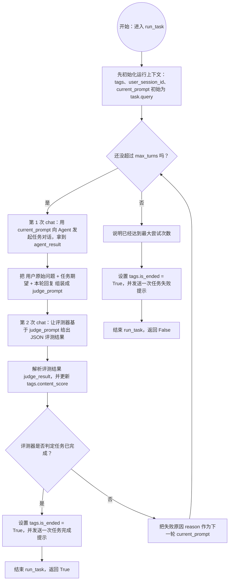
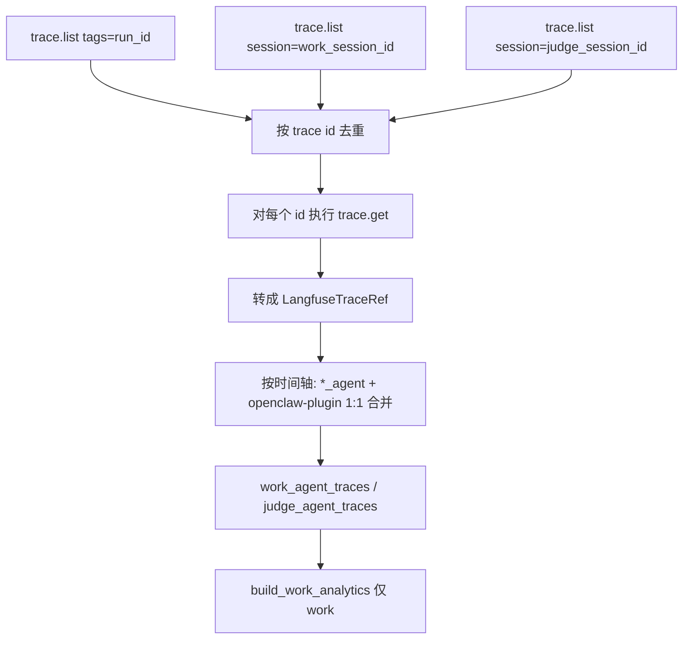

# evolve\_eval

一个用于运行 benchmark task 并做循环评测的 Python 项目，当前支持 `hermes` 和 `openclaw` 两种 agent framework。目前Openclaw链路已完善

当前稳定主链路是：

1. 用 [openclaw_main.py](./openclaw_main.py) 跑 benchmark，产出轻量 report JSON
2. 用 [postprocess/run_post_process.py](./postprocess/run_post_process.py) 统一完成 enrich、抽取、打分、指标统计和 HTML 展示
3. 或者直接在 `openclaw_main.py --evaluate` 中一键完成整条流水线

## 1. 环境准备

- Conda（Miniconda/Anaconda 任一）
- 可用的 `hermes` CLI（项目会调用 `hermes gateway restart` 和 `hermes gateway`）
- 可用的 `openclaw` CLI（使用 `openclaw` framework 时需要；若用 Langfuse 观测，需用 `openclaw plugins install` 注册 `langfuse-tracer`，见下文「OpenClaw 说明」）
- 可访问的 Hermes OpenAI 兼容服务（默认 `http://localhost:8642/v1`）

## 2. 安装依赖

创建并激活 conda 环境：

```bash
conda create -n evolve_eval python=3.12
conda activate evolve_eval
```

在项目根目录安装依赖：

```bash
pip install -r requirements.txt
```

## 3. 配置环境变量

项目通过 `src/config.py` 使用 `python-dotenv` 读取根目录 `.env`。

请在项目根目录创建（或修改）`.env`：

```env
HERMES_API_KEY=your_api_key
HERMES_ENV_FILE=~/.hermes/.env
OPENCLAW_ENV_FILE=~/.openclaw/.env
MODEL_NAME=provider/model_name
EVAL_MAX_TURNS=10

# Langfuse（langfuse_report.py / pre-chat 上报，见第 7 节）
LANGFUSE_PUBLIC_KEY=pk-lf-...
LANGFUSE_SECRET_KEY=sk-lf-...
LANGFUSE_HOST=http://your-langfuse-host:3000
```

说明：

- `HERMES_API_KEY`：调用 Hermes OpenAI 接口所需
- `HERMES_ENV_FILE`：Hermes 的 env 文件路径，程序会写入 `FORNAX_UDF_TAGS`
- `OPENCLAW_ENV_FILE`：OpenClaw 的 env 文件路径，程序会写入 `FORNAX_UDF_TAGS`
- `MODEL_NAME`：`openclaw agents add --model` 使用的模型名，必须填写为 `provider/model_name` 格式，例如 `anthropic/claude-sonnet-4-20250514`
- `EVAL_MAX_TURNS`：`run_task` 最大尝试轮次（默认 10）

> 注意：路径中的 `~` 在代码里会自动展开。

## 4. benchmark 数据格式

运行入口默认读取：

- `assets/benchmarks/**/*.json`

每个 benchmark JSON 由 [preprocess/convert_benchmark_mds_to_json.py](./preprocess/convert_benchmark_mds_to_json.py) 生成，核心结构包含：

其中至少需要：

- 顶层 `name / categories / tasks`
- 每个 task 包含 `query / expected_result`


## 5. 运行

在项目根目录执行：

### Openclaw
```bash
python openclaw_main.py
```

常用参数：

- `--benchmark`：指定单个 benchmark 文件或目录，默认 `assets/benchmarks`
- `--test`：只跑 baseline
- `--repeat`：完整执行全部 benchmark 文件 N 次，每次完整执行写入 `report.runs[i]`
- `--trace`：选择 tracing 插件，默认 `langfuse`
- `--evaluate`：benchmark 结束后自动执行后处理流水线

若要将对话 trace 上报 Langfuse：请在项目根目录执行：

  ```bash
  ln -s "$(pwd)/langfuse-tracer" ~/.openclaw/extensions/langfuse-tracer
  openclaw plugins install --link "$(pwd)/langfuse-tracer"
  openclaw gateway restart
  ```

  安装后再在 `~/.openclaw/openclaw.json` 中为 `langfuse-tracer` 配置环境变量与 `hooks.allowConversationAccess` 等项，详见 `langfuse-tracer/index.js` 文件头部注释。需要刷新清单时可执行 `openclaw plugins registry --refresh`。

### run_task 流程图



### run_task 自然语言说明（chat 表示一轮对话）

`run_task` 会先初始化 `tags`、`user_session_id` 和 `current_prompt`（初始为 `task.query`），然后最多循环 `max_turns` 次。

每次循环里会发生两次 `chat`：

1. 第一次 `chat`（任务对话）：用 `current_prompt` 向 agent 提问，得到本轮回复 `agent_result`
2. 第二次 `chat`（评测对话）：把用户原始问题、任务期望结果、本轮回复拼成评测提示词，让评测器返回 JSON 结果

拿到评测结果后会更新 `tags.content_score`：

- 如果 `success=True`：设置 `tags.is_ended=True`，再发送一次“任务完成”提示，函数返回 `True`
- 如果 `success=False`：把 `reason` 作为下一轮 `current_prompt`，继续循环

如果达到 `max_turns` 仍未成功：设置 `tags.is_ended=True`，发送一次“任务失败（超过最大尝试次数）”提示，函数返回 `False`。


如果只想跑 Hermes，可直接使用：

```bash
python main.py
```

详细功能待补全

## 6. 数据处理

此处主要为Langfuse方式收集数据时，可以使用的数据处理方法。如果启动时使用了`--evaluate`，则会自动处理数据，直接输出分析报告。
可选输出参数：

```bash
python postprocess/run_post_process.py evobench-reports/evobench-runid-xxxx.json ^
  --output-dir results ^
  --output-prefix my_run ^
  --enriched-json results/my_run_enriched.json ^
  --comparison-csv results/my_run_comparison_metrics.csv ^
  --summary-csv results/my_run_summary_metrics.csv ^
  --report-html results/my_run_metrics_report.html
```

默认输出文件名规则定义在 [postprocess/run_post_process.py](./postprocess/run_post_process.py) 的 `default_output_paths()` 中：

- `<prefix>_enriched.json`
- `<prefix>_comparison_metrics.csv`
- `<prefix>_summary_metrics.csv`
- `<prefix>_metrics_report.html`

### 6.1 Python 函数入口

如果想在代码里直接调用，使用：

`process_report_to_outputs()`，定义在 [postprocess/run_post_process.py](./postprocess/run_post_process.py)

它会一次性完成：

1. 判断输入是否已 enrich
2. 必要时从 Langfuse 拉 trace 并生成 enriched JSON 数据
3. 抽取 task 粒度指标
4. 计算 trajectory score
5. 生成 comparison CSV
6. 生成 summary CSV
7. 生成 HTML 报告

### 6.2. 后处理指标口径

抽取逻辑在 [postprocess/extract.py](./postprocess/extract.py)，对比逻辑在 [postprocess/metrics.py](./postprocess/metrics.py)。

任务级 comparison CSV 当前包含：

- `run`
- `benchmark_name`
- `benchmark_path`
- `task_name`
- `category`
- `is_final_task`
- `success`
- `trials`
- `tool_use_num`
- `content_score`
- `cached_token`
- `total_tokens`
- `total_latency_seconds`
- `trajectory_score`
- 每个指标对应的 `impr_*`

其中：

- 原始指标列是 evolved 侧的值
- `impr_*` 的定义是 `evolved / baseline`
- baseline/evolved 的配对键是 `run + benchmark_name + benchmark_path + task_name + category`

当前纳入 improvement 的指标有：

- `trials`
- `tool_use_num`
- `content_score`
- `cached_token`
- `total_tokens`
- `total_latency_seconds`
- `trajectory_score`


## 7. Langfuse 串联逻辑

Langfuse enrich 内核已经收敛到 [postprocess/langfuse_enrich.py](./postprocess/langfuse_enrich.py)。

真正的 trace stitching 入口是：

- `stitch_phase_langfuse_traces()`，位于 [src/report/langfuse_trace_stitch.py](./src/report/langfuse_trace_stitch.py)

处理流程：

1. `trace.list` 按 `run_id` / `work_session_id` / `judge_session_id` 搜索 trace
2. `trace.get` 拉全量 detail 和 observations
3. 合并 `*_agent` 与 `openclaw-plugin`
4. 生成 `work_agent_traces` / `judge_agent_traces`
5. 仅基于 work 侧生成 `work_analytics`

插件实现见 [langfuse-tracer/](./langfuse-tracer/)。

## 8. Langfuse拉取trace数据链路

最推荐的使用方式是：

```bash
# 全量 task，输出到 stdout
python langfuse_report.py --report evobench-reports/evobench-runid-20260515-xxxx__Information_Search__benchmark1.json

# 写入 enriched JSON
python langfuse_report.py --report evobench-reports/....json --out enriched.json

# 只处理第 0 个 task
python langfuse_report.py --report evobench-reports/....json --task 0 --out enriched.json

# 仅打印摘要（轮次、token、latency）
python langfuse_report.py --report evobench-reports/....json --print-summary
```

每个 phase 会调用 `stitch_phase_langfuse_traces`，在对应 `baseline` / `evolved` 上填充 `langfuse` 字段。

### 8.1 采集与合并流程



说明：

| 步骤 | 作用 |
|------|------|
| `trace.list` | 发现 trace id；列表接口 **无** token，仅有 latency 等粗字段 |
| `trace.get` | 拉取 input/output/metadata、子 observation 的 **usage（token）** |
| 1:1 合并 | 每条 `work_agent` / `judge_agent` 行吸收紧随其后的 `openclaw-plugin` |
| `work_analytics` | 仅统计 **work** 侧（judge 模拟用户反馈，不参与全局 token 汇总） |

### 8.2 输出结构（`phase.langfuse`）

**`work_agent_traces` / `judge_agent_traces`**（每轮对话一条，已合并 plugin）：

| 字段 | 含义 |
|------|------|
| `id` | pre-chat agent trace id |
| `plugin_trace_id` | 配对的 `openclaw-plugin` trace id |
| `agent_input` | Fornax 全量字段（run、task、task_query、content_reqs 等） |
| `plugin_prompt` / `plugin_response` | 当轮用户 prompt / assistant 回复 |
| `plugin_metadata` | success、message_count、tool_roundtrips、tool_call_blocks 等 |
| `tokens` | 来自 plugin trace 的 GENERATION usage |
| `latency_seconds` | 来自 plugin trace 的 latency（秒） |

**`work_analytics`**（仅 work）：

| 字段 | 含义 |
|------|------|
| `trace_chain` | 与 `work_agent_traces` 一一对应；每轮仅 `input` / `output` / `latency_seconds`（对话可读） |
| `chat_turns` | 每轮 `agent_trace_id`、`plugin_trace_id`、`stats`（token + 工具） |
| `global_stats` | 各轮 token/工具合计 |
| `total_latency_seconds` | 各轮 latency 之和 |

### 8.3 代码模块（`src/report/`）

| 文件 | 职责 |
|------|------|
| `langfuse_reporting.py` | 每次 chat 前 `emit_pre_chat_state`（Fornax tags → span input） |
| `langfuse_trace_stitch.py` | 入口：`stitch_phase_langfuse_traces` |
| `langfuse_trace_fetch.py` | `trace.get`、解析 observation、生成 `LangfuseTraceRef` |
| `langfuse_trace_merge.py` | 按时间将 agent 与 plugin 合并为单条 turn |
| `langfuse_trace_parse.py` | 结构化 `agent_input` / `plugin_metadata` |
| `langfuse_work_analytics.py` | 生成 `trace_chain`、`chat_turns`、`global_stats` |

插件实现见仓库根目录 `langfuse-tracer/`。

### 8.4 Langfuse for Openclaw 最佳实践

```bash
python openclaw_main.py --benchmark assets/benchmarks --evaluate
```

这样会同时得到：

- 轻量 report JSON：`evobench-reports/<run_id>.json`
- enriched JSON：`results/<run_id>/<run_id>_enriched.json`
- 对比指标 CSV：`results/<run_id>/<run_id>_comparison_metrics.csv`
- 汇总指标 CSV：`results/<run_id>/<run_id>_summary_metrics.csv`
- HTML 报告：`results/<run_id>/<run_id>_metrics_report.html`

如果 post-process 失败，benchmark report JSON 仍然会保留，便于后续单独重新处理。
