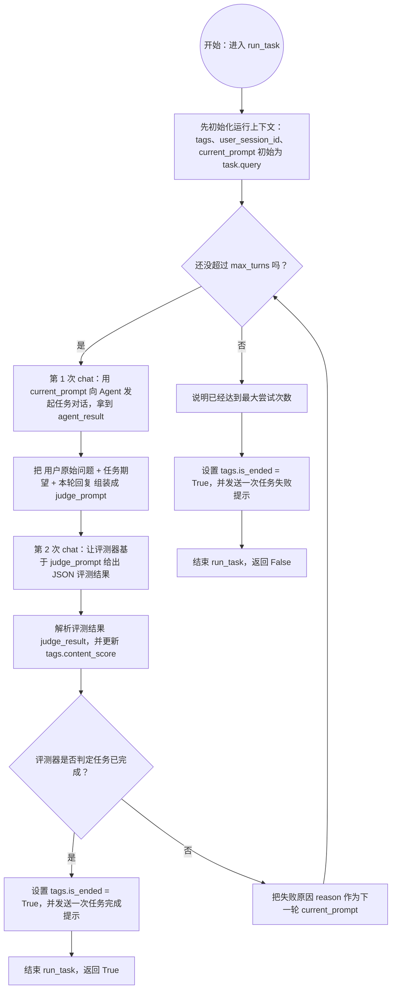

# evolve_eval

一个用于运行 benchmark task 并做循环评测的 Python 项目。

## 1. 环境准备

- Conda（Miniconda/Anaconda 任一）
- 可用的 `hermes` CLI（项目会调用 `hermes gateway restart` 和 `hermes gateway`）
- 可访问的 Hermes OpenAI 兼容服务（默认 `http://localhost:8642/v1`）

## 2. 安装依赖

创建并激活 conda 环境：

```bash
conda create -n evolve_eval python=3.12
conda activate evolve_eval
```

在项目根目录安装依赖：

```bash
pip install -r requirements.txt
```

## 3. 配置环境变量

项目通过 `src/config.py` 使用 `python-dotenv` 读取根目录 `.env`。

请在项目根目录创建（或修改）`.env`：

```env
HERMES_API_KEY=your_api_key
HERMES_ENV_FILE=~/.hermes/.env
OPENCLAW_ENV_FILE=~/.openclaw/.env
EVAL_MAX_TURNS=10
```

说明：

- `HERMES_API_KEY`：调用 Hermes OpenAI 接口所需
- `HERMES_ENV_FILE`：Hermes 的 env 文件路径，程序会写入 `FORNAX_UDF_TAGS`
- `OPENCLAW_ENV_FILE`：预留给 OpenClaw
- `EVAL_MAX_TURNS`：`run_task` 最大尝试轮次（默认 10）

> 注意：路径中的 `~` 在代码里会自动展开。

## 4. benchmark 数据格式

运行入口默认读取：

- `assets/benchmarks/benchmark_test.json`

其中至少需要：

- 顶层 `name / categories / tasks`
- 每个 task 包含 `query / expected_result`


## 5. 运行

在项目根目录执行：

```bash
python main.py
```

程序会：

1. 读取 benchmark 文件并取第一个 task
2. 创建 `HermesAgent`
3. 执行 `eval_task` 循环评测，直到 success
4. 输出最终结果 `First task success: True/False`

### run_task 流程图



### run_task 自然语言说明（chat 表示一轮对话）

`run_task` 会先初始化 `tags`、`user_session_id` 和 `current_prompt`（初始为 `task.query`），然后最多循环 `max_turns` 次。

每次循环里会发生两次 `chat`：

1. 第一次 `chat`（任务对话）：用 `current_prompt` 向 agent 提问，得到本轮回复 `agent_result`
2. 第二次 `chat`（评测对话）：把用户原始问题、任务期望结果、本轮回复拼成评测提示词，让评测器返回 JSON 结果

拿到评测结果后会更新 `tags.content_score`：

- 如果 `success=True`：设置 `tags.is_ended=True`，再发送一次“任务完成”提示，函数返回 `True`
- 如果 `success=False`：把 `reason` 作为下一轮 `current_prompt`，继续循环

如果达到 `max_turns` 仍未成功：设置 `tags.is_ended=True`，发送一次“任务失败（超过最大尝试次数）”提示，函数返回 `False`。

## 6. 如何支持 OpenClaw

当前仓库的 OpenClaw 仅有基础骨架，默认还不能直接跑：

- `src/agents.py` 中 `OpenClawAgent._restart_gateway()` 仍是 `NotImplementedError`
- `src/agents.py` 中 `OpenClawAgent.chat()` 仍是 `NotImplementedError`
- `main.py` 目前固定使用 `HermesAgent`

要接入 OpenClaw，建议按下面步骤：

1. 完成 `OpenClawAgent` 实现
   - 在 `src/agents.py` 的 `OpenClawAgent._restart_gateway()` 中补上 OpenClaw 对应的 gateway 启动/重启逻辑
   - 在 `OpenClawAgent.chat()` 中补上对 OpenAI 兼容接口（或 OpenClaw SDK）的实际调用，返回 assistant 文本
2. 配置 OpenClaw 环境变量
   - 在项目根目录 `.env` 中填写 `OPENCLAW_ENV_FILE`
   - 如果 OpenClaw 需要 API key / base url，也在 `.env` 新增对应变量，并在 `src/config.py` 读取
3. 切换入口使用的 Agent
   - 将 `main.py` 里的 `HermesAgent()` 替换为 `OpenClawAgent()`
4. 验证
   - 先运行一个最小 benchmark，确认 `run_task` 能正常进行多轮 `chat` 与评测

如果你希望同时支持 Hermes / OpenClaw 两种后端，推荐再加一个 `AGENT_BACKEND=hermes|openclaw` 配置，在 `main.py` 按配置动态选择 Agent。
