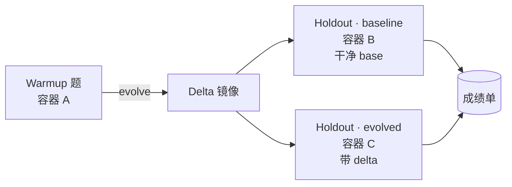
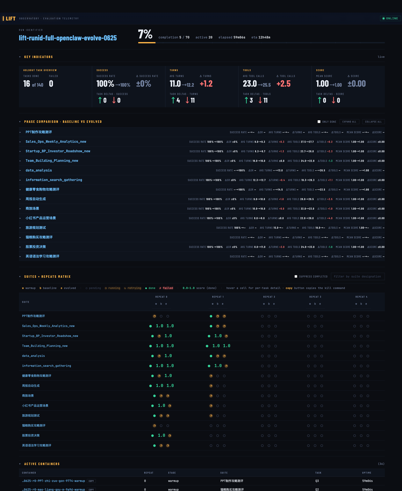
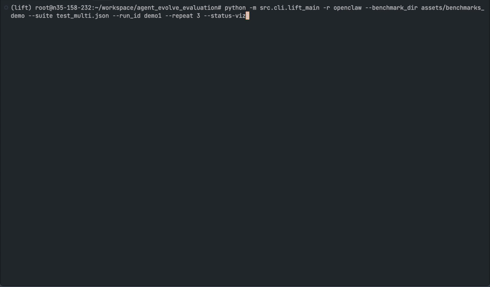

# LIFT — Loaded Impact on Final Task

<p align="center">
  <a href="https://github.com/FeiZhuNiU-INFJA/LIFT/stargazers"></a>
  <a href="https://github.com/FeiZhuNiU-INFJA/LIFT/network/members"></a>
  <a href="https://github.com/FeiZhuNiU-INFJA/LIFT/watchers"></a>
  
</p>

<p align="center">
  <a href="https://github.com/FeiZhuNiU-INFJA/LIFT/commits/main"></a>
  <a href="https://github.com/FeiZhuNiU-INFJA/LIFT/issues"></a>
  <a href="https://github.com/FeiZhuNiU-INFJA/LIFT/pulls"></a>
  <a href="https://github.com/FeiZhuNiU-INFJA/LIFT/graphs/contributors"></a>
  <a href="./LICENSE"></a>
</p>

<p align="center">
  
  
  
  
  
  
</p>

> Agent **越用越好用**到底是不是真的？给它一份「练习题」、一份「期末考」，把进化前后的成绩单摆在一起。

LIFT 是一套面向 **Agent 自我进化能力**的评测框架。它不评测 agent 本身的开箱能力，而是回答一个朴素但被忽视的问题：

> Agent 做完练习题、跑过一轮记忆/技能/上下文沉淀之后，**期末考**能不能考得更好？好多少？

---

## 为什么需要它

近一两年，越来越多 agent 在试图从「一次性执行器」变成「长期合作伙伴」：优化记忆系统、沉淀 skill、根据用户反馈改写自身代码……这些机制统称 **Agent Self-Evolving**。

但现实是 —— **我们不知道一个 agent 进化之后到底变好了还是变坏了，更不知道好了多少**。

主流评测都在卷 agent 本身的能力（数学、代码、推理），却没人专门衡量"持续进化"这件事。LIFT 想填的就是这个空白：

- **不评测 agent 本身**：基础能力差的 agent，本来就不在比较视野里
- **评测进化的边际收益**：同一道题，同一个 agent，**加载进化产物前后** 的对照差值，才是关键信号
- **以效率为核心指标**：完成任务的尝试轮数、工具调用次数、token 消耗 —— 这些是用户能直接感知的"越用越顺手"

完整 motivation 与数据集设计见 [docs/benchmark-intro.md](./docs/benchmark-intro.md)。

---

## 它怎么工作

LIFT 把每份 benchmark suite 切成两组任务：

- **warmup_tasks**（练习题）—— 让 agent 跑、触发它的进化机制（记忆 / skill / 自改写）
- **holdout_tasks**（期末考）—— 同一道题跑两遍：**baseline**（干净环境）+ **evolved**（加载进化产物）



三个关键设计取舍：

1. **Warmup 共用一个容器**，状态要连续，进化才有意义
2. **每道 holdout 起新容器**，baseline 必须是干净环境，题与题 workspace 也要隔离
3. **进化产物以 Docker 镜像形式落地**，baseline / evolved 完全对称

---

## 看得见的评测

每一次 LIFT run 都带一个实时的「任务控制台」—— warmup / baseline / evolved 进度、容器生命周期、对话轮次、retry / truncation 状态全部实时刷新。三种打开方式：

- **终端 TUI**（`--tui`）：终端里原地刷新，header 进度条 + suite × repeat 矩阵 + 活跃容器表
- **浏览器 Dashboard**（`--dashboard 8080`）：无需额外依赖，多人可同时连。点任一 task 弹出 work↔judge 完整对话；KPI 条 / phase delta 着色 / retry 闪烁告警一应俱全
- **静态快照**（自动）：跑完自动写 `results/<run_id>/dashboard.html`，发出去同事打开就能复盘；事后用 `--evaluate-only` 还能在不重跑 agent 的前提下，把整个评测过程的 dashboard 重建出来

<table>
  <tr>
    <td width="60%" align="center">
      <br/>
      <sub><b>浏览器 Dashboard</b> · KPI / phase 对比 / suite×repeat 矩阵 / 活跃容器</sub>
    </td>
    <td width="40%" align="center">
      <br/>
      <sub><b>终端 TUI</b> · 终端里原地刷新</sub>
    </td>
  </tr>
</table>

协议细节见 [docs/eval-flow.md §12.8](./docs/eval-flow.md#128)。

---

## 怎么读这张图：核心指标

Dashboard 有两层数据，**实时**和**跑完后**：

### 实时（run 进行中）

agent 每完成一个 phase，dashboard 立刻显示三个原始计数：

- **`turns`** —— 这一 phase 的对话轮数。轮数下降 = agent "想清楚了再做"，是进化最直接的体现
- **`tools`** —— 工具调用次数。次数下降 = 学会复用 / 合并 / 跳过冗余探查
- **`score` / `success`** —— judge 直接打的分

打开 dashboard 第一眼就在 **PHASE COMPARISON**：每道题的 `baseline → evolved` 三列对照，颜色 + 箭头明示哪几道题在 `turns` / `tools` 维度变好（↓ 绿）、变差（↑ 红）、持平。

### 跑完后

跑完后，后处理会从 trace 抽出更精细的口径，回写到 dashboard 的 **FINAL SUMMARY** 面板，把核心指标从「实时聚合」切到「最终成绩单」：

| 指标 | 含义 |
|---|---|
| `impr_trials` | "完美达成所需轮数"的比值 —— 比实时 `turns` 更严格 |
| `impr_tool_use_num` | 工具调用次数比 |
| `impr_total_tokens` | token 成本比 |

聚合公式（越低越好）：

$$
\mathrm{impr\_metric} = \frac{\mathrm{evolved}}{\mathrm{baseline}}
$$

更细的字段定义、列映射、汇总规则见 [docs/eval-flow.md](./docs/eval-flow.md)。

---

## 跑得快也跑得稳

LIFT 一次 run 是个 **`repeat × suite` 的并发矩阵**：默认 3 个 cell 同时跑，
cell 内 warmup tasks、holdout tasks、baseline / evolved 双相也都默认并行。
典型 3 repeats × 14 suites × 6 holdouts 的 run，holdout 高峰
**3 × 6 × 2 = 36 个容器同时在跑**。

跑稳的关键设计：

- **Cell 级隔离 + 自动重试**：一道题挂掉不波及矩阵其他位置，失败的 cell 收集起来自动再跑一遍
- **容器端口随机化**：宿主交给 Docker 自分配，启动后反查映射 —— 几十个容器并行也不会撞口
- **资源闸门**：宿主吃紧时调一个参数（`--max-parallel-suites`）即可全局收口，不用改业务参数

---

## 上手

需要 Docker + Conda（Python 3.12）+ 本地 Langfuse + 一个 OpenClaw 评测镜像。

**第一次配置环境**：调用 [`setup-lift-env`](./skill/setup-lift-env/SKILL.md) skill —— 它会按 6 步顺序检测并引导：Docker、Conda、Langfuse、`.env`、benchmark 数据、镜像构建，最后用 `hello.json` 冒烟。

**已经配好环境，想直接跑**：

```bash
conda activate lift
python -m src.cli.lift_main \
  -r openclaw \
  --benchmark_dir assets/benchmarks_demo \
  --suite hello.json \
  --run_id my-first-run \
  --tui \
  --dashboard 8080
```

跑完看 [results/lift-runid-my-first-run/](./results) 下的报告与自动生成的 `dashboard.html` 离线快照。

**其它 runtime**：`-r genericagent` / `genericagent_active_evolve` 跑文件 I/O 型
GenericAgent；`-r hermes` 跑 Hermes（容器空转 + `docker exec` 拉起
`hermes_runner.py`，warmup 期 work session 结束触发 review 演化）；`-r openhuman`
跑 OpenHuman Rust JSON-RPC runtime；`-r evoscientist` / `evoscientist_active_evolve`
跑 EvoScientist，其中 active 变体在 warmup 后显式触发 EvoMemory AutoSkills。

Hermes 镜像构建见 [agent-runtimes/hermes/README.md](./agent-runtimes/hermes/README.md)；
EvoScientist 镜像构建和 AutoSkills active evolve 说明见
[agent-runtimes/evoscientist/README.md](./agent-runtimes/evoscientist/README.md)。
推荐 WSL/Linux 服务器跑完整评测，本机只做最小 smoke test。Hermes warmup 建议加
`--warmup-container-policy serial_single`（避免每题 review 并发写共享 `/opt/hermes-state` 的竞态）。

```bash
bash agent-runtimes/hermes/build-image.sh   # 默认基于 nousresearch/hermes-agent:v2026.5.16
python -m src.cli.lift_main -r hermes \
  --benchmark_dir assets/benchmarks_demo --suite hello.json --run_id hermes-smoke \
  --warmup-container-policy serial_single
```

---

## 想看更细的

| 你想了解 | 去哪 |
|---|---|
| LIFT 框架讲稿（考试类比、推荐阅读顺序） | [docs/lift-framework-guide-cn.md](./docs/lift-framework-guide-cn.md) |
| 评测设计动机 + 数据集三层结构 | [docs/benchmark-intro.md](./docs/benchmark-intro.md) |
| 协议主仓：CLI 参数、report 字段、并发模型、Langfuse trace、模型契约 | [docs/eval-flow.md](./docs/eval-flow.md) |
| 架构图、类图、时序图 | [docs/lift-framework-visualization.html](./docs/lift-framework-visualization.html) |
| LIFT 代码速查 + 测试命令 | [src/lift/README.md](./src/lift/README.md) |
| Benchmark 收集规范（query / 要求 / 轨迹要求） | [assets/suite_requirement.md](./assets/suite_requirement.md) |
| OpenClaw 镜像构建细节 | [agent-runtimes/openclaw/README.md](./agent-runtimes/openclaw/README.md) |
| Hermes 镜像构建细节 | [agent-runtimes/hermes/README.md](./agent-runtimes/hermes/README.md) |
| OpenHuman 镜像构建细节 | [agent-runtimes/openhuman/README.md](./agent-runtimes/openhuman/README.md) |
| GenericAgent 镜像构建细节 | [agent-runtimes/genericagent/README.md](./agent-runtimes/genericagent/README.md) |
| EvoScientist 镜像与 AutoSkills active evolve | [agent-runtimes/evoscientist/README.md](./agent-runtimes/evoscientist/README.md) |
| 从零搭环境 | skill: [setup-lift-env](./skill/setup-lift-env/SKILL.md) |
| 所有 runtime 镜像 build 命令（SSoT） | [docs/build-images.md](./docs/build-images.md) + [scripts/build-all-images.sh](./scripts/build-all-images.sh) |
| 清理评测残留容器/镜像 | [lift-integrate-agent-runtime/docs/environment-cleanup.md](./skill/lift-integrate-agent-runtime/docs/environment-cleanup.md) |
| 接入新的 agent runtime | skill: [lift-integrate-agent-runtime](./skill/lift-integrate-agent-runtime/SKILL.md) |
| 历次重要改动复盘 | [docs/release-notes/](./docs/release-notes/README.md) |

---

## 仓库布局

```
.
├── src/
│   ├── lift/               # LIFT 内核：pipeline / adapters / eval / status
│   ├── cli/                # CLI 入口（lift_main、preprocess）
│   ├── preprocess/         # 任务源 → suite JSON 的预处理
│   └── postprocess/        # 跑完后的指标计算与 trace 回填
├── agent-runtimes/         # 各 runtime 的 Docker 镜像与插件
│   ├── openclaw/
│   ├── genericagent/
│   └── hermes/
├── assets/
│   ├── benchmark_mds/      # 人类可读任务源（preprocess 从 TOS / HF 下载，gitignore）
│   ├── benchmarks_demo/    # 冒烟 demo suite（hello.json，随仓库提供）
│   └── benchmarks/         # 完整 suite JSON（preprocess 生成，gitignore）
├── docs/                   # 流程与架构文档
├── skill/                  # 引导用 SKILL（首次搭环境、接入 runtime + 集成/观测/清理）
├── scripts/                # 运维 / 分析小工具
└── results/                # 每次 run 产物（gitignore）
```

---

## Benchmark 数据：TOS / HuggingFace / ModelScope 多源

完整 benchmark 的 markdown 源同时托管在：

- **TOS**（字节内网，`aml-fde-boe/benchmark_mds.zip`，需 TOS 凭证）
- **HuggingFace dataset**（公开仓库，默认 [`FeiZhuNiU-INFJA/EALE`](https://huggingface.co/datasets/FeiZhuNiU-INFJA/EALE)，读取无需 token；可用 `BENCHMARK_HF_REPO` 覆盖）
- **ModelScope dataset**（默认 [`Evolvon/EALE`](https://modelscope.cn/datasets/Evolvon/EALE)，通过 `modelscope download --dataset ... --local_dir assets/benchmark_mds` 拉取目录树；可用 `BENCHMARK_MODELSCOPE_REPO` 覆盖）

切换走哪边：`.env` 的 `BENCHMARK_SOURCE=tos|huggingface|modelscope`，或 CLI 加 `--source modelscope`。具体命令见 [`setup-lift-env`](./skill/setup-lift-env/SKILL.md) 步骤 4。

---

## Star History

如果 LIFT 对你有帮助，欢迎点一颗 ⭐️ —— 它是这个项目能被更多人看见的最直接方式。

<p align="center">
  <a href="https://star-history.com/#FeiZhuNiU-INFJA/LIFT&Date">
    <picture>
      <source media="(prefers-color-scheme: dark)" srcset="https://api.star-history.com/svg?repos=FeiZhuNiU-INFJA/LIFT&type=Date&theme=dark" />
      <source media="(prefers-color-scheme: light)" srcset="https://api.star-history.com/svg?repos=FeiZhuNiU-INFJA/LIFT&type=Date" />
      
    </picture>
  </a>
</p>

<p align="center">
  <a href="https://github.com/FeiZhuNiU-INFJA/LIFT/stargazers"></a>
  <a href="https://github.com/FeiZhuNiU-INFJA/LIFT/network/members"></a>
</p>
