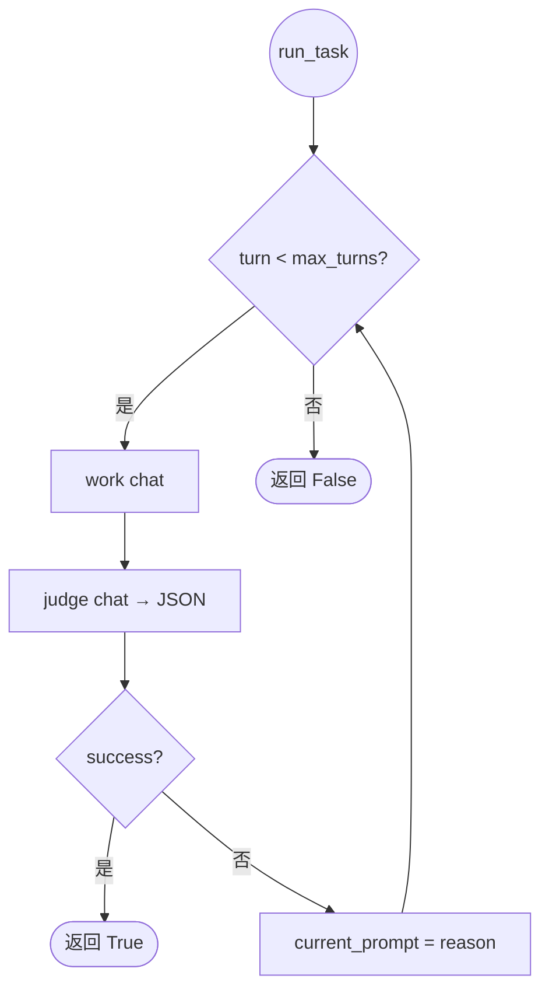

# evolve-eval

LIFT（Loaded Impact on Final Task）评测框架：Docker 容器内 OpenClaw agent，warmup → evolve → hold-out 对照。

```bash
# 1. 构建镜像（首次或 agent-runtimes 变更后）
bash agent-runtimes/openclaw/build-image.sh

# 2. 冒烟（hello.json 在 assets/benchmarks_demo/，与完整 benchmark 目录分离）
python -m src.cli.lift_main -r openclaw --benchmark_dir assets/benchmarks_demo --suite hello.json --run_id my-run

# 3. 完整 benchmark 需先 preprocess（需 .env 中 TOS_ACCESS_KEY / TOS_SECRET_KEY）
# python -m src.cli.preprocess
# python -m src.cli.lift_main -r openclaw --suite all --run_id my-run

# 4. 仅后处理已有 report
python -m src.cli.lift_main -r openclaw --evaluate-only --run_id my-run
```

更多细节见 [docs/README.md](./docs/README.md)、[docs/lift-framework-guide-cn.md](./docs/lift-framework-guide-cn.md) 与 [src/lift/README.md](./src/lift/README.md)。

## 1. 环境准备

- **Docker**（LIFT 在容器内跑 OpenClaw；宿主机**无需**安装 `openclaw` CLI）
- **Conda**（Miniconda/Anaconda 任一）+ Python 3.12
- **Langfuse**（**必需**）：pre-chat 上报、容器内 trace、后处理 trace backfill 与 token/延迟指标均依赖 Langfuse

### 安装 Docker（macOS）

[Docker 官方文档](https://docs.docker.com/desktop/setup/install/mac-install/) 仅推荐 **Docker Desktop**（图形界面应用），**不包含** Colima 等第三方方案。本项目只需 `docker` CLI + 可用的 Docker daemon，以下两种方式任选其一：

**方式 A：Docker Desktop（官方）**

按 [Install Docker Desktop on Mac](https://docs.docker.com/desktop/setup/install/mac-install/) 下载安装，启动后确认：

```bash
docker info
```

**方式 B：Colima + Docker CLI（轻量、纯命令行，非 Docker 官方产品）**

适合不想装 Docker Desktop、或偏好 Homebrew + 终端管理的 Mac 开发者。Colima 在 macOS 上启动一个 Linux 虚拟机并在其中运行 Docker Engine；本项目已在此方案下验证通过。

```bash
brew install colima docker docker-compose
colima start --cpu 4 --memory 8   # 首次启动会下载 VM 镜像，需等待数分钟
docker info                       # 应能正常输出 Server 信息
```

常用命令：`colima status`（查看状态）、`colima stop`（停止）。可选开机自启：`brew services start colima`。

> **说明**：Colima 文档见 [abiosoft/colima](https://github.com/abiosoft/colima)。若 `docker compose` 找不到插件，在 `~/.docker/config.json` 中加入 `"cliPluginsExtraDirs": ["/opt/homebrew/lib/docker/cli-plugins"]`（Apple Silicon Homebrew 路径；Intel 一般为 `/usr/local/lib/docker/cli-plugins`）。

**Linux**：按 [Docker Engine 安装指南](https://docs.docker.com/engine/install/) 安装对应发行版包即可。

## 2. 安装 Langfuse

按官方文档用 Docker Compose 本地或 VM 部署即可：

**[Langfuse 自托管：Docker Compose 部署](https://langfuse.com/self-hosting/deployment/docker-compose)**

简要步骤：

```bash
git clone https://github.com/langfuse/langfuse.git
cd langfuse
docker compose up
```

待 `langfuse-web` 容器日志出现 `Ready` 后，打开 `http://localhost:3000`，创建项目并复制 **Public Key** / **Secret Key** 填入根目录 `.env` 的 `LANGFUSE_PUBLIC_KEY`、`LANGFUSE_SECRET_KEY`。`LANGFUSE_BASE_URL` 本地填 `http://localhost:3000`（评测容器内会自动改用 `host.docker.internal`）。

## 3. 安装依赖与镜像

```bash
conda create -n evolve_eval python=3.12
conda activate evolve_eval
pip install -r requirements.txt
```

构建 OpenClaw 评测镜像（`self-evolving-plugin-pro`、`langfuse-tracer` 等已内置，无需宿主机手动装插件）：

```bash
bash agent-runtimes/openclaw/build-image.sh
# 产出 evolve-eval-openclaw:latest，详见 agent-runtimes/openclaw/README.md
```

Benchmark 预处理（从 TOS 拉取 `benchmark_mds.zip` 并生成 `assets/benchmarks/*.json`，与 LIFT CLI 解耦）：

```bash
# 需配置 .env 中的 TOS_ACCESS_KEY / TOS_SECRET_KEY（bucket: aml-fde-boe）
python -m src.cli.preprocess
# 强制重新下载
python -m src.cli.preprocess --force-download
# 已有本地 assets/benchmark_mds/ 时跳过下载
python -m src.cli.preprocess --skip-download
```

## 4. 环境变量

复制 [.env.example](./.env.example) 为 `.env`。LIFT 主链路常用项：

```env
# 模型（容器内 openclaw agents add --model）
MODEL_NAME=custom-ark-cn-beijing-volces-com/doubao-seed-2-0-pro-260215
# 构建镜像时写入 models fragment；运行时亦传入容器
ARK_API_KEY=your_ark_api_key

EVAL_MAX_TURNS=2

# Langfuse（pre-chat 上报 + 后处理 trace backfill）
LANGFUSE_PUBLIC_KEY=pk-lf-...
LANGFUSE_SECRET_KEY=sk-lf-...
# 宿主机 .env 可用 localhost；容器内由 src 自动改为 host.docker.internal
LANGFUSE_BASE_URL=http://localhost:3000

# 轨迹评判（后处理，可选）
DO_TRAJECTORY_JUDGE=false
OPENAI_API_KEY=your_api_key_here
OPENAI_BASE_URL=https://your-openai-compatible-endpoint
TRAJECTORY_JUDGE_MODEL=gpt-4o-mini

# 联网搜索（部分 benchmark 可选）
FIRECRAWL_API_KEY=

# preprocess 从 TOS 下载 benchmark markdown（aml-fde-boe/benchmark_mds.zip）
TOS_ACCESS_KEY=your_access_key
TOS_SECRET_KEY=your_secret_key
```

说明：

- `MODEL_NAME`：须为 `provider/model_id` 格式，且与评测镜像内已注册的 provider/model **一致**（详见 [docs/eval-flow.md §12.6](./docs/eval-flow.md#126-agent-模型配置契约lift--容器运行时)）
- `EVAL_MAX_TURNS`：`run_task` 最大 judge 重试轮次（默认 2）
- `LANGFUSE_*`：**必填**；在 Langfuse UI 创建项目后获取（见 §2）
- `ARK_API_KEY`：构建镜像前建议在 `.env` 中设置，写入 `models.fragment.json`；否则镜像内模型 apiKey 为空

容器启动时通过 `--env-file .env` 挂载上述变量。

## 5. Benchmark 数据格式

### 术语

| 术语 | 含义 | 示例 | CLI / 代码 |
|------|------|------|------------|
| **eval run** | 一次完整评测（一个 `run_id`、一份 report） | `evobench-runid-my-run` | `EvalReport`；`--run_id` |
| **repeat** | `--repeat` 的一轮完整 LIFT | 第 2 次 `--repeat 3` | `EvalReport.runs[]` |
| **suite** | 一份规格 JSON | `hello.json` | `--suite`；`SuiteRun` |
| **task** | suite 内 `tasks[]` 的一条 | `Q1`、`Q2` | `TaskRun` |
| **phase** | 单题的 baseline 或 evolved 执行 | baseline / evolved | `PhaseRun` |
| **benchmark_dir** | suite JSON 目录 | `assets/benchmarks` | `--benchmark_dir` |

```
EvalReport
  └── runs[]（repeat）
        └── suites[]
              └── tasks[]（hold-out 题）
                    ├── baseline（PhaseRun）
                    └── evolved（PhaseRun）
```

- 冒烟 suite：`assets/benchmarks_demo/hello.json`（随仓库提供；`--benchmark_dir assets/benchmarks_demo`）
- 完整 benchmark：`assets/benchmarks/*.json`（由 `python -m src.cli.preprocess` 从 TOS markdown 生成；不纳入 git；默认 `--benchmark_dir`）
- 规范说明：[assets/suite_requirement.md](./assets/suite_requirement.md)
- 模型定义：[src/models.py](./src/models.py)（`SuiteSpec`、`EvalReport`、`PhaseRun`）

## 6. 运行 LIFT

```bash
python -m src.cli.lift_main -r openclaw --benchmark_dir assets/benchmarks_demo --suite hello.json --run_id my-run
```

常用参数：

| 参数 | 默认 | 含义 |
|------|------|------|
| `-r` / `--agent-runtime` | **必填** | 当前支持 `openclaw` |
| `--benchmark_dir` | `assets/benchmarks` | suite JSON 目录 |
| `--suite` | `all` | 逗号分隔文件名或 `all` |
| `--run_id` | 自动生成 | 后缀，生成 `evobench-runid-{run_id}` |
| `--warmup-only` | off | 只跑 warmup + evolve + delta，跳过 hold-out |
| `--repeat` | `1` | 重复完整 LIFT N 次 |
| `-p` / `--parallel` | off | warmup 题并行 |
| `-e` / `--evaluate` | **on** | 结束后自动后处理；`--no-evaluate` 关闭 |
| `--evaluate-only` | off | 仅后处理已有 report（需 `--run_id`） |

等价入口：`python -m src.cli`。

### LIFT 流程（简述）

1. **Warmup**：单容器串行跑前序题 → `openclaw learn review` → `docker commit` 得 delta 镜像
2. **Hold-out**：每题各起 baseline（base 镜像）与 evolved（delta 镜像）容器，workspace 按题隔离
3. **Report**：写入 `results/{run_id}/report.json`（执行期 `langfuse` 一般为 `null`）
4. **后处理**（默认）：从 Langfuse 拉 trace，回填至 `results/{run_id}/*_backfilled.json` 并出 CSV/HTML

### `run_task`（单题 judge 回路）

每个 phase 对一题调用 `src/lift/eval/run_task.py`：work chat → judge chat（JSON 判定）→ 未通过则用 `reason` 重试，最多 `EVAL_MAX_TURNS` 轮。



## 7. 产出物

一次 `run_id` 对应目录 `results/{run_id}/`：

| 路径 | 内容 |
|------|------|
| `report.json` | 执行期结构化 report（success、score、session、workspace_dir） |
| `outcome/` | Agent 工作区（warmup / baseline / evolved） |
| `{run_id}_backfilled.json` 等 | 后处理：trace 回填、对比/汇总 CSV、HTML 报告 |

> **为何 `report.json` 里 `langfuse` 为空？** 执行期只写评测结论；Langfuse trace 在**后处理**阶段填入 `{run_id}_backfilled.json`。请确认 Langfuse 已按 §2 启动且 `.env` 中 `LANGFUSE_*` 已配置。

单独跑后处理：

```bash
python -m src.postprocess.run_post_process results/evobench-runid-my-run/report.json
# 或通过 CLI（自动解析 report 路径）
python -m src.cli.lift_main -r openclaw --evaluate-only --run_id my-run
```

默认输出前缀见 [src/postprocess/run_post_process.py](./src/postprocess/run_post_process.py) 的 `default_output_paths()`（`*_backfilled.json` 等）。

### 后处理指标

- 抽取：[src/postprocess/extract.py](./src/postprocess/extract.py)
- 对比与 `impr_*`：[src/postprocess/metrics.py](./src/postprocess/metrics.py)
- 配对键：`run + suite_name + suite_path + task_name + category`
- 相对改进：`impr_* = (evolved - baseline) / baseline`

## 8. Langfuse 与本项目

- **部署**：[Docker Compose 官方教程](https://langfuse.com/self-hosting/deployment/docker-compose)（§2）
- **容器内插件**： [agent-runtimes/openclaw/plugins/langfuse-tracer/](./agent-runtimes/openclaw/plugins/langfuse-tracer/)（镜像已内置）
- **框架 pre-chat**：[src/report/langfuse_reporting.py](./src/report/langfuse_reporting.py) 的 `emit_pre_chat_state`
- **回填入口**：[src/report/langfuse_trace_stitch.py](./src/report/langfuse_trace_stitch.py) 的 `stitch_phase_langfuse_traces`
- **关联契约（pre-chat ↔ 插件 trace）**：[docs/eval-flow.md §12.5](./docs/eval-flow.md#125-trace_backfill观测) — `session_id`、`openclaw-plugin` 命名、`agent_end` 等写入/检索/配对规则

流程：`trace.list`（按 `run_id` / session）→ `trace.get` → 合并 `*_agent` 与 `openclaw-plugin` → 写入 `PhaseRun.langfuse`。

## 9. 仓库布局

```
evolve_eval/
├── src/                    # LIFT 框架、CLI、后处理
│   └── lift/               # pipeline、adapters、eval 内核
├── agent-runtimes/         # 各 runtime 的 Docker 镜像与插件
│   └── openclaw/
├── assets/
│   ├── benchmark_mds/      # 人类可读任务源（preprocess 从 TOS 下载，gitignore）
│   ├── benchmarks_demo/    # 冒烟 demo suite（如 hello.json）
│   └── benchmarks/         # 完整 suite JSON（preprocess 生成，gitignore）
├── docs/                   # 流程与架构文档
└── results/                # 每次 run 产物（report、outcome、后处理；gitignore）
```

## 10. 测试

```bash
python -m pytest src/lift/tests -q
```
