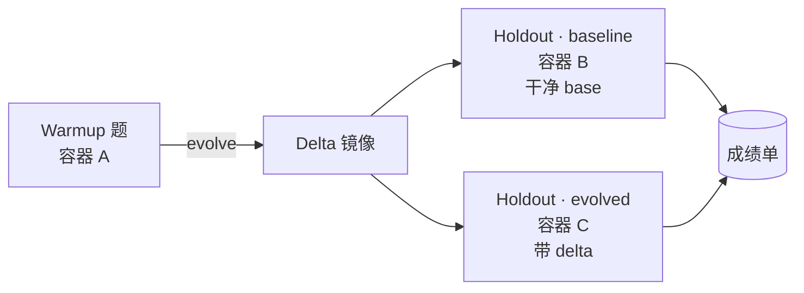

# LIFT — Loaded Impact on Final Task

> Agent **越用越好用**到底是不是真的？给它一份「练习题」、一份「期末考」，把进化前后的成绩单摆在一起。

LIFT 是一套面向 **Agent 自我进化能力**的评测框架。它不评测 agent 本身的开箱能力，而是回答一个朴素但被忽视的问题：

> Agent 做完练习题、跑过一轮记忆/技能/上下文沉淀之后，**期末考**能不能考得更好？好多少？

<!-- TODO(screenshot): docs/assets/dashboard.png — 一张 LIFT dashboard 截图，体现 baseline / evolved 并排对照 + impr_metric -->

---

## 为什么需要它

近一两年，越来越多 agent 在试图从「一次性执行器」变成「长期合作伙伴」：优化记忆系统、沉淀 skill、根据用户反馈改写自身代码……这些机制统称 **Agent Self-Evolving**。

但现实是 —— **我们不知道一个 agent 进化之后到底变好了还是变坏了，更不知道好了多少**。

主流评测都在卷 agent 本身的能力（数学、代码、推理），却没人专门衡量"持续进化"这件事。LIFT 想填的就是这个空白：

- **不评测 agent 本身**：基础能力差的 agent，本来就不在比较视野里
- **评测进化的边际收益**：同一道题，同一个 agent，**加载进化产物前后** 的对照差值，才是关键信号
- **以效率为核心指标**：完成任务的尝试轮数、工具调用次数、token 消耗 —— 这些是用户能直接感知的"越用越顺手"

完整 motivation 与数据集设计见 [docs/benchmark-intro.md](./docs/benchmark-intro.md)。

---

## 它怎么工作

LIFT 把每份 benchmark suite 切成两组任务：

- **warmup_tasks**（练习题）—— 让 agent 跑、触发它的进化机制（记忆 / skill / 自改写）
- **holdout_tasks**（期末考）—— 同一道题跑两遍：**baseline**（干净环境）+ **evolved**（加载进化产物）



三个关键设计取舍：

1. **Warmup 共用一个容器**，状态要连续，进化才有意义
2. **每道 holdout 起新容器**，baseline 必须是干净环境，题与题 workspace 也要隔离
3. **进化产物以 docker image 形式落地**（`docker commit` → delta 镜像），baseline / evolved 完全对称

最终指标是相对改进率（越低越好）：

$$
\mathrm{impr\_metric} = \frac{\mathrm{evolved}}{\mathrm{baseline}}
$$

| 指标 | 含义 |
|---|---|
| `impr_attempts` | 完美达成要求需要的对话轮数比值 |
| `impr_tool_calls` | 工具调用次数比值 |
| `impr_tokens` | 总 token 消耗比值 |

---

## 上手

需要 Docker + Conda（Python 3.12）+ 本地 Langfuse + 一个 OpenClaw 评测镜像。

**第一次配置环境**：调用 [`setup-eval-env`](./skill/setup-eval-env/SKILL.md) skill —— 它会按 6 步顺序检测并引导：Docker、Conda、Langfuse、`.env`、benchmark 数据、镜像构建，最后用 `hello.json` 冒烟。

**已经配好环境，想直接跑**：

```bash
conda activate lift
python -m src.cli.lift_main \
  -r openclaw \
  --benchmark_dir assets/benchmarks_demo \
  --suite hello.json \
  --run_id my-first-run \
  --status-viz \
  --status-http 8080
```

跑完看 [results/lift-runid-my-first-run/](./results) 下的 `report.json` 和 `*_backfilled.json`。

<!-- TODO(screenshot): docs/assets/tui.png — 终端 TUI 状态面板的实拍 -->

---

## 想看更细的

| 你想了解 | 去哪 |
|---|---|
| LIFT 框架讲稿（考试类比、推荐阅读顺序） | [docs/lift-framework-guide-cn.md](./docs/lift-framework-guide-cn.md) |
| 评测设计动机 + 数据集三层结构 | [docs/benchmark-intro.md](./docs/benchmark-intro.md) |
| 协议主仓：CLI 参数、report 字段、并发模型、Langfuse trace、模型契约 | [docs/eval-flow.md](./docs/eval-flow.md) |
| 架构图、类图、时序图 | [docs/lift-framework-visualization.html](./docs/lift-framework-visualization.html) |
| LIFT 代码速查 + 测试命令 | [src/lift/README.md](./src/lift/README.md) |
| Benchmark 收集规范（query / 要求 / 轨迹要求） | [assets/suite_requirement.md](./assets/suite_requirement.md) |
| OpenClaw 镜像构建细节 | [agent-runtimes/openclaw/README.md](./agent-runtimes/openclaw/README.md) |
| 从零搭环境 | skill: [setup-eval-env](./skill/setup-eval-env/SKILL.md) |
| 清理评测残留容器/镜像 | skill: [cleanup-eval-env](./skill/cleanup-eval-env/SKILL.md) |
| 接入新的 agent runtime | skill: [lift-integrate-agent-runtime](./skill/lift-integrate-agent-runtime/SKILL.md) |

---

## 仓库布局

```
agent_evolve_evaluation/
├── src/                    # LIFT 框架、CLI、后处理
│   └── lift/               # pipeline、adapters、eval 内核
├── agent-runtimes/         # 各 runtime 的 Docker 镜像与插件
│   └── openclaw/
├── assets/
│   ├── benchmark_mds/      # 人类可读任务源（preprocess 从 TOS / HF 下载，gitignore）
│   ├── benchmarks_demo/    # 冒烟 demo suite（hello.json，随仓库提供）
│   └── benchmarks/         # 完整 suite JSON（preprocess 生成，gitignore）
├── docs/                   # 流程与架构文档
├── skill/                  # 引导用 SKILL（搭环境、清理、接 runtime）
├── scripts/                # 一次性维护脚本
└── results/                # 每次 run 产物（gitignore）
```

---

## Benchmark 数据：TOS / HuggingFace 双源

完整 benchmark 的 markdown 源（`benchmark_mds.zip`）同时托管在：

- **TOS**（字节内网，`aml-fde-boe/benchmark_mds.zip`，需 TOS 凭证）
- **HuggingFace dataset**（公开仓库，默认 [`FeiZhuNiU-INFJA/EALE`](https://huggingface.co/datasets/FeiZhuNiU-INFJA/EALE)，读取无需 token；可用 `BENCHMARK_HF_REPO` 覆盖）

切换走哪边：`.env` 的 `BENCHMARK_SOURCE=tos|huggingface`，或 CLI 加 `--source huggingface`。具体命令见 [`setup-eval-env`](./skill/setup-eval-env/SKILL.md) 步骤 4。
