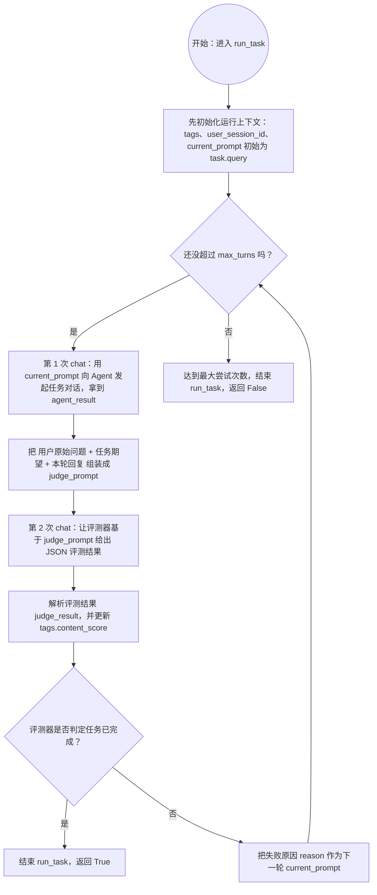
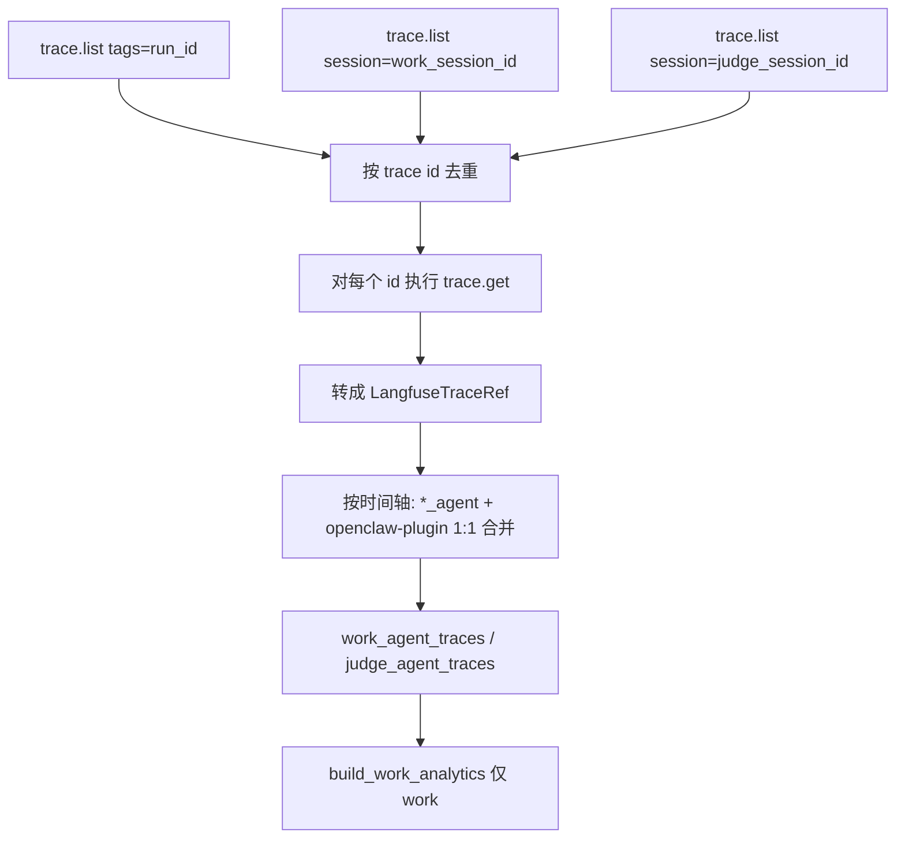

# evolve-eval

LIFT（Loaded Impact on Final Task）评测框架：容器内 OpenClaw agent，warmup → evolve → hold-out 对照。

**主链路**（[`src/`](./src/)）：

```bash
# 完整 LIFT + 默认后处理（trace backfill、指标、HTML）
python -m src.cli.lift_main -r openclaw --suite hello.json --run_id my-run

# 仅后处理已有 report
python -m src.cli.lift_main -r openclaw --evaluate-only --run_id my-run
```

详见 [docs/README.md](./docs/README.md)、[docs/lift-framework-guide-cn.md](./docs/lift-framework-guide-cn.md) 与 [src/lift/README.md](./src/lift/README.md)。

**Legacy** 宿主机直跑（OpenClaw / Hermes）已归档至 [`legacy/`](./legacy/README.md)，不再维护为主入口。

## 1. 环境准备

- Conda（Miniconda/Anaconda 任一）
- 可用的 `hermes` CLI（项目会以 `<profile_name> gateway run` 启动每个 HermesAgent 的网关进程，并隔离端口）
- 可用的 `openclaw` CLI（使用 `openclaw` framework 时需要）
- 可访问的 Hermes OpenAI 兼容服务（每个 HermesAgent 默认监听 `50000 + agent_id`，对应 base_url `http://localhost:<port>/v1`）
- Langfuse 观测插件：本项目的 trace stitching 强依赖 langfuse 插件，OpenClaw / Hermes 各有一份本地实现需要安装到对应 framework 的 plugins 目录，详见下文「2.1 插件配置」

## 2. 安装依赖

创建并激活 conda 环境：

```bash
conda create -n evolve_eval python=3.12
conda activate evolve_eval
```

在项目根目录安装依赖：

```bash
pip install -r requirements.txt
```

### 2.1 插件配置（Langfuse Tracer）

仓库根目录提供了两份 langfuse 插件源码：

- [agents/openclaw/plugins/langfuse-tracer/](./agents/openclaw/plugins/langfuse-tracer/)：OpenClaw 用的 Node.js 插件
- [legacy/langfuse-hermes/](./legacy/langfuse-hermes/)：Hermes 用的 Python 插件（legacy）

#### OpenClaw

```bash
# 1. 把插件源码放到 OpenClaw 扩展目录
cp -r agents/openclaw/plugins/langfuse-tracer/ ~/.openclaw/extensions/

# 2. 在 ~/.openclaw/openclaw.json 的 plugins 字段中加入：
#       "langfuse-tracer": {
#         "enabled": true,
#         "hooks": {
#           "allowConversationAccess": true
#         }
#       }
#    并按 langfuse-tracer/index.js 文件头注释配置 LANGFUSE_* 等环境变量

# 3. 重启网关让插件生效
openclaw gateway restart
```

### 安装自进化插件

执行以下命令安装插件：

```bash
unzip agents/openclaw/plugins/self-evolving-plugin-pro-2026.4.23.zip
cd assets
bash self-evolving-plugin-pro/scripts/install-openclaw-plugin.sh
```

如遇 `ModuleNotFoundError: No module named '_sqlite3'` 错误，请依次执行以下操作进行修复：

```bash
sudo apt install libsqlite3-dev

openclaw plugins uninstall self-evolving-plugin-pro
openclaw gateway restart
rm -rf ~/.openclaw/extensions/self-evolving-plugin-pro/

bash self-evolving-plugin-pro/scripts/install-openclaw-plugin.sh
```

注：`OpenClawAgent.initialize_environment` 会自动执行 `openclaw plugins enable langfuse-tracer`，所以只要扩展目录与 `openclaw.json` 配置就位即可。

#### Hermes

Hermes 的 langfuse 插件走的是 hermes 自带的 venv，需要先在该 venv 内安装 `langfuse` Python SDK，再启用并覆盖插件源码：

```bash
# 1. 在 Hermes 自己的 venv 里安装 langfuse SDK（CLI 用的也是这个 venv）
~/.hermes/hermes-agent/venv/bin/pip install langfuse

# 2. 启用 observability/langfuse 插件
hermes plugins enable observability/langfuse

# 3. 用本仓库的实现覆盖 Hermes 自带的 langfuse 插件目录
cp -r legacy/langfuse-hermes/* ~/.hermes/hermes-agent/plugins/observability/langfuse
```

完成后 HermesAgent 启动 gateway 时即可上报 langfuse trace。

## 3. 配置环境变量

项目通过 `src/config.py` 使用 `python-dotenv` 读取根目录 `.env`。仓库提供了 [.env.example](./.env.example) 作为模板，可复制为 `.env` 后按需修改。

```env
# Hermes 调用相关
HERMES_API_KEY=your_api_key
HERMES_ENV_FILE=~/.hermes/.env
OPENCLAW_ENV_FILE=~/.openclaw/.env
MODEL_NAME=provider/model_name
EVAL_MAX_TURNS=10

# Hermes API Server（HermesAgent gateway 自身需要的鉴权）
API_SERVER_ENABLED=true
API_SERVER_KEY=your_api_server_key

# Judge（可选，启用后用 OpenAI 兼容接口跑 judge agent）
DO_TRAJECTORY_JUDGE=false
OPENAI_API_KEY=your_api_key_here
OPENAI_BASE_URL=https://your-openai-compatible-endpoint
TRAJECTORY_JUDGE_MODEL=gpt-4o-mini

# Langfuse（pre-chat 上报与 trace stitching，见第 7 节）
LANGFUSE_PUBLIC_KEY=pk-lf-...
LANGFUSE_SECRET_KEY=sk-lf-...
LANGFUSE_BASE_URL=http://your-langfuse-host:3000

# 搜索工具（可选）：本项目原本使用 firecrawl 作为搜索工具，
# 部分 benchmark / skill 在跑联网检索时会读取该 key；不需要联网搜索可留空。
FIRECRAWL_API_KEY=your_firecrawl_api_key
```

说明：

- `HERMES_API_KEY`：调用 Hermes OpenAI 接口所需
- `HERMES_ENV_FILE`：Hermes 的 env 文件路径
- `OPENCLAW_ENV_FILE`：OpenClaw 的 env 文件路径
- `MODEL_NAME`：`openclaw agents add --model` 使用的模型名，必须填写为 `provider/model_name` 格式，例如 `anthropic/claude-sonnet-4-20250514`
- `EVAL_MAX_TURNS`：`run_task` 最大尝试轮次（默认 2，参见 `src/config.py`）
- `API_SERVER_ENABLED` / `API_SERVER_KEY`：HermesAgent 启动 gateway 时写入到 `HERMES_ENV_FILE` 的 API Server 鉴权字段
- `DO_TRAJECTORY_JUDGE` / `OPENAI_API_KEY` / `OPENAI_BASE_URL` / `TRAJECTORY_JUDGE_MODEL`：当 `DO_TRAJECTORY_JUDGE=true` 时，judge agent 走该 OpenAI 兼容接口
- `LANGFUSE_PUBLIC_KEY` / `LANGFUSE_SECRET_KEY` / `LANGFUSE_BASE_URL`：Langfuse 拉取 / 上报 trace 所需；缺一个就视为没配
- `FIRECRAWL_API_KEY`：本项目原本使用 firecrawl 作为搜索工具，HermesAgent gateway 启动时会把它写入到 `HERMES_ENV_FILE` 的 `HERMES_FIRECRAWL_API_KEY`；如果不依赖联网搜索，可留空

> 注意：路径中的 `~` 在代码里会自动展开。

## 4. benchmark 数据格式

### 术语

本项目里评测相关概念分层如下：


| 术语                       | 含义                                       | 示例                            | CLI / 代码                                                          |
| ------------------------ | ---------------------------------------- | ----------------------------- | ----------------------------------------------------------------- |
| **eval / benchmark run** | 一次完整评测 invocation（一个 `run_id`、一份 report） | `evobench-runid-20260529-abc` | `EvalReport`；`--run_id`                                           |
| **repeat**               | `--repeat` 的一轮完整执行                       | 第 2 次 `--repeat 3`            | `EvalReport.runs[]` → `EvalRepeat`                                |
| **suite**                | 一份规格 JSON                                | `Team_Building_Planning.json` | `--suite`；`SuiteSpec`；report 里 `EvalRepeat.suites[]` → `SuiteRun` |
| **task**                 | suite 内 `tasks[]` 的一条                    | `Q1`、`Q2`                     | `SuiteRun.tasks[]` → `TaskRun`                                    |
| **phase**                | 单个 task 的 baseline 或 evolved 执行          | baseline / evolved            | `TaskRun.baseline` / `.evolved` → `PhaseRun`                      |
| **benchmark_dir**        | 存放多个 suite JSON 的目录                      | `assets/benchmarks`           | `--benchmark_dir`                                                 |


层级关系：

```
EvalReport（一次 eval run，一份 report JSON）
  └── runs[]（EvalRepeat，--repeat 的一轮）
        └── suites[]（SuiteRun，一个 suite JSON 的结果）
              └── tasks[]（TaskRun，Q1/Q2…）
                    ├── baseline（PhaseRun）
                    └── evolved（PhaseRun）
```

suite 源文件目录：

```
--benchmark_dir（目录）
  └── suite（一个 *.json，SuiteSpec）
        └── task（JSON 内的 Q1、Q2…）
```

### 文件结构

运行入口默认读取：

- `assets/benchmarks/**/*.json`

每个 suite JSON 由 [src/preprocess/convert_suite_mds_to_json.py](./src/preprocess/convert_suite_mds_to_json.py) 生成，核心结构包含：

其中至少需要：

- 顶层 `name / category / tasks`（对应 [src/models.py](./src/models.py) 的 `SuiteSpec`）
- 每个 task 包含 `name / query / requirements / expected_result`

## 5. 运行（LIFT / OpenClaw 容器）

在项目根目录执行：

```bash
python -m src.cli.lift_main -r openclaw --suite hello.json --run_id my-run
```

常用参数：

- `-r` / `--agent-runtime`：当前支持 `openclaw`（必填）
- `--benchmark_dir`：suite JSON 目录，默认 `assets/benchmarks`
- `--suite`：逗号分隔的 suite 文件名或 `all`
- `--run_id`：自定义后缀，生成 `evobench-runid-{run_id}`
- `--warmup-only`：只跑 warmup + evolve + delta，跳过 hold-out
- `--repeat`：完整 LIFT 流程重复 N 次
- `-p` / `--parallel`：warmup 题并行（受容器策略约束）
- `-e` / `--evaluate`：评测结束后自动后处理（默认开启，`--no-evaluate` 可关闭）
- `--evaluate-only`：仅后处理已有 report，需 `--run_id`

等价入口：`python -m src.cli`（转发到 `lift_main`）。

> OpenClaw 评测在 Docker 容器内执行，宿主机无需安装 `openclaw` CLI。镜像见 [agents/openclaw/](./agents/openclaw/README.md)。

### Legacy 宿主机模式

见 [legacy/README.md](./legacy/README.md)：`PYTHONPATH=legacy python legacy/openclaw_main.py ...`

### run_task 流程图




### run_task 自然语言说明（chat 表示一轮对话）

`run_task` 会先初始化 `tags`、`user_session_id` 和 `current_prompt`（初始为 `task.query`），然后最多循环 `max_turns` 次。

每次循环里会发生两次 `chat`：

1. 第一次 `chat`（任务对话）：用 `current_prompt` 向 agent 提问，得到本轮回复 `agent_result`
2. 第二次 `chat`（评测对话）：把用户原始问题、任务期望结果、本轮回复拼成评测提示词，让评测器返回 JSON 结果

拿到评测结果后会更新 `tags.content_score`：

- 如果 `success=True`：函数直接返回 `True`
- 如果 `success=False`：把 `reason` 作为下一轮 `current_prompt`，继续循环

如果达到 `max_turns` 仍未成功，函数返回 `False`（不再发送额外的"任务失败"终结提示）。

### Hermes（legacy）

```bash
PYTHONPATH=legacy python legacy/hermes_main.py --suite hello.json
```

详见 [legacy/README.md](./legacy/README.md)。

## 6. 数据处理

此处主要为Langfuse方式收集数据时，可以使用的数据处理方法。如果启动时使用了`--evaluate`，则会自动处理数据，直接输出分析报告。
可选输出参数：

```bash
python -m src.postprocess.run_post_process.py evobench-reports/evobench-runid-xxxx.json ^
  --output-dir results ^
  --output-prefix my_run ^
  --enriched-json results/my_run_enriched.json ^
  --comparison-csv results/my_run_comparison_metrics.csv ^
  --summary-csv results/my_run_summary_metrics.csv ^
  --report-html results/my_run_metrics_report.html
```

默认输出文件名规则定义在 [src/postprocess/run_post_process.py](./src/postprocess/run_post_process.py) 的 `default_output_paths()` 中：

- `<prefix>_enriched.json`
- `<prefix>_comparison_metrics.csv`
- `<prefix>_summary_metrics.csv`
- `<prefix>_metrics_report.html`

### 6.1 Python 函数入口

如果想在代码里直接调用，使用：

`process_report_to_outputs()`，定义在 [src/postprocess/run_post_process.py](./src/postprocess/run_post_process.py)

它会一次性完成：

1. 判断输入是否已完成 trace_backfill
2. 必要时从 Langfuse 拉 trace 并生成回填后的 JSON（文件名仍可为 `*_enriched.json`）
3. 抽取 task 粒度指标
4. 计算 trajectory score
5. 生成 comparison CSV
6. 生成 summary CSV
7. 生成 HTML 报告

### 6.2. 后处理指标口径

抽取逻辑在 [src/postprocess/extract.py](./src/postprocess/extract.py)，对比逻辑在 [src/postprocess/metrics.py](./src/postprocess/metrics.py)。

任务级 comparison CSV 当前包含：

- `run`（对应 `--repeat` 的轮次下标）
- `suite_name`
- `suite_path`
- `task_name`
- `category`
- `is_final_task`
- `success`
- `trials`
- `tool_use_num`
- `content_score`
- `cached_token`
- `cached_token_ratio`
- `total_tokens`
- `total_latency_seconds`
- `trajectory_score`
- 每个指标对应的 `impr_*`

其中：

- 原始指标列是 evolved 侧的值
- `impr_*` 的定义是 `(evolved - baseline) / baseline`（相对改进比例，常用百分比展示；baseline 为 0 时返回 NaN，详见 [src/postprocess/metrics.py](./src/postprocess/metrics.py) 的 `compute_improvement_pct`）
- baseline/evolved 的配对键是 `run + suite_name + suite_path + task_name + category`

当前纳入 improvement 的指标有：

- `trials`
- `tool_use_num`
- `content_score`
- `cached_token`
- `cached_token_ratio`
- `total_tokens`
- `total_latency_seconds`
- `trajectory_score`

## 7. Langfuse 串联逻辑

Langfuse **trace_backfill**（轨迹回填）内核在 [src/postprocess/trace_backfill.py](./src/postprocess/trace_backfill.py)。

真正的 trace stitching 入口是：

- `stitch_phase_langfuse_traces()`，位于 [src/report/langfuse_trace_stitch.py](./src/report/langfuse_trace_stitch.py)

处理流程：

1. `trace.list` 按 `run_id` / `work_session_id` / `judge_session_id` 搜索 trace
2. `trace.get` 拉全量 detail 和 observations
3. 合并 `*_agent` 与 `openclaw-plugin`
4. 生成 `work_agent_traces` / `judge_agent_traces`
5. 仅基于 work 侧生成 `work_analytics`

插件实现见 [agents/openclaw/plugins/langfuse-tracer/](./agents/openclaw/plugins/langfuse-tracer/)（容器镜像已内置）与 [legacy/langfuse-hermes/](./legacy/langfuse-hermes/)（Hermes legacy）。

## 8. Langfuse拉取trace数据链路

`postprocess/run_post_process.py` 是后处理流水线唯一的命令行入口：

```bash
# 默认输出位置：results/<run_id>/<run_id>_*.{json,csv,html}
python -m src.postprocess.run_post_process.py evobench-reports/evobench-runid-20260515-xxxx.json

# 自定义输出目录与前缀
python -m src.postprocess.run_post_process.py evobench-reports/....json ^
  --output-dir results --output-prefix my_run

# 强制使用 hermes 模式做 trace stitching（默认 openclaw）
python -m src.postprocess.run_post_process.py evobench-reports/....json --agent-source hermes
```

每个 phase 会调用 `stitch_phase_langfuse_traces`，在对应 `baseline` / `evolved` 上填充 `langfuse` 字段。

> LIFT 全链路：`python -m src.cli.lift_main -r openclaw --suite ... --run_id <id>`；legacy 见 [legacy/README.md](./legacy/README.md)。

### 8.1 采集与合并流程




说明：


| 步骤               | 作用                                                         |
| ---------------- | ---------------------------------------------------------- |
| `trace.list`     | 发现 trace id；列表接口 **无** token，仅有 latency 等粗字段               |
| `trace.get`      | 拉取 input/output/metadata、子 observation 的 **usage（token）**  |
| 1:1 合并           | 每条 `work_agent` / `judge_agent` 行吸收紧随其后的 `openclaw-plugin` |
| `work_analytics` | 仅统计 **work** 侧（judge 模拟用户反馈，不参与全局 token 汇总）                |


### 8.2 输出结构（`phase.langfuse`）

> 下表以 OpenClaw 链路（`agent_source=openclaw`）为基准；Hermes 链路（`agent_source=hermes`）下 `plugin_trace_id` / `plugin_*` 来自 hermes turn 而非 `openclaw-plugin`，但字段含义一致。

`**work_agent_traces` / `judge_agent_traces`**（每轮对话一条，已合并 plugin）：


| 字段                                  | 含义                                                       |
| ----------------------------------- | -------------------------------------------------------- |
| `id`                                | pre-chat agent trace id                                  |
| `plugin_trace_id`                   | 配对的 `openclaw-plugin` trace id                           |
| `agent_input`                       | pre-chat span 全量字段（run、task、task_query、content_reqs 等）   |
| `plugin_prompt` / `plugin_response` | 当轮用户 prompt / assistant 回复                               |
| `plugin_metadata`                   | success、message_count、tool_roundtrips、tool_call_blocks 等 |
| `tokens`                            | 来自 plugin trace 的 GENERATION usage                       |
| `latency_seconds`                   | 来自 plugin trace 的 latency（秒）                             |


### 8.3 代码模块（`src/report/`）


| 文件                           | 职责                                                         |
| ---------------------------- | ---------------------------------------------------------- |
| `langfuse_reporting.py`      | 每次 chat 前 `emit_pre_chat_state`（`CustomTags` → span input） |
| `langfuse_trace_stitch.py`   | 入口：`stitch_phase_langfuse_traces`                          |
| `langfuse_trace_fetch.py`    | `trace.get`、解析 observation、生成 `LangfuseTraceRef`           |
| `langfuse_trace_merge.py`    | 按时间将 agent 与 plugin 合并为单条 turn                             |
| `langfuse_trace_parse.py`    | 结构化 `agent_input` / `plugin_metadata`                      |
| `langfuse_work_analytics.py` | 生成 `trace_chain`、`chat_turns`、`global_stats`               |


插件实现见 [agents/openclaw/plugins/langfuse-tracer/](./agents/openclaw/plugins/langfuse-tracer/)（容器镜像已内置）与 [legacy/langfuse-hermes/](./legacy/langfuse-hermes/)（Hermes legacy）。