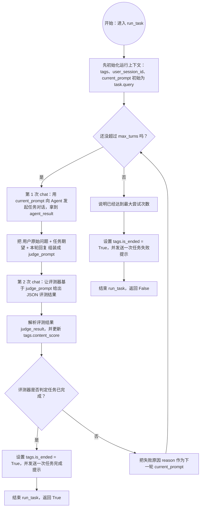
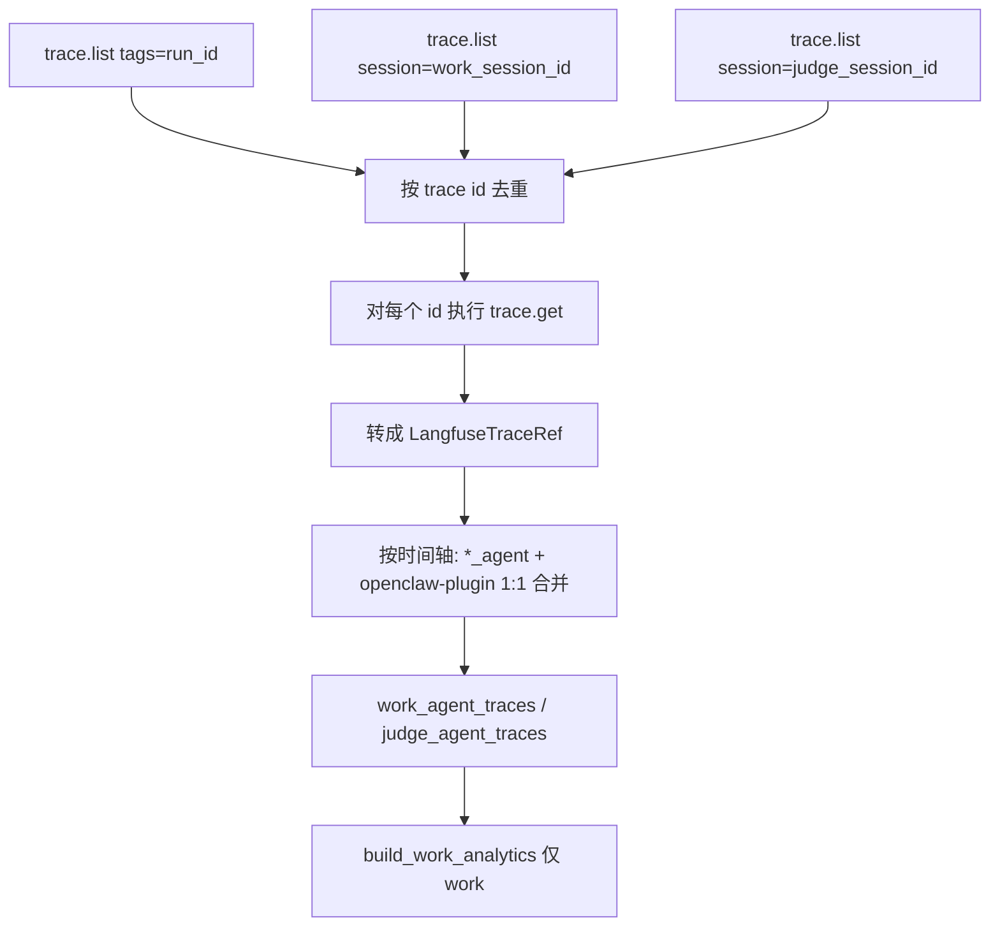

# evolve_eval

一个用于运行 benchmark task 并做循环评测的 Python 项目，当前支持 `hermes` 和 `openclaw` 两种 agent framework。

## 1. 环境准备

- Conda（Miniconda/Anaconda 任一）
- 可用的 `hermes` CLI（项目会调用 `hermes gateway restart` 和 `hermes gateway`）
- 可用的 `openclaw` CLI（使用 `openclaw` framework 时需要；若用 Langfuse 观测，需用 `openclaw plugins install` 注册 `langfuse-tracer`，见下文「OpenClaw 说明」）
- 可访问的 Hermes OpenAI 兼容服务（默认 `http://localhost:8642/v1`）

## 2. 安装依赖

创建并激活 conda 环境：

```bash
conda create -n evolve_eval python=3.12
conda activate evolve_eval
```

在项目根目录安装依赖：

```bash
pip install -r requirements.txt
```

## 3. 配置环境变量

项目通过 `src/config.py` 使用 `python-dotenv` 读取根目录 `.env`。

请在项目根目录创建（或修改）`.env`：

```env
HERMES_API_KEY=your_api_key
HERMES_ENV_FILE=~/.hermes/.env
OPENCLAW_ENV_FILE=~/.openclaw/.env
MODEL_NAME=provider/model_name
EVAL_MAX_TURNS=10

# Langfuse（langfuse_report.py / pre-chat 上报，见第 7 节）
LANGFUSE_PUBLIC_KEY=pk-lf-...
LANGFUSE_SECRET_KEY=sk-lf-...
LANGFUSE_HOST=http://your-langfuse-host:3050
```

说明：

- `HERMES_API_KEY`：调用 Hermes OpenAI 接口所需
- `HERMES_ENV_FILE`：Hermes 的 env 文件路径，程序会写入 `FORNAX_UDF_TAGS`
- `OPENCLAW_ENV_FILE`：OpenClaw 的 env 文件路径，程序会写入 `FORNAX_UDF_TAGS`
- `MODEL_NAME`：`openclaw agents add --model` 使用的模型名，必须填写为 `provider/model_name` 格式，例如 `anthropic/claude-sonnet-4-20250514`
- `EVAL_MAX_TURNS`：`run_task` 最大尝试轮次（默认 10）

> 注意：路径中的 `~` 在代码里会自动展开。

## 4. benchmark 数据格式

运行入口默认读取：

- `assets/benchmarks/benchmark1.json`

其中至少需要：

- 顶层 `name / categories / tasks`
- 每个 task 包含 `query / expected_result`


## 5. 运行

在项目根目录执行：

```bash
python main.py --framework openclaw
```

或：

```bash
python main.py --framework hermes
```

参数说明：

- `--framework`：选择 agent framework，可选值为 `openclaw` 或 `hermes`
- 默认值是 `openclaw`

程序会：

1. 读取 `assets/benchmarks/benchmark1.json`
2. 遍历 benchmark 中的 task
3. 对每个 task 依次执行 `baseline` 和 `evolved` 两轮评测
4. 根据 `--framework` 创建 `OpenClawAgent` 或 `HermesAgent`
5. 执行 `run_task` 循环评测并输出日志

### run_task 流程图



### run_task 自然语言说明（chat 表示一轮对话）

`run_task` 会先初始化 `tags`、`user_session_id` 和 `current_prompt`（初始为 `task.query`），然后最多循环 `max_turns` 次。

每次循环里会发生两次 `chat`：

1. 第一次 `chat`（任务对话）：用 `current_prompt` 向 agent 提问，得到本轮回复 `agent_result`
2. 第二次 `chat`（评测对话）：把用户原始问题、任务期望结果、本轮回复拼成评测提示词，让评测器返回 JSON 结果

拿到评测结果后会更新 `tags.content_score`：

- 如果 `success=True`：设置 `tags.is_ended=True`，再发送一次“任务完成”提示，函数返回 `True`
- 如果 `success=False`：把 `reason` 作为下一轮 `current_prompt`，继续循环

如果达到 `max_turns` 仍未成功：设置 `tags.is_ended=True`，发送一次“任务失败（超过最大尝试次数）”提示，函数返回 `False`。

## 6. OpenClaw 说明

当前仓库已经支持 `OpenClawAgent` 运行，但使用前需要确认本地 OpenClaw 环境可用：

- 已安装并可执行 `openclaw`
- `OPENCLAW_ENV_FILE` 已配置
- `MODEL_NAME` 已填写，且格式必须是 `provider/model_name`
- 若要将对话 trace 上报 Langfuse：请在项目根目录执行：

  ```bash
  ln -s "$(pwd)/langfuse-tracer" ~/.openclaw/extensions/langfuse-tracer
  openclaw plugins install --link "$(pwd)/langfuse-tracer"
  openclaw gateway restart
  ```

  安装后再在 `~/.openclaw/openclaw.json` 中为 `langfuse-tracer` 配置环境变量与 `hooks.allowConversationAccess` 等项，详见 `langfuse-tracer/index.js` 文件头部注释。需要刷新清单时可执行 `openclaw plugins registry --refresh`。

运行 `openclaw` framework 时，程序会：

1. 启用 `openclaw-fornax-trace` 插件
2. 启动 OpenClaw gateway
3. 创建 benchmark 专用 agent 和工作区
4. 使用 `openclaw agent --json --local` 发起对话
5. 在任务结束后调用 `chat.send` / `chat.history` 触发进化流程

如果只想跑 Hermes，可直接使用：

```bash
python main.py --framework hermes
```

如果只想跑 OpenClaw，可直接使用：

```bash
python main.py --framework openclaw
```

## 7. Evobench Report 与 Langfuse 串联

OpenClaw 评测跑完后会落盘一份 **轻量 report JSON**；可用 `langfuse_report.py` 从 Langfuse 拉全量 trace，合并 agent/plugin 并写入结构化字段（对话、token、工具、latency）。

### 7.1 评测时如何产生 report

`openclaw_main.py` 在每个 benchmark 跑完后写入：

```text
evobench-reports/{run_id}__{category}__{benchmark_name}.json
```

内容为 `OpenClawBenchmarkReport`（见 `src/models.py`），每个 task 包含：

- `baseline` / `evolved`：`work_session_id`、`judge_session_id`、`success`、`workspace_dir`
- 此时 **不含** Langfuse 详情，仅 session id 等元数据

`--test` 模式下只跑 baseline，不写 evolved。

### 7.2 Langfuse 环境变量

在 `.env` 中配置（`langfuse_report.py` 与 `src/report/langfuse_reporting.py` 共用）：

```env
LANGFUSE_PUBLIC_KEY=pk-lf-...
LANGFUSE_SECRET_KEY=sk-lf-...
LANGFUSE_HOST=http://your-langfuse-host:3050
# 或 LANGFUSE_BASE_URL（与插件侧一致）

# 可选：关闭每次 chat 前的 pre-chat span
EVAL_LANGFUSE_PRE_CHAT=true
```

评测运行时还会通过 `FORNAX_UDF_TAGS` / `emit_pre_chat_state` 上报 pre-chat span（name 为 `work_agent` / `judge_agent`）；插件 `langfuse-tracer` 在 `agent_end` 上报 `openclaw-plugin` trace（含 prompt/回复、工具 metadata、GENERATION usage）。

### 7.3 串联命令：`langfuse_report.py`

```bash
# 全量 task，输出到 stdout
python langfuse_report.py --report evobench-reports/evobench-runid-20260515-xxxx__Information_Search__benchmark1.json

# 写入 enriched JSON
python langfuse_report.py --report evobench-reports/....json --out enriched.json

# 只处理第 0 个 task
python langfuse_report.py --report evobench-reports/....json --task 0 --out enriched.json

# 仅打印摘要（轮次、token、latency）
python langfuse_report.py --report evobench-reports/....json --print-summary
```

每个 phase 会调用 `stitch_phase_langfuse_traces`，在对应 `baseline` / `evolved` 上填充 `langfuse` 字段。

### 7.4 采集与合并流程



说明：

| 步骤 | 作用 |
|------|------|
| `trace.list` | 发现 trace id；列表接口 **无** token，仅有 latency 等粗字段 |
| `trace.get` | 拉取 input/output/metadata、子 observation 的 **usage（token）** |
| 1:1 合并 | 每条 `work_agent` / `judge_agent` 行吸收紧随其后的 `openclaw-plugin` |
| `work_analytics` | 仅统计 **work** 侧（judge 模拟用户反馈，不参与全局 token 汇总） |

### 7.5 输出结构（`phase.langfuse`）

**`work_agent_traces` / `judge_agent_traces`**（每轮对话一条，已合并 plugin）：

| 字段 | 含义 |
|------|------|
| `id` | pre-chat agent trace id |
| `plugin_trace_id` | 配对的 `openclaw-plugin` trace id |
| `agent_input` | Fornax 全量字段（run、task、task_query、content_reqs 等） |
| `plugin_prompt` / `plugin_response` | 当轮用户 prompt / assistant 回复 |
| `plugin_metadata` | success、message_count、tool_roundtrips、tool_call_blocks 等 |
| `tokens` | 来自 plugin trace 的 GENERATION usage |
| `latency_seconds` | 来自 plugin trace 的 latency（秒） |

**`work_analytics`**（仅 work）：

| 字段 | 含义 |
|------|------|
| `trace_chain` | 与 `work_agent_traces` 一一对应；每轮仅 `input` / `output` / `latency_seconds`（对话可读） |
| `chat_turns` | 每轮 `agent_trace_id`、`plugin_trace_id`、`stats`（token + 工具） |
| `global_stats` | 各轮 token/工具合计 |
| `total_latency_seconds` | 各轮 latency 之和 |

### 7.6 代码模块（`src/report/`）

| 文件 | 职责 |
|------|------|
| `langfuse_reporting.py` | 每次 chat 前 `emit_pre_chat_state`（Fornax tags → span input） |
| `langfuse_trace_stitch.py` | 入口：`stitch_phase_langfuse_traces` |
| `langfuse_trace_fetch.py` | `trace.get`、解析 observation、生成 `LangfuseTraceRef` |
| `langfuse_trace_merge.py` | 按时间将 agent 与 plugin 合并为单条 turn |
| `langfuse_trace_parse.py` | 结构化 `agent_input` / `plugin_metadata` |
| `langfuse_work_analytics.py` | 生成 `trace_chain`、`chat_turns`、`global_stats` |

插件实现见仓库根目录 `langfuse-tracer/`。
