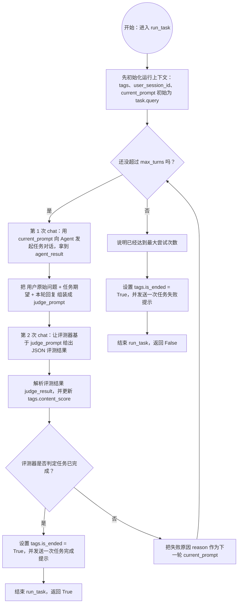

# evolve_eval

一个用于运行 benchmark task 并做循环评测的 Python 项目，当前支持 `hermes` 和 `openclaw` 两种 agent framework。

## 1. 环境准备

- Conda（Miniconda/Anaconda 任一）
- 可用的 `hermes` CLI（项目会调用 `hermes gateway restart` 和 `hermes gateway`）
- 可用的 `openclaw` CLI（使用 `openclaw` framework 时需要）
- 可访问的 Hermes OpenAI 兼容服务（默认 `http://localhost:8642/v1`）

## 2. 安装依赖

创建并激活 conda 环境：

```bash
conda create -n evolve_eval python=3.12
conda activate evolve_eval
```

在项目根目录安装依赖：

```bash
pip install -r requirements.txt
```

## 3. 配置环境变量

项目通过 `src/config.py` 使用 `python-dotenv` 读取根目录 `.env`。

请在项目根目录创建（或修改）`.env`：

```env
HERMES_API_KEY=your_api_key
HERMES_ENV_FILE=~/.hermes/.env
OPENCLAW_ENV_FILE=~/.openclaw/.env
MODEL_NAME=provider/model_name
EVAL_MAX_TURNS=10
```

说明：

- `HERMES_API_KEY`：调用 Hermes OpenAI 接口所需
- `HERMES_ENV_FILE`：Hermes 的 env 文件路径，程序会写入 `FORNAX_UDF_TAGS`
- `OPENCLAW_ENV_FILE`：OpenClaw 的 env 文件路径，程序会写入 `FORNAX_UDF_TAGS`
- `MODEL_NAME`：`openclaw agents add --model` 使用的模型名，必须填写为 `provider/model_name` 格式，例如 `anthropic/claude-sonnet-4-20250514`
- `EVAL_MAX_TURNS`：`run_task` 最大尝试轮次（默认 10）

> 注意：路径中的 `~` 在代码里会自动展开。

## 4. benchmark 数据格式

运行入口默认读取：

- `assets/benchmarks/benchmark1.json`

其中至少需要：

- 顶层 `name / categories / tasks`
- 每个 task 包含 `query / expected_result`


## 5. 运行

在项目根目录执行：

```bash
python main.py --framework openclaw
```

或：

```bash
python main.py --framework hermes
```

参数说明：

- `--framework`：选择 agent framework，可选值为 `openclaw` 或 `hermes`
- 默认值是 `openclaw`

程序会：

1. 读取 `assets/benchmarks/benchmark1.json`
2. 遍历 benchmark 中的 task
3. 对每个 task 依次执行 `baseline` 和 `evolved` 两轮评测
4. 根据 `--framework` 创建 `OpenClawAgent` 或 `HermesAgent`
5. 执行 `run_task` 循环评测并输出日志

### run_task 流程图



### run_task 自然语言说明（chat 表示一轮对话）

`run_task` 会先初始化 `tags`、`user_session_id` 和 `current_prompt`（初始为 `task.query`），然后最多循环 `max_turns` 次。

每次循环里会发生两次 `chat`：

1. 第一次 `chat`（任务对话）：用 `current_prompt` 向 agent 提问，得到本轮回复 `agent_result`
2. 第二次 `chat`（评测对话）：把用户原始问题、任务期望结果、本轮回复拼成评测提示词，让评测器返回 JSON 结果

拿到评测结果后会更新 `tags.content_score`：

- 如果 `success=True`：设置 `tags.is_ended=True`，再发送一次“任务完成”提示，函数返回 `True`
- 如果 `success=False`：把 `reason` 作为下一轮 `current_prompt`，继续循环

如果达到 `max_turns` 仍未成功：设置 `tags.is_ended=True`，发送一次“任务失败（超过最大尝试次数）”提示，函数返回 `False`。

## 6. OpenClaw 说明

当前仓库已经支持 `OpenClawAgent` 运行，但使用前需要确认本地 OpenClaw 环境可用：

- 已安装并可执行 `openclaw`
- `OPENCLAW_ENV_FILE` 已配置
- `MODEL_NAME` 已填写，且格式必须是 `provider/model_name`

运行 `openclaw` framework 时，程序会：

1. 启用 `openclaw-fornax-trace` 插件
2. 启动 OpenClaw gateway
3. 创建 benchmark 专用 agent 和工作区
4. 使用 `openclaw agent --json --local` 发起对话
5. 在任务结束后调用 `chat.send` / `chat.history` 触发进化流程

如果只想跑 Hermes，可直接使用：

```bash
python main.py --framework hermes
```

如果只想跑 OpenClaw，可直接使用：

```bash
python main.py --framework openclaw
```
