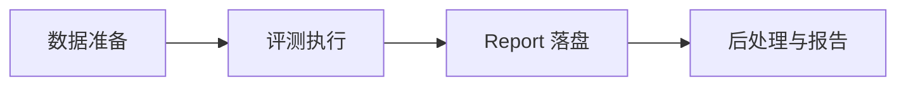
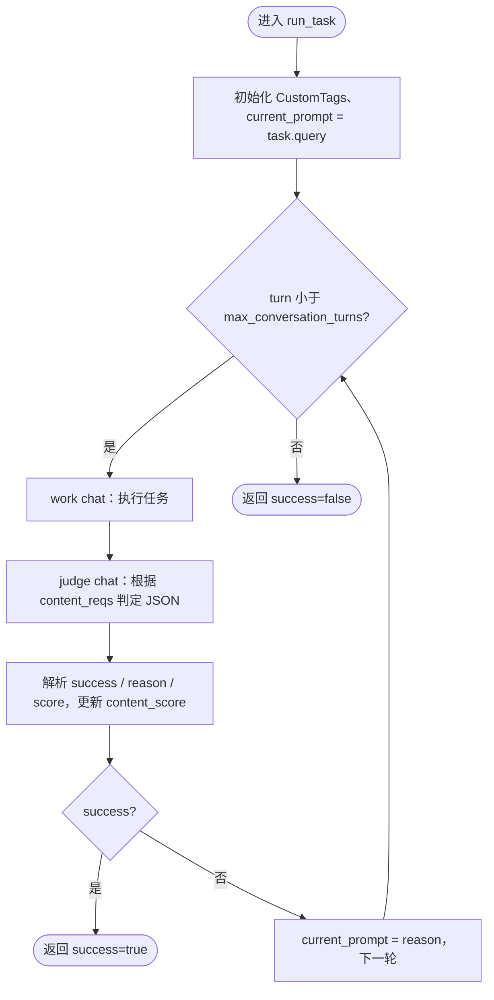
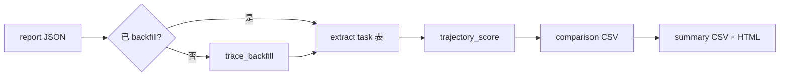

# 评测流程说明

本文描述 evolve_eval 的**抽象评测流程**：从数据准备、执行编排、结果落盘到后处理指标，不区分具体 agent 运行时实现。

主实现入口为 [`src/cli/lift_main.py`](../src/cli/lift_main.py)（LIFT 容器协议）。宿主机直跑旧栈见 [legacy/README.md](../legacy/README.md)。

---

## 1. 概述

evolve_eval 用于评测 **self-evolving agent**：在 hold-out final task 上对比 **产物未加载 / 已加载**（LIFT），由 judge 模拟用户反馈驱动多轮执行；report 中 `baseline` / `evolved` 表示加载状态对照，而非某种固定进化实现名称。

一次命令行 invocation 对应一次 **eval run**：

- 一个 `run_id`（形如 `lift-runid-{后缀}` 或自定义后缀）
- 一份 **report JSON**（`results/{run_id}/report.json`）：执行期写入评测结果；`PhaseRun.langfuse` 通常在后处理 **trace_backfill** 时再填
- 可选一套 **后处理产物**（trace_backfill 后的 JSON、对比 CSV、汇总 CSV、HTML 报告；`*_backfilled.json`）

---

## 2. 术语与层级

| 术语 | 含义 | 示例 | 模型 / CLI |
|------|------|------|------------|
| **eval run** | 一次完整评测 invocation | `python -m src.cli.lift_main ...` | `EvalReport`；`--run_id` |
| **repeat** | `--repeat` 的一轮完整执行 | 第 2 次 `--repeat 3` | `EvalReport.runs[]` → `EvalRepeat` |
| **suite** | 一份规格 JSON 文件 | `hello.json` | `SuiteSpec`；`--suite`；report 里 `SuiteRun` |
| **task** | suite 内 `tasks[]` 的一条 | `Q1`、`Q2` | `SuiteTask`；report 里 `TaskRun` |
| **phase** | 单个 task 的一次 baseline 或 evolved 执行 | baseline / evolved | `PhaseRun` |
| **benchmark_dir** | 存放多个 suite JSON 的目录 | `assets/benchmarks` | `--benchmark_dir` |

### 2.1 Report 层级

```
EvalReport（一次 eval run，一份 report JSON）
  └── runs[]（EvalRepeat，--repeat 的一轮）
        └── suites[]（SuiteRun，一个 suite 的结果）
              └── tasks[]（TaskRun，hold-out 题）
                    ├── baseline（PhaseRun）
                    └── evolved（PhaseRun，未跑时为 null）
```

### 2.2 Suite 源数据层级

```
--benchmark_dir（目录）
  └── suite（一个 *.json，SuiteSpec）
        └── task（JSON 内的 Q1、Q2…，SuiteTask）
```

每个 `SuiteTask` 至少包含：

- `query`：交给 work agent 的任务描述
- `requirements`：技能目录、材料目录等
  - `extra_skills_dir`：任务级自定义技能目录；由 runtime adapter 挂载/加载到对应 agent 的 skills 搜索路径
- `expected_result.content_reqs`：内容质量判定依据（judge 使用）
- `expected_result.trajectory_reqs`：轨迹质量判定依据（后处理 trajectory judge 使用）

---

## 3. 端到端流水线



| 阶段 | 做什么 | 入口 |
|------|--------|------|
| **数据准备** | 从 TOS 下载 `benchmark_mds.zip` 并转为 suite JSON | `python -m src.cli.preprocess` → `src/preprocess/benchmark_mds_fetch.py` + `convert_suite_mds_to_json.py` |
| **评测执行** | LIFT 编排：warmup 产 Δ → hold-out 对照 → 写 report | `python -m src.cli.lift_main -r openclaw` |
| **Report 落盘** | 执行期 JSON（先填 success/score/session 等；trace 后填） | `EvalReport.write_json` → `results/{run_id}/report.json` |
| **后处理** | trace_backfill、抽指标、trajectory 打分、出报告 | `src/postprocess/run_post_process.py`（默认随 `-e` 触发） |

> **注意**：benchmark 预处理与 LIFT 执行**已解耦**。`lift_main` 不会自动跑 preprocess。冒烟用 `assets/benchmarks_demo/hello.json`（`--benchmark_dir assets/benchmarks_demo`）；完整 benchmark 的 `assets/benchmark_mds/` 与 `assets/benchmarks/` 不纳入 git，需先执行 `python -m src.cli.preprocess`（默认 `--benchmark_dir assets/benchmarks`）。

---

## 4. 主流程：LIFT（Loaded Impact on Final Task）

框架的**目标评测协议**是 LIFT：在 hold-out final task 上，比较 **产物未加载** 与 **产物已加载** 两种状态下 agent 的表现。

```text
ArtifactPolicy（默认：跑 Q1..Q_{n-1} 产生产物）→ UpdateArtifact（Δ 镜像）
       ↓
final @ before-load（control）  → PhaseRun  → report.baseline
final @ after-load（treatment） → PhaseRun  → report.evolved
```

- **写入 report**：每个 **holdout_tasks** 题各一条 `TaskRun`（`baseline` + `evolved` 两个 `PhaseRun`）。warmup / hold-out 在 suite JSON 中由 `warmup_tasks` / `holdout_tasks` 显式给出（对应 benchmark ``train/`` / ``test/``）。
- **warmup 结果**：`Q1..Q_{n-1}` 用于产生产物，一般**不进 report**（仅日志）；产物固化进 **delta 镜像**（`docker commit`）。
- **final 的 before-load**：干净 base 镜像起**新容器**（无 Δ）。
- **final 的 after-load**：从 warmup 后 commit 的 **Δ 镜像**起**新容器**；多道 hold-out **共用 Δ、workspace 按题隔离**。
- **清理**：每个 suite 评测结束 `SuiteRunResources.cleanup()` 删除容器与 Δ 镜像。

### 4.1 环境模型（`src/lift/`）

```text
warmup（默认 parallel_single：同容器并发；可切 serial_single / parallel_multi）→ evolve → docker commit → DeltaRef (Δ 镜像)
对每个 hold-out 题 Q_h：
  before-load: docker run base_image + workspace_h → PhaseRun → destroy
  after-load:  docker run Δ_image + workspace_h   → PhaseRun → destroy
repeat 之间默认并行；每 suite 独立 Δ 与 `SuiteRunResources` 登记簿。
```

入口：

```bash
python -m src.cli.lift_main -r openclaw --benchmark_dir assets/benchmarks_demo --suite hello.json --run_id my-run
```

详见 [lift-framework-guide-cn.md](./lift-framework-guide-cn.md)。

容器 Agent 的**模型配置契约**（镜像内注册 provider/model，运行时 `.env` `MODEL_NAME` 选用）见 [§12.6](./eval-flow.md#126-agent-模型配置契约lift--容器运行时)。

### 4.2 Legacy 宿主机模式（非主入口）

旧栈 `legacy/openclaw_main.py` 使用 `--mode exam`（语义等同 LIFT）或 `--mode replay`（全 suite 双遍，**遗留**）。新开发与复现应使用 `src/cli/lift_main.py`。

| | **LIFT（`src`，目标）** | **replay（`legacy`，遗留）** |
|---|------------------------|------------------------------|
| 评测焦点 | 仅 hold-out **final** 的加载对照 | **全部** task 进化前后各跑一遍 |
| 产物阶段 | warmup 产 Δ 镜像 | 全 suite baseline 后一次 evolve |
| report | 通常每 suite 若干 hold-out `TaskRun` | 每题一条 `TaskRun` |
| 科学问题 | 产物对 final 是否有效 | 每题进化幅度（诊断用） |

### 4.3 Warmup 容器策略（`WarmupContainerPolicy`）

`§4.1` 给出的是 warmup 默认策略（`parallel_single`），LIFT 在 [`src/lift/policies/container.py`](../src/lift/policies/container.py) 中以枚举显式表达 warmup **容器编排维度**的三种策略。CLI 通过 `--warmup-container-policy` 选择；该枚举仅决定容器数量与是否并发，**evolve 产物的去向（commit 镜像 vs 写外部系统）由 adapter 类型决定**。

| 枚举值 | 容器数 | 题级并发 | 适用 adapter 形态 |
|--------|--------|----------|--------------------|
| `serial_single` | 1（共享） | 否（顺序） | 单容器 commit 镜像类（`ContainerAgentRuntimeAdapter` 默认） |
| `parallel_single`（默认） | 1（共享） | 是（同容器 `asyncio.gather`） | 同上；适合 runtime 可并发处理多 session 的场景 |
| `parallel_multi` | N（每题一个） | 是 | 群体记忆 / 外部产物类（`GroupMemoryAdapterMixin`） |

**delta 形态由 adapter 决定，不由本枚举决定：**

```text
ContainerAgentRuntimeAdapter（serial_single / parallel_single）：
  warmup（共享容器，多题串行或并发）→ evolve_after_warmup（容器内）→ docker commit → DeltaRef(owned=True)
  hold-out evolved：docker run delta_image

GroupMemoryAdapterMixin（必须 parallel_multi）：
  warmup（多容器并行，每题一个，模拟多用户）→ evolve_after_task per-container（默认 no-op）
                                              → DeltaRef(image_tag=base_image, owned=False)
  hold-out evolved：docker run base_image，runtime 在 load_state=EVOLVED 时注入群体记忆配置
```

**何时选哪种：**

- runtime 的 evolve 产物**能 commit 进镜像**（如 OpenClaw 的 `learn review` 写入容器文件系统）→ `serial_single`（默认）或 `parallel_single`（同容器并发提速）
- runtime 的 evolve 产物**在容器外**（如群体记忆服务、远端向量库）→ 选用 `GroupMemoryAdapterMixin` 系列 adapter（如 `multi_user_openclaw`），并使用 `parallel_multi`（adapter 默认会自动覆盖到此值）
- 需要"模拟多用户"语义 → `parallel_multi` + 群体记忆 adapter（`serial_single` 多题共享 agent 状态，会污染"独立用户"假设）

### 4.4 Hold-out 容器策略（`HoldoutContainerPolicy`）

hold-out 与 warmup 的容器维度不同：每道 hold-out 题必须用独立容器（baseline 与 evolved 镜像分裂、避免状态污染），所以本枚举不提供"单容器"形态，只决定**多题之间是否并发**。

| 枚举值 | 容器数 | 题级并发 | 适用场景 |
|--------|--------|----------|----------|
| `serial_multi` | N（每题独立） | 否（顺序） | 调试单题、严格按题顺序产出 trace |
| `parallel_multi`（默认） | N（每题独立） | 是（`asyncio.gather`） | 加速大量 hold-out 题；docker / runtime 资源足够时建议默认 |

**与 warmup 的差别**：

- warmup 关心"产物如何累积"，所以容器维度有 single / multi 之分；
- hold-out 只做对照评估，每题镜像分裂强制多容器，没有共享意义；
- 同题内 baseline / evolved 默认 **并行** 执行（两者镜像/workspace 子目录互不依赖），可用 `--holdout-phase-policy serial` 退回串行；本枚举只控制**多题之间**。

**实现位置**：[`LIFTPipeline._run_holdout_tasks`](../src/lift/pipeline/lift_pipeline.py)。

### 4.5 并发模型与限制

LIFT 在多个维度可以并行；下表汇总**默认行为、控制方式与已知限制**，完整的代码索引见 [`lift_pipeline.py`](../src/lift/pipeline/lift_pipeline.py) 与 [`task_exec.py`](../src/lift/eval/task_exec.py)。

| 维度 | 默认 | 控制方式 | 备注 |
|------|------|----------|------|
| repeat 之间 | 并行 | `--max-parallel-repeats=1` 串行；`>1` 限并发上限 | repeat 之间不共享 delta 镜像，互不阻塞 |
| 同 repeat 内多个 suite | **并行（默认上限 3）** | `--max-parallel-suites`（默认 `3`；`1` 串行；`<=0` 无上限） | 每个 suite 独立 `SuiteRunResources`（容器 + delta 镜像），互不干扰；失败隔离见下文 |
| warmup 题 | 并行（同容器） | `--warmup-container-policy`（见 §4.3）；`--max-concurrent-tasks` | 容器形态由 policy 决定 |
| hold-out 多题之间 | 并行（多容器） | `--holdout-container-policy serial_multi` 串行（见 §4.4）；`--max-concurrent-tasks` | 每题独立容器强制 |
| 单 hold-out task 内 baseline ↔ evolved | **并行（默认）** | `--holdout-phase-policy serial` 退回串行 | 两 phase 镜像/workspace 子目录互不依赖；并行后单 task 内同时存活 2 容器 |
| 同 task 内 work agent ↔ judge agent | 看 runtime | — | 由 `worker_judger_factory` 实现细节决定 |

**`--max-concurrent-tasks` 作用域**：

- 限制的是**单个 phase 内并发执行的 task 数**（asyncio Semaphore），由 [`bounded_gather`](../src/lift/eval/task_exec.py) 实现。
- warmup 阶段与 hold-out 阶段**各自持有一个独立的 Semaphore**，不是跨阶段全局上限。
- **不限制单个 task 内部启动的容器数**——例如 `parallel_multi` 下每个 warmup task 起 1 个容器、`max_concurrent_tasks=4` 时同时存活上限是 4 个 warmup 容器。
- **不跨 repeat / suite 共享**——多个 repeat 并发执行时，每个 repeat 各自的 phase 独立计数。

**已知限制**（如需突破再做扩展）：

1. **`--max-concurrent-tasks` 仅在 phase 级生效**：默认 `--holdout-phase-policy parallel` 下，单 task 内会同时启 baseline + evolved 两容器，但 Semaphore 只在 task 维度计数；`max_concurrent_tasks=4` 时 hold-out 容器数最高可达 8，需要硬上限请配合 `--holdout-phase-policy serial` 或下调 `--max-concurrent-tasks`。
2. **warmup → hold-out 之间被 `evolve_after_warmup` 阻塞**：hold-out 必须等 evolve 完成才能起容器，期间宿主机资源闲置。
3. **跨 repeat / suite 没有容器级全局上限**：`--max-parallel-repeats` / `--max-parallel-suites` 限的是协程数，不是容器数；总峰值容器数 ≈ `并发 repeat 数 × 并发 suite 数 × max_concurrent_tasks × (phase 并行?2:1)`。例如 `repeat=4 × suites=3 × max_concurrent_tasks=4 × holdout-phase-policy=parallel` 同时跑，宿主机可见容器数会非常大，需结合 §4.6 资源约束与并发上限一起设。
4. **OpenClaw 容器宿主机端口**：现已改为 `docker run -p <container_port>` 由 docker 在临时端口段自动分配，启动后通过 `docker inspect` 把真实端口回填到 `ContainerSession.published_ports`；旧的 instance_id hash slot 方案已废弃，避免并行容器端口碰撞。

**suite 级失败隔离与重跑**（[`_run_suites`](../src/lift/pipeline/lift_pipeline.py)）：

- 同 repeat 内的并发 suite 用 `bounded_gather(..., return_exceptions=True)`，**单个 suite 抛异常不会取消其余 suite**（避免 fail-fast 拖垮整个 run，丢失其它 suite 已完成的工作）。
- 首轮失败的 suite 会被收集起来**放到队列最后重跑一次**；重跑仍失败则记录 `suite failed after retry` 并在报告里保留 `None` 占位（该 suite 缺最终结果，其余 suite 正常落盘）。
- 报告顺序稳定：`repeat_run.suites` 先按输入顺序占位，再由各 suite 协程按索引回填，不随完成时间错乱。

### 4.6 容器资源约束与运维（Colima / Docker VM）

并发会按上一节公式放大**同时存活的容器数**。在资源受限的本地 Docker VM（macOS 上的 Colima / Docker Desktop）上，峰值容器一旦超过 VM 内存会触发 **OOM kill 或整机卡死**，典型症状：hold-out 报 `container ... is not running` / `Failed to list agents in container`、`docker ps -a` 显示 `Exited (137)`。`colima ssh -- sudo dmesg | grep -i oom` 区分 `global_oom`（VM 总内存耗尽）/ `Memory cgroup out of memory`（撞 `--memory` 上限）。

> **实测教训**：单个 OpenClaw 容器是 node/V8 多进程，常驻峰值可能超过 3g。`--container-memory 3g` 反而会让正常推理被 cgroup OOM-kill（`constraint=CONSTRAINT_MEMCG`）。**默认不设单容器上限**，把内存交给 VM 内核统一调度（溢出落 swap）。

**两道防线：**

1. **单容器上限**（默认均不设）：`--container-memory` / `--container-cpus` 透传 `docker run --memory` / `--cpus`；仅在需要 cgroup 硬隔离时才设（且要给足，如 `5~6g`）。
2. **VM 总资源**：物理 16GB/10 核的 Mac 建议 `colima start --cpu 8 --memory 12 --disk 60`，**不要 overcommit 超过物理内存**；需要瞬时缓冲在 guest 内加 swapfile（`fallocate -l 8G /swapfile && mkswap && swapon`）。agent 推理走线上 API，容器只跑 gateway + 插件 + 文件 IO，swap 命中时性能影响有限。

**容器名冲突自愈**（[`ContainerSession.start`](../src/lift/adapters/container/session.py)）：warmup 容器名是确定性的；若上一次同名容器残留 + 启动时预删抖动失败，会强制再删一次后重试，使 suite 队尾重跑不会因残留容器直接失败。

**调参建议**：先用默认（不限单容器内存）+ `--max-parallel-suites` 控制并发；若 `Exited (137)` 出现，优先**下调 `--max-parallel-suites` / `--max-concurrent-tasks`**，再考虑扩 VM 内存 / swap。

### 4.7 异常处理与重试矩阵

LIFT 框架在不同层级对异常采取**就地重试一次 + 同级隔离**的组合策略：让"瞬时抖动 / provider 抖动 / 容器抖动"在最近的层级吸收掉，同时保证一颗节点失败不会拖垮整个 run。下表汇总各层级当前的重试与隔离行为（自底向上）。

| 层级 | 异常类型 | 重试 | 同级隔离 | 失败上抛后果 | 实现 |
|------|----------|------|----------|--------------|------|
| **chat** | LLM provider 错误（超时 / 限流 / `LLM request timed out`） | **5 次**用原始 prompt 原地重试，**不**新发 pre-chat span | — | 抛 `RuntimeError("provider error: ...")`，由外层 task 重试接管 | `_judge_with_retry` / `_work_chat_with_provider_retry`（[run_task.py](../src/lift/eval/run_task.py)） |
| **chat** | judge 返回非 JSON / 解析失败 | **8 次**用 retry prompt 重发；判 provider 错误优先（避免误判） | — | 抛 `ValueError("Judge response is not valid JSON")` | `_judge_with_retry`（[run_task.py](../src/lift/eval/run_task.py)） |
| **turn** | `judge.success=False` | run_task 内 work↔judge 多轮（`--max-conversation-turns`，默认 5）；judge fail **不抛异常** | — | 跑满后 `success=False` + 最后一轮 score 正常返回，**不视为失败** | `run_task`（[run_task.py L297-L343](../src/lift/eval/run_task.py#L297-L343)） |
| **task（单题）** | `execute_task` 抛异常（如容器崩、agent runtime 异常） | **原地重试 1 次**（重新拿 factory、重新 run_task） | 由调用方决定 | 二次仍失败抛出，进入上层 phase / warmup 路径 | `execute_tasks` 的 `retry_each=True`（[task_exec.py L153-L194](../src/lift/eval/task_exec.py#L153-L194)） |
| **phase（baseline / evolved）** | hold-out 单 phase 抛异常（`run_before_load` / `run_after_load`） | **原地重试 1 次**（重新起 hold-out 容器） | `parallel` 时 `asyncio.gather(return_exceptions=True)` ⇒ baseline ↔ evolved 互不连坐 | 二次仍失败 → task 标 failed | `_run_phase` / `_one_task`（[lift_pipeline.py L404-L477](../src/lift/pipeline/lift_pipeline.py#L404-L477)） |
| **task（hold-out）** | 单题最终失败（baseline 或 evolved 二次失败） | — | `tasks_parallel`：`bounded_gather(return_exceptions=True)`；串行：`try/except` 跳过 | 该 task 不写入 `suite_run.tasks[]`，其余 task 正常落盘 | `_run_holdout_tasks`（[lift_pipeline.py L515-L532](../src/lift/pipeline/lift_pipeline.py#L515-L532)） |
| **task（warmup，base 路径）** | 单题最终失败 | task 层已 `retry_each` 一次 | `bounded_gather(return_exceptions=True)`，单题失败不取消兄弟题 | 该 warmup 题被跳过；不影响后续 evolve_after_warmup / commit delta | `execute_tasks(tasks_isolated=True)`（[base.py L100-L113](../src/lift/adapters/base.py#L100-L113)） |
| **task（warmup，GroupMemory 路径）** | 单题独立容器抛异常 | **原地重试 1 次**（重启容器、重跑该题） | `bounded_gather(return_exceptions=True)`，题间隔离 | 该 warmup 题被跳过；其余题独立容器照常运行 | `_run_warmup_in_isolated_container`（[mixin.py L126-L174](../src/lift/adapters/group_memory/mixin.py#L126-L174)） |
| **suite** | 单 suite 抛异常（warmup / hold-out / produce_delta 任一阶段未捕获的失败） | **首轮失败队尾重跑 1 次** | 同 repeat 内并发 suite 用 `bounded_gather(return_exceptions=True)`，单 suite 失败不取消其它 suite | 二次仍失败 → 报告里该 suite 对应位置保留 `None` 占位（其它 suite 完整落盘） | `_attempt` + 队尾重跑（[lift_pipeline.py L167-L220](../src/lift/pipeline/lift_pipeline.py#L167-L220)） |
| **repeat** | 单 repeat 抛异常 | — | repeat 之间默认并行（`bounded_gather` 默认 `return_exceptions=False`，**未启用隔离**） | 当前会 fail-fast 取消其他 repeat | `LIFTPipeline.run`（[lift_pipeline.py L99-L114](../src/lift/pipeline/lift_pipeline.py#L99-L114)） |

#### 4.7.1 状态事件契约（对应 dashboard / TUI）

每一层重试 / 失败都会通过 `status_events.emit_stage(detail=...)` 把异常摘要透出来，便于 dashboard hover / TUI 红框面板观察。摘要由 [`exc_summary`](../src/lift/eval/task_exec.py#L19-L31) 把 `Exception` 压成 `"<ClassName>: <first line>"` 单行；`asyncio.CancelledError` 单独标记为 `"CancelledError: cancelled by sibling failure"`，区分"自身失败"和"被兄弟节点 fail-fast 牵连"。

| 状态 | 触发时机 | detail 内容 |
|------|----------|-------------|
| `running` | 每次 attempt 开始 | — |
| `retrying` | 首次失败、即将重试 | `retry after: <exc_summary>` |
| `done` | 成功；或 judge fail（`judge fail (score=0.42)`） | judge fail 时携带 score |
| `failed` | 最终失败（重试已耗尽） | `<exc_summary>` |

适用维度：`kind=warmup_task` / `phase` / `task` / `suite`。

#### 4.7.2 设计取舍说明

- **`judge.success=False` 不视为失败**：judge 是"模拟用户反馈"，跑满 turns 后返回 `success=False` 是正常评测信号，不应触发重试浪费 LLM 配额；phase 仍 emit `done`，detail 携带 score。
- **重试只在最近一层 + 每层一次**：让"瞬时错误"被吸收，"持续性错误"快速暴露；chat 层 provider 重试 5 次因 LLM 抖动样本量更大。
- **同级隔离普遍 `return_exceptions=True`**：避免兄弟节点 fail-fast 牵连；尤其 phase parallel 必须用——历史踩过坑（baseline 跑了 90% 被 evolved 异常取消）。
- **provider 重试不 emit pre-chat span**：见 [§12.5.6](#1256-provider-错误重试--扩展贪心配对跨-runtime-通用)，与配对算法相耦合。
- **repeat 层暂未隔离**：repeat 之间不共享 delta，单 repeat 异常通常是环境级问题（docker / Langfuse 整体不可用），fail-fast 更易暴露根因；如需更强容错可在 [`LIFTPipeline.run`](../src/lift/pipeline/lift_pipeline.py#L99-L114) 切到 `return_exceptions=True`。

#### 4.7.3 不进入框架重试的失败模式

下列情况框架**不会**自动重试，依赖运维 / 调用方处理：

| 失败模式 | 现状 | 建议处理 |
|---------|------|----------|
| docker daemon 不可用 / VM OOM | 容器启动直接抛 `docker: ... is not running`，task / phase 重试也起不来 | §4.6 调 VM 内存 / `--max-parallel-suites` |
| Langfuse 不可达 | `emit_pre_chat_state` warning 不阻塞主流程；trace 后处理时拉不到数据 | 检查 `.env` / 网络；后处理可单独 retry |
| benchmark JSON 格式错 / 缺字段 | `load_lift_suite` 启动时直接抛 | 修正 suite JSON |
| `MODEL_NAME` 未在镜像注册 | `agents add --model` 报错 | §12.6 重建镜像或换已 bake 的模型 |
| 主进程被 kill / 机器重启 | report 落盘有节奏（每个 suite 完成都 write_json），但当前 suite 进度丢失 | 重新提交 run，已完成 suite 不会被重跑（设计上仍是新 run_id） |

---


## 5. 最小执行单元：`run_task`

每个 **phase** 对 **一个 task** 调用一次 `run_task`（定义于 [`src/lift/eval/run_task.py`](../src/lift/eval/run_task.py)）。无论 baseline 还是 evolved，内核相同。

### 5.1 输入与输出

**输入：**

- `SuiteTask`（query、expected_result 等）
- `run_id`、phase 标记（`is_evolve_turn`、`is_final_task`）
- work session 与 judge session（隔离两条对话链）
- `max_conversation_turns`（由 CLI `--max-conversation-turns` 设置，默认 5）

**输出（填入 `PhaseRun`）：**

- `success`：judge 是否判定任务完成
- `content_score`：judge 给出的 0–1 分数（最后一轮为准）
- `work_session_id` / `judge_session_id`
- `workspace_dir`：该 phase 使用的工作区路径

### 5.2 单 task 内循环



每一 **turn** 包含两次 chat：

1. **work chat**：work agent 根据 `current_prompt` 执行任务，产出 `agent_result`。
2. **judge chat**：评测器根据用户原题、`content_reqs` 与 `agent_result` 输出 JSON：`success`、`reason`、`score`。

若 `success=false` 且未达 `max_conversation_turns`，将 `reason` 作为下一轮 `current_prompt` 重试；若 judge 输出无法解析，会对 judge 侧有限次重试。

### 5.3 可观测性（CustomTags）

每次 chat 前会通过 `emit_pre_chat_state`（[`src/report/langfuse_reporting.py`](../src/report/langfuse_reporting.py)）上报 run、task、content_score、是否 final task / evolve turn 等字段，供 Langfuse 链路追踪；**不参与**任务成败判定逻辑。

与容器内 runtime trace 的**关联契约**（写入 / 检索 / 配对规则）见 [§12.5 trace_backfill](#125-trace_backfill观测)。

---

## 6. 一次 eval run 的编排顺序

以下为逻辑顺序；具体实现可能在 repeat 粒度并行，**不改变** warmup → hold-out 的先后约束。

```mermaid
flowchart TD
  A[preprocess 可选] --> B[解析 benchmark_dir + suite]
  B --> C[生成 run_id，创建 EvalReport]
  C --> D{repeat 0..N-1}
  D --> E[新建 EvalRepeat]
  E --> F{每个 suite}
  F --> G[LIFTPipeline]
  G --> H[warmup + evolve + commit Δ]
  H --> I[hold-out before/after load]
  I --> J[写入/更新 EvalReport JSON]
  J --> F
  F --> D
  D --> K{--evaluate?}
  K -->|是| L[后处理流水线]
  K -->|否| end([结束])
  L --> end
```

**始终串行的约束（单 suite 内）：**

- **产生产物（warmup + evolve）→ final before-load → final after-load**
- 同一 eval run：只有一个 `run_id`、一份 report 文件

编排实现：[`src/lift/pipeline/lift_pipeline.py`](../src/lift/pipeline/lift_pipeline.py)。

---

## 7. `--repeat` 与产物份数

| 产物 | 路径 | `--repeat N` 时的份数 |
|------|------|------------------------|
| `run_id` | — | **1 个** |
| Report JSON | `results/{run_id}/report.json` | **1 份**（内含 `runs[0..N-1]`） |
| Outcome workspace | `results/{run_id}/outcome/run-{i}/{phase}/{category}/` | **N 套**（i = 0..N-1） |
| 后处理输出 | `results/{run_id}/*_backfilled.json` 等 | **1 套**（汇总全部 repeat，CSV 含 `run` 列） |

若要 N 份独立 report，需执行 N 次命令（不同 `--run_id`），而不是依赖 `--repeat`。

---

## 8. 目录与 Report 内容

### 8.1 Report 是什么、怎么从 task 汇进来

**一次命令行 invocation = 一个 `run_id` = 一份 report JSON**（不是「一题一文件」）。

层级（内存里边跑边 append，结束时 `write_json` 一次写出）：

```text
EvalReport（run_id）
  └── runs[]                    ← --repeat 的第 1/2/3 轮
        └── suites[]            ← 本轮跑过的每个 suite JSON
              └── tasks[]       ← TaskRun（LIFT 下为 hold-out 题）
                    ├── baseline: PhaseRun   ← before-load 的一次 run_task
                    └── evolved:  PhaseRun   ← after-load 的一次 run_task
```

| 层级 | 含义 | 谁产生 |
|------|------|--------|
| **eval run** | 整次 CLI invocation | 顶层 `EvalReport` |
| **repeat** | `--repeat` 的一轮完整 LIFT | `EvalReport.runs[i]`（`EvalRepeat`） |
| **suite** | 一个 `*.json` 规格 | `SuiteRun` |
| **task（进 report）** | hold-out 题 | `TaskRun` |
| **phase** | 单题、单加载状态的一次执行 | `PhaseRun`（`baseline` 或 `evolved`） |

**LIFT 注意**：warmup 题会 `run_task`，但 **一般不写入** `suite_run.tasks[]`，只打日志；进 report 的是 hold-out 的 `baseline` + `evolved` 两个 `PhaseRun`。

路径：`results/{run_id}/report.json`

#### 执行期 vs 后处理：Report 分两阶段填

| 阶段 | 写入内容 | `PhaseRun.langfuse` |
|------|----------|---------------------|
| **执行期**（`run_task` 结束） | `success`、`content_score`、`work_session_id`、`judge_session_id`、`workspace_dir` | 一般为 **`null`** |
| **后处理**（`trace_backfill`） | 从 Langfuse 拉 trace 并 stitch | 填 **`PhaseLangfuseBundle`** |

#### `run_id` / `session_id` / `repeat` 各管什么

| 标识 | 作用 | 出现在哪 |
|------|------|----------|
| **`run_id`** | 标识**整次评测**；Langfuse pre-chat 的 tag `run` | `EvalReport.run_id`；`CustomTags.run` |
| **`repeat_index`** | 第几轮 repeat | report 树 `runs[i]`；**不**编码进 session_id |
| **`work_session_id` / `judge_session_id`** | 标识**这一次** `run_task` 的两条对话链 | 每个 `PhaseRun` |
| **suite / task 名** | 逻辑分组与配对键 | `SuiteRun` / `TaskRun.task_name` |

**trace_backfill** 对每个 `PhaseRun` 用 `run_id + work_session_id + judge_session_id` 拉 trace 并写回 `PhaseRun.langfuse`。

### 8.2 Outcome workspace

路径模式：

```text
results/{run_id}/outcome/run-{repeat_index}/
  warmup/{category}/              ← warmup 共用工作区
  baseline/{category}/{task}/   ← hold-out baseline
  evolved/{category}/{task}/    ← hold-out evolved
```

agent 在该目录下读写任务产物；baseline 与 evolved 使用不同 phase 子目录。

### 8.3 后处理产物（`-e` / `--evaluate-only`）

路径：`results/{run_id}/`

| 文件 | 含义 |
|------|------|
| `{run_id}_backfilled.json` | trace_backfill 后的 report |
| `{run_id}_comparison_metrics.csv` | task 级 baseline vs evolved 对比 |
| `{run_id}_summary_metrics.csv` | 按 category / 全局汇总 |
| `{run_id}_metrics_report.html` | 可视化报告 |

---

## 9. 后处理流水线

由 [`src/postprocess/run_post_process.py`](../src/postprocess/run_post_process.py) 的 `process_report_to_outputs()` / `run_post_process_pipeline()` 执行：



1. **trace_backfill**：从 Langfuse 拉 trace 并与 pre-chat 合并（`stitch`），写入各 `PhaseRun.langfuse`。
2. **Extract**：展平为 task × phase 行。
3. **Trajectory score**：按 `trajectory_reqs` 打分（`DO_TRAJECTORY_JUDGE=true` 走模型，否则 mock）。
4. **Comparison**：baseline 与 evolved **配对**，计算各指标及 `impr_*`。
5. **Summary & HTML**：按 category / 全局聚合。

### 9.1 配对与改进率

- **配对键**：`run + suite_name + suite_path + task_name + category`
- **相对改进**：`impr_* = (evolved - baseline) / baseline`；baseline 为 0 时为 NaN

---

## 10. CLI 参数与流程映射（`lift_main`）

| 参数 | 作用 |
|------|------|
| `-r` / `--agent-runtime` | **必填**；当前支持 `openclaw`、`multi_user_openclaw`（OpenClaw + 群体记忆） |
| `--benchmark_dir` | suite JSON 目录（默认 `assets/benchmarks`） |
| `--suite` | 逗号分隔 suite 文件名，或 `all` |
| `--run_id` | 自定义 eval run 后缀 |
| `--warmup-only` | 只跑 warmup + evolve + Δ，跳过 hold-out |
| `--repeat` | 完整 LIFT 重复 N 次，写入 `EvalReport.runs[]` |
| `--warmup-container-policy` | warmup 容器编排策略（`serial_single` / `parallel_single` / `parallel_multi`，默认 `parallel_single`），见 [§4.3](#43-warmup-容器策略warmupcontainerpolicy) |
| `--holdout-container-policy` | hold-out 容器编排策略（`serial_multi` / `parallel_multi`，默认 `parallel_multi`），见 [§4.4](#44-hold-out-容器策略holdoutcontainerpolicy) |
| `--holdout-phase-policy` | 单 task 内 baseline / evolved 顺序（`parallel` / `serial`，默认 `parallel`），见 [§4.5](#45-并发模型与限制) |
| `--max-parallel-repeats` | repeat 并发上限（默认无上限；`1` 串行），见 [§4.5](#45-并发模型与限制) |
| `--max-parallel-suites` | 同 repeat 内 suite 并发上限（默认 `3`；`1` 串行；`<=0` 无上限），见 [§4.5](#45-并发模型与限制) |
| `--max-concurrent-tasks` | 单 phase 内题级并发容器数上限（默认无上限），见 [§4.5](#45-并发模型与限制) |
| `--max-conversation-turns` | 单 task 内 work→judge 最大对话轮数（默认 `5`，替代旧的 `EVAL_MAX_TURNS` 环境变量） |
| `--container-memory` | 单容器内存上限，透传 `docker run --memory`（**默认不限制**；设过小会触发 `CONSTRAINT_MEMCG` OOM），见 [§4.6](#46-容器资源约束与运维colima--docker-vm) |
| `--container-cpus` | 单容器 CPU 上限，透传 `docker run --cpus`（默认不限制），见 [§4.6](#46-容器资源约束与运维colima--docker-vm) |
| `--status-viz` | 启动终端 TUI 实时状态面板（`rich.Live`），见 [§12.8](#128-运行状态可视化--status-viz----status-http) |
| `--status-http [HOST:]PORT` | 启动浏览器 HTTP 状态面板（标准库零依赖），见 [§12.8](#128-运行状态可视化--status-viz----status-http) |
| `-e` / `--evaluate` | 评测结束后自动后处理（**默认开启**；`--no-evaluate` 关闭） |
| `--evaluate-only` | 跳执行，仅对已有 report 后处理（需 `--run_id`） |

等价入口：`python -m src.cli`（转发到 `lift_main`）。

冒烟建议：`--warmup-only`（非 legacy 的 `--test`）。

---

## 11. 相关代码索引

| 主题 | 位置 |
|------|------|
| Suite / Report 模型 | `src/models.py` |
| 单 task 执行 | `src/lift/eval/run_task.py` |
| LIFT 编排 | `src/lift/pipeline/lift_pipeline.py` |
| OpenClaw 适配 | `src/lift/adapters/openclaw/` |
| CLI | `src/cli/lift_main.py` |
| Suite 路径 / workspace | `src/utils.py` |
| Markdown → JSON | `src/preprocess/convert_suite_mds_to_json.py`；CLI：`src/cli/preprocess.py` |
| Langfuse stitch | `src/report/langfuse_trace_stitch.py` |
| 后处理 | `src/postprocess/` |
| Legacy 宿主机栈 | `legacy/openclaw_main.py`、`legacy/hermes_main.py` |

---

## 12. 实现无关抽象：LIFT

**LIFT**（Loaded Impact on Final Task）：度量能力产物加载对 hold-out final task 表现的影响；通过在终测题上对比 **before-artifact-load** 与 **after-artifact-load** 的配对结果实现。不限定 agent 运行时与产物生产方式。

### 12.1 三层与部署假设

| 层 | 职责 |
|----|------|
| **协议层** | LIFT 对照语义、report schema、`ArtifactPolicy` |
| **执行层** | `AgentRuntimeAdapter`：跑 task、挂载素材、切换加载状态 |
| **观测层** | pre-chat + runtime trace → **trace_backfill** |

当前主实现：**agent 在 Docker 中运行**；`src/lift/adapters/container/` 提供通用容器与 delta commit。

### 12.2 核心概念

- **`UpdateArtifact`**：能力产物（记忆、规则、索引、项目指令等）；OpenClaw 实现为 **delta 镜像**。
- **`ArtifactPolicy`**：如何得到产物。默认 = 跑 `Q1..Q_{n-1}`（warmup）后触发更新。
- **`ArtifactLoader`（抽象）**：在 final 上切换产物是否对当前 runtime **生效**；对应 Adapter 的 before-load / after-load 环境差异（**非**独立类名）。
- **`PhaseRun`**：单 task × 单加载状态 × 完整 judge 回路。
- **`TaskRun`**：同一 final 的 pre/post 两个 `PhaseRun` → report 字段 `baseline` / `evolved`。

#### 12.2.1 Delta 形态与加载机制

`UpdateArtifact` 是抽象概念；其在框架中的引用类型 `DeltaRef`（[`src/lift/runtime/delta_ref.py`](../src/lift/runtime/delta_ref.py)）当前仅承载**镜像句柄**：

```python
class DeltaRef(BaseModel, Disposable):
    image_tag: str           # hold-out evolved 启动用的镜像（可能等于 base 镜像）
    source_container: str | None
    owned: bool = True       # cleanup 时是否 docker rmi（False = 复用外部镜像，不可删）
```

非镜像形态（如群体记忆、外挂经验文件）通过两条**正交信号**借用此通道：

| 信号 | 作用 | 谁消费 |
|------|------|--------|
| `DeltaRef.image_tag` | hold-out evolved 启动用的镜像 | `_run_holdout` → `start_holdout_environment` → `docker run` |
| `HoldoutLoadState` | 当前是 `BASELINE` 还是 `EVOLVED` | runtime 的 `start_container(load_state=…)`，决定是否注入 evolved-only 配置（env、卷、namespace） |

**两种典型组合：**

| Delta 形态 | `image_tag` | `owned` | evolved 与 baseline 镜像 | runtime 如何区分 |
|------------|-------------|---------|--------------------------|------------------|
| 镜像 delta（OpenClaw 主流） | `docker commit` 出的 delta 镜像 | `True` | **不同** | 镜像本身已不同，无需读 `load_state` |
| 外部记忆 delta（`MultiUserOpenClawAdapter`） | base 镜像（占位） | `False` | **相同** | 在 `start_container` 中按 `load_state == EVOLVED` 注入群体记忆 namespace/token 等 |
| 文件 delta（占位形态，未实现） | base 镜像（占位） | `False` | **相同** | `load_state == EVOLVED` 时挂载经验文件目录 |

**为什么需要 `load_state` 而不是仅靠 `image_tag` 区分？** 当 evolved 与 baseline 共用镜像（外部记忆 / 文件 delta），二者镜像名相同，仅靠 `image_tag` 无法表达"现在该加载已学产物了"——`load_state` 是显式信号位。镜像 delta 主流路径不读它，但接口契约保留该参数以支持非镜像形态。

**`owned` 字段语义**：表达"`DeltaRef` 是否拥有这个镜像、有权 `docker rmi` 它"。`False` 时 cleanup 跳过 `rmi`，避免误删 base 镜像。

### 12.3 LIFT Pipeline（编排）

```text
1. produceArtifact(ArtifactPolicy)     # 默认 warmup Q1..Qn-1 + triggerUpdate
2. optional: awaitArtifactReady()        # 异步产物（如 dreaming）
3. runFinal(Qn, before_load) -> PhaseRun -> baseline
4. runFinal(Qn, after_load)  -> PhaseRun -> evolved
5. compare & write EvalReport
6. trace_backfill -> PhaseRun.langfuse
```

### 12.4 最小契约（Adapter 需实现）

`AgentRuntimeAdapter`（[`src/lift/adapters/base.py`](../src/lift/adapters/base.py)）模板方法已覆盖大部分编排；子类实现：

```text
worker_judger_factory()           # ChatAgent 工厂
start_warmup_environment()        # before 产物积累
start_holdout_environment(..., load_state)  # per-task 隔离容器；load_state 区分 baseline/evolved
evolve_after_task()               # 每题完成后钩子（默认 no-op；群体记忆方案常用）
evolve_after_warmup()             # 所有 warmup 完成后钩子（OpenClaw=learn review；外部记忆方案可 no-op）
materialize_delta()               # 默认 docker commit（Container 层）；非镜像方案返回 owned=False 占位
baseline_image()                  # before-load 运行时标识
```

**Mixin 扩展点**：`produce_delta` / `evolve_after_task` / `evolve_after_warmup` / `materialize_delta` 都可以由 Mixin 覆盖以支持不同 delta 形态。`GroupMemoryAdapterMixin` 是首个示例：与具体 runtime adapter（如 `OpenClawAdapter`）多重继承组合得到 `MultiUserOpenClawAdapter`，无需重写 runtime 特性方法（`start_container`、`worker_judger_factory`）。详见 [`src/lift/adapters/group_memory/mixin.py`](../src/lift/adapters/group_memory/mixin.py)。

#### 12.4.1 evolve 钩子契约：`evolve_after_task` vs `evolve_after_warmup`

**两套钩子设计目标**：让 adapter 自由选择"每题完成后立刻 evolve"还是"全部 warmup 完成后统一 evolve"，无需重写整个 `produce_delta`。

| 钩子 | 是否抽象 | 默认实现 | 调用时机 | 适用场景 |
|------|---------|---------|---------|---------|
| `evolve_after_task(env, task, ctx)` | 否（有默认 no-op） | `pass` | **每道** warmup 题完成后立刻调用一次 | 每题独立 evolve（群体记忆 flush、增量学习） |
| `evolve_after_warmup(env, ctx)` | 是（@abstractmethod） | 子类必须实现 | 所有 warmup 题完成、`materialize_delta` 之前调用一次 | 批次级 evolve（OpenClaw `learn review`） |

**调用次数 × 容器编排矩阵**

设 warmup 题数为 N。

| `WarmupContainerPolicy` | `evolve_after_task` 调用 | 调用所在容器 | `evolve_after_warmup` 调用 | 调用所在容器 |
|---|---|---|---|---|
| `SERIAL_SINGLE` | N 次（顺序，每题后） | **同一**共享容器 | 1 次 | 同一共享容器 |
| `PARALLEL_SINGLE` | N 次（并发，每题协程槽位内） | **同一**共享容器（⚠️ 并发调用） | 1 次 | 同一共享容器 |
| `PARALLEL_MULTI`（GroupMemoryAdapterMixin） | N 次（并发） | **各自独立**容器（每题一个） | 1 次（**Mixin 默认 no-op**，因为 Mixin 不走 base `produce_delta`） | — |

**关键约束**

1. **`evolve_after_warmup` 是抽象方法**：所有 adapter 必须显式实现（即使是 no-op，也要写出来表态）。`OpenClawAdapter` 实现为 `openclaw learn review`；`GroupMemoryAdapterMixin` 显式覆盖为 no-op。

2. **`evolve_after_task` 默认 no-op**：基类 [`AgentRuntimeAdapter`](../src/lift/adapters/base.py) 提供默认空实现；子类只在需要"每题立刻 evolve"时覆写。

3. **并发竞态警告**：`PARALLEL_SINGLE` 模式下，多个 `evolve_after_task` 协程**共享同一容器**并发执行——若 evolve 操作非原子（如修改容器内同一文件），调用方需自行加锁或选择 `SERIAL_SINGLE`。`PARALLEL_MULTI` 各题独立容器，无此问题。

4. **`evolve_after_task` 钩子由谁触发**：
   - base 路径（`SERIAL_SINGLE` / `PARALLEL_SINGLE`）：由 `execute_tasks` 的 `on_task_done` 参数自动调用，见 [`base.py` produce_delta 中 `on_task_done=lambda...`](../src/lift/adapters/base.py)。
   - Mixin 路径（`PARALLEL_MULTI`）：由 `_run_warmup_in_isolated_container` 在每题容器 `cleanup` 之前显式调用，见 [`mixin.py`](../src/lift/adapters/group_memory/mixin.py)。

**子类覆写决策树**

```text
是否需要"每题完成后立刻 evolve"？
  ├─ 是（群体记忆 flush / 增量学习 / 每题指标采集）
  │    → 覆写 evolve_after_task
  │    → 通常 evolve_after_warmup 设为 no-op
  │
  └─ 否（warmup 结束后统一处理产物，最常见）
       → 覆写 evolve_after_warmup（OpenClaw 风格）
       → evolve_after_task 保持默认 no-op
```

**典型实现示意**

```python
# OpenClaw：批次级 evolve（默认 evolve_after_task no-op）
class OpenClawAdapter(ContainerAgentRuntimeAdapter):
    async def evolve_after_warmup(self, env, ctx) -> None:
        await openclaw_learn_review(openclaw_context(env.handle))

# 群体记忆 Mixin：题级 evolve（evolve_after_warmup no-op）
class GroupMemoryAdapterMixin:
    async def evolve_after_task(self, env, task, ctx) -> None:
        # 例：把当前题的产物 flush 到外部群体记忆
        return None  # 默认插件已实时写入，无需显式 flush
    async def evolve_after_warmup(self, env, ctx) -> None:
        return None  # 题级产物，无批次收尾语义
```

### 12.5 trace_backfill（观测）

每一轮 chat 在 Langfuse 上通常产生**两条** trace，后处理再合并为一条「完整轮次」：

| 来源 | 写入方 | trace `name` | 主要 payload |
|------|--------|--------------|--------------|
| eval 框架（宿主机） | `emit_pre_chat_state` | `work_agent` / `judge_agent`（以 `_agent` 结尾） | run、task、content_score、是否 final / evolve 等（`CustomTags`） |
| agent runtime（容器内） | `langfuse-tracer` 等插件 | `openclaw-plugin`（OpenClaw）或 `Hermes turn`（Hermes） | prompt、回复、`metadata.messages`、token、工具统计 |

实现入口：`stitch_phase_langfuse_traces`（[`src/report/langfuse_trace_stitch.py`](../src/report/langfuse_trace_stitch.py)）→ `pair_session_traces_to_agent_turns`（[`src/report/langfuse_trace_merge.py`](../src/report/langfuse_trace_merge.py)）。

#### 12.5.1 写入与检索契约

**runtime 插件须满足 4 条**：

1. **同 Langfuse 项目**：宿主机与容器使用相同 `LANGFUSE_PUBLIC_KEY` / `LANGFUSE_SECRET_KEY` / `LANGFUSE_HOST`（容器在 Linux 上需 `host.docker.internal:host-gateway`，仓库根 `.env` 通过 `--env-file` 挂入）。
2. **`session_id` 必须一致**（最关键）：LIFT 为 work / judge 各生成独立 session id，同时用于 `propagate_attributes(session_id=…)`（pre-chat）与 `openclaw agent --session-id …`（容器侧）。插件优先取 hook `ctx.sessionId`，若回退到 `ctx.sessionKey` 与 `--session-id` 分叉，**配对会断裂**。
3. **trace name 须符合约定**：pre-chat 以 `_agent` 结尾（[`is_agent_trace`](../src/report/langfuse_trace_parse.py)）；plugin 为 `openclaw-plugin` / `Hermes turn`（`LANGFUSE_PLUGIN_TRACE_NAMES`）。
4. **`agent_end` 必须成功触发**：OpenClaw 须在 `openclaw.json` 为 `langfuse-tracer` 配置 `hooks.allowConversationAccess: true`，否则 plugin trace 缺失、pre-chat 变孤儿。

**backfill 检索路径**（OpenClaw 模式）：`tags=run_id`（pre-chat span） + `session_id=work/judge_session_id`（双侧 trace） + `tags=session_id`（兜底）。OpenClaw 容器启动时注入 `LIFT_EVAL_RUN_TAG=run_id` 写入 plugin tags 便于按 run 过滤；插件**不强制**带 run tag，主要靠 `session_id`。

#### 12.5.2 配对契约

**Join key = `session_id` + 时间顺序 + trace name 模式**，不依赖两边 `input` 字段对齐（`user_id`：pre-chat 是 `run_id`，plugin 是 `agentId`，语义不同；`input` 也分别是 `CustomTags` dict 与用户 prompt 文本）。

同 `session_id` 内按时间排序（[`pair_session_traces_to_agent_turns`](../src/report/langfuse_trace_merge.py)）：遇到 `*_agent` 暂存为 pending，下一条若是 plugin → 合并进上一条。plugin 的 timestamp 严格晚于 pre-chat（先 `emit_pre_chat_state`，再 `openclaw agent`）。

> **一句话**：插件与 pre-chat 配上的条件 = **同 Langfuse 项目** + **同 `session_id`** + plugin name 在 `LANGFUSE_PLUGIN_TRACE_NAMES` 中 + **`agent_end` 成功上报** + 时间晚于对应 `*_agent`。脆弱点：OpenClaw 升级后若 ctx 字段分叉，需在容器内查 `langfuse-tracer-plugin.log` 或设 `LANGFUSE_TRACER_DEBUG_MESSAGES=1` 核对。

**Hermes 差异**：`Hermes turn` 的 `session_id` 为内部 task id（与外部 work/judge session 不一致），但 tags 中带外部 session id；配对走 [`pair_hermes_traces_to_agent_turns`](../src/report/langfuse_trace_merge.py)。

#### 12.5.3 Provider 错误重试 × 扩展贪心配对（跨 runtime 通用）

worker / judge 对 LLM provider 错误（超时 / 限流）原地用同一 prompt 重试 3 次（见 §4.7）。OpenClaw 的 `langfuse-tracer` 在 `agent_end` 必触发——成功/超时都会写 plugin trace，重试 N 次会产生 N 条同 `session_id`、时间戳依次递增的 plugin trace。若每次重试再 emit 一条新的 `*_agent` pre-chat span，配对算法会把重试当成新轮，吹大 `turn_index` 并重复累加 token / latency。

**eval 侧契约**：重试**不** emit pre-chat span——见 [`run_task.py`](../src/lift/eval/run_task.py) 的 `_agent_chat_no_emit` / `_work_chat_with_provider_retry` / `_judge_with_retry`。多次重试的 plugin trace 都挂在最初那条 `*_agent` 之后。

**后处理侧契约**：[`_pair_single_session`](../src/report/langfuse_trace_merge.py) / [`pair_hermes_traces_to_agent_turns`](../src/report/langfuse_trace_merge.py) 改用扩展贪心配对：

```text
按 timestamp 排序，桶状累积；遇到 *_agent 就 flush 上一个桶：
  无 agent 有 plugin   -> 全部 _orphan_plugin_ref
  有 agent 无 plugin   -> 保留 agent
  有 agent 有 plugins  -> chosen = 最后一条 success=True 的 plugin（fallback 最后一条）
                          merged = merge_plugin_into_agent(agent, chosen)
                          merged.provider_retry_count = len(plugins) - 1
```

`provider_retry_count` 字段在 [`LangfuseTraceRef`](../src/models.py)：本 agent span 下挂的 plugin trace 数 - 1，0 即首发成功无重试。Hermes 模式不写 `metadata.success`，所以 `_choose_representative_plugin` 退化为"取最后一条"（通常就是最后一次重试，成功才会跳出循环）；3 次全超时由外层抛 `RuntimeError` 接管，桶内仍保留最后一条上下文便于定位。

**新接入 runtime 必须满足**：

1. plugin trace 的 `name` 在 `LANGFUSE_PLUGIN_TRACE_NAMES` 内；
2. plugin trace 的时间戳严格晚于其 `*_agent` pre-chat；
3. plugin trace 携带正确的 `session_id`（OpenClaw 路径）或 session tag（Hermes 路径）；
4. 重试不发起新的 `*_agent` pre-chat span。配对算法不依赖任何 runtime 私有字段（`metadata.success` 仅供桶内挑代表，**不**作配对 key）。

### 12.6 Agent 模型配置契约（LIFT ↔ 容器运行时）

LIFT 在容器内通过 `agents add --model …` 注册 work / judge agent。OpenClaw 只接受已在容器 `openclaw.json` 中**登记过**的 `provider/model_id` 字符串。因此镜像构建与运行时 `.env` 之间存在固定契约——**当前由 OpenClaw 实现**，未来其他容器 runtime 亦应遵守同等「能力在镜像、选用在宿主」分层。

| 层级 | 谁配置 | 做什么 |
|------|--------|--------|
| **能力层**（镜像构建） | Agent runtime 的 config fragment（OpenClaw：`agent-runtimes/openclaw/config/models.fragment.json`） | 注册 provider：`baseUrl`、`apiKey`、可调用的 **model id 列表**；构建时 `ARK_API_KEY` 等写入 fragment |
| **默认选用层**（镜像构建，可选） | Agent defaults fragment（OpenClaw：`config/agents.fragment.json` 的 `agents.defaults.model.primary`） | 未显式指定模型时 OpenClaw 的默认值 |
| **运行时选用层**（评测前） | 仓库根 `.env` 的 `MODEL_NAME` | LIFT 调用 `openclaw agents add --model $MODEL_NAME`；**一次 eval run 内所有 eval agent 共用同一模型** |

**契约规则：**

1. `MODEL_NAME` 必须为 `provider/model_id` 格式（例如 `custom-ark-cn-beijing-volces-com/doubao-seed-2-0-pro-260215`）。
2. `provider` 前缀与 `models.fragment.json` 中某 provider 的 key 一致；`model_id` 与该 provider 下 `models[].id` 之一一致。
3. 仅改 `.env` 的 `MODEL_NAME` **不能**使用镜像未注册的模型；须先在 fragment 中增加 provider/model，再 `build-image.sh` 重建镜像。
4. 若 `MODEL_NAME` 与 `agents.fragment.json` 默认一致，则行为与镜像默认相同，但 LIFT 仍会显式传入 `--model`（便于不换镜像切换已 bake 的候选模型）。

**常见操作：**

| 目标 | 做法 |
|------|------|
| 换用已 bake 的另一模型 | 只改 `.env` 的 `MODEL_NAME` |
| 新增 provider 或 model id | 改 runtime 的 `models.fragment.json`（及所需 API key）→ 重建镜像 → `.env` 指向新 `provider/model_id` |
| 对齐默认与评测 | 保持 `MODEL_NAME` 与 `agents.fragment.json` 的 `primary` 一致，或有意偏离以 A/B 不同模型 |

代码入口：[`chat_agent.py`](../src/lift/adapters/openclaw/chat_agent.py)（`agents add --model`）；配置加载：[`config.py`](../src/config.py)（`MODEL_NAME`）。OpenClaw 镜像构建细节见 [agent-runtimes/openclaw/README.md](../agent-runtimes/openclaw/README.md)。

### 12.7 当前实现映射

| 抽象步骤 | `src/lift`（OpenClaw 容器） | `MultiUserOpenClaw`（群体记忆） | `legacy`（宿主机，遗留） |
|----------|----------------------------|---------------------------------|-------------------------|
| 默认 ArtifactPolicy | warmup `tasks[:-holdout]` + `learn review` | warmup 多容器并行（`parallel_multi` 策略 + `GroupMemoryAdapterMixin`） | warmup + `evolve()` |
| before-load final | `docker run` base 镜像 + 新 workspace | `docker run` base 镜像 + `load_state=BASELINE`（不读群体记忆） | `disable_evolve()` 后跑 final |
| after-load final | `docker run` delta 镜像 + 新 workspace | `docker run` base 镜像 + `load_state=EVOLVED`（读已学群体记忆） | `enable_evolve()` + evolved workspace |
| trace_backfill | `agent_source=openclaw` | `agent_source=openclaw`（共享 OpenClaw 链路） | `agent_source=hermes` |

---

### 12.8 运行状态可视化（`--status-viz` / `--status-http`）

LIFT 内置事件总线 + 状态聚合器，驱动两种可选的实时观察方式（互不干扰，可单开也可同开；未启用时 `emit_*` 是零成本 no-op）：

- `--status-viz`：终端 TUI（基于 `rich.Live`），适合 tmux 内前台观察；启用时 console 日志被静音以保护渲染区，文件日志照常写。
- `--status-http <[host:]port>`：浏览器仪表盘（标准库 `http.server.ThreadingHTTPServer`，零额外依赖），适合 nohup 离线跑 + 远端浏览器看进度；端口被占用时仅 warning，不影响主流程。

```bash
# 单开 / 双开
python -m src.cli.lift_main ... --status-viz
python -m src.cli.lift_main ... --status-http 0.0.0.0:8765   # 默认仅本机；显式 0.0.0.0 允许远端
python -m src.cli.lift_main ... --status-viz --status-http 8765
```

⚠️ 不要 `nohup ... --status-viz`：`rich.Live` 依赖 tty，重定向到文件后输出全是 ANSI 转义符。

**看板布局**（TUI / HTTP 一致）：Header（总进度 + ETA）/ Repeats（按 repeat 一行进度条）/ Suites × Repeats 栅格（每格 `w b e` 三状态符号 `· ◔ ● ✗`，done suite 自动折叠）/ Containers（按启动时长降序）。HTTP Dashboard 额外提供 suite 名 filter、hide done 折叠、连接状态徽标；通过 `GET /snapshot`（断线重连）+ `GET /events`（SSE 长连接）推送事件。

**代码 navigation**：[events.py](../src/lift/status/events.py) / [state.py](../src/lift/status/state.py) / [tui.py](../src/lift/status/tui.py) / [http_dashboard.py](../src/lift/status/http_dashboard.py) / [lift_main.py](../src/cli/lift_main.py)（`_status_dashboard` context manager）。

---

## 13. 相关文档

| 文档 | 用途 |
|------|------|
| [README.md](./README.md) | 本目录索引 |
| [lift-framework-guide-cn.md](./lift-framework-guide-cn.md) | **LIFT 阅读与实操指南**（推荐首选） |
| [../src/lift/README.md](../src/lift/README.md) | LIFT 实现速查 |
| [../assets/suite_requirement.md](../assets/suite_requirement.md) | Benchmark 收集规范 |
