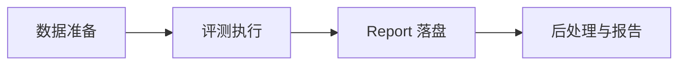
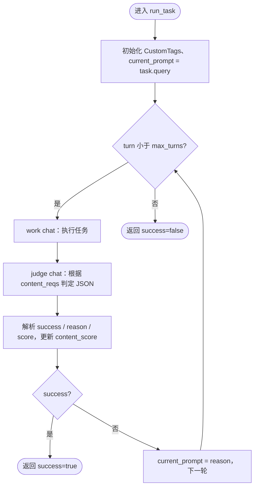
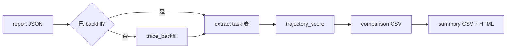

# 评测流程说明

本文描述 evolve_eval 的**抽象评测流程**：从数据准备、执行编排、结果落盘到后处理指标，不区分具体 agent 运行时实现。

主实现入口为 [`src/cli/lift_main.py`](../src/cli/lift_main.py)（LIFT 容器协议）。宿主机直跑旧栈见 [legacy/README.md](../legacy/README.md)。

---

## 1. 概述

evolve_eval 用于评测 **self-evolving agent**：在 hold-out final task 上对比 **产物未加载 / 已加载**（LIFT），由 judge 模拟用户反馈驱动多轮执行；report 中 `baseline` / `evolved` 表示加载状态对照，而非某种固定进化实现名称。

一次命令行 invocation 对应一次 **eval run**：

- 一个 `run_id`（形如 `evobench-runid-{后缀}` 或自定义后缀）
- 一份 **report JSON**（`results/{run_id}/report.json`）：执行期写入评测结果；`PhaseRun.langfuse` 通常在后处理 **trace_backfill** 时再填
- 可选一套 **后处理产物**（trace_backfill 后的 JSON、对比 CSV、汇总 CSV、HTML 报告；`*_backfilled.json`）

---

## 2. 术语与层级

| 术语 | 含义 | 示例 | 模型 / CLI |
|------|------|------|------------|
| **eval run** | 一次完整评测 invocation | `python -m src.cli.lift_main ...` | `EvalReport`；`--run_id` |
| **repeat** | `--repeat` 的一轮完整执行 | 第 2 次 `--repeat 3` | `EvalReport.runs[]` → `EvalRepeat` |
| **suite** | 一份规格 JSON 文件 | `hello.json` | `SuiteSpec`；`--suite`；report 里 `SuiteRun` |
| **task** | suite 内 `tasks[]` 的一条 | `Q1`、`Q2` | `SuiteTask`；report 里 `TaskRun` |
| **phase** | 单个 task 的一次 baseline 或 evolved 执行 | baseline / evolved | `PhaseRun` |
| **benchmark_dir** | 存放多个 suite JSON 的目录 | `assets/benchmarks` | `--benchmark_dir` |

### 2.1 Report 层级

```
EvalReport（一次 eval run，一份 report JSON）
  └── runs[]（EvalRepeat，--repeat 的一轮）
        └── suites[]（SuiteRun，一个 suite 的结果）
              └── tasks[]（TaskRun，hold-out 题）
                    ├── baseline（PhaseRun）
                    └── evolved（PhaseRun，未跑时为 null）
```

### 2.2 Suite 源数据层级

```
--benchmark_dir（目录）
  └── suite（一个 *.json，SuiteSpec）
        └── task（JSON 内的 Q1、Q2…，SuiteTask）
```

每个 `SuiteTask` 至少包含：

- `query`：交给 work agent 的任务描述
- `requirements`：技能目录、材料目录等
- `expected_result.content_reqs`：内容质量判定依据（judge 使用）
- `expected_result.trajectory_reqs`：轨迹质量判定依据（后处理 trajectory judge 使用）

---

## 3. 端到端流水线



| 阶段 | 做什么 | 入口 |
|------|--------|------|
| **数据准备** | 从 TOS 下载 `benchmark_mds.zip` 并转为 suite JSON | `python -m src.cli.preprocess` → `src/preprocess/benchmark_mds_fetch.py` + `convert_suite_mds_to_json.py` |
| **评测执行** | LIFT 编排：warmup 产 Δ → hold-out 对照 → 写 report | `python -m src.cli.lift_main -r openclaw` |
| **Report 落盘** | 执行期 JSON（先填 success/score/session 等；trace 后填） | `EvalReport.write_json` → `results/{run_id}/report.json` |
| **后处理** | trace_backfill、抽指标、trajectory 打分、出报告 | `src/postprocess/run_post_process.py`（默认随 `-e` 触发） |

> **注意**：benchmark 预处理与 LIFT 执行**已解耦**。`lift_main` 不会自动跑 preprocess。冒烟用 `assets/benchmarks_demo/hello.json`（`--benchmark_dir assets/benchmarks_demo`）；完整 benchmark 的 `assets/benchmark_mds/` 与 `assets/benchmarks/` 不纳入 git，需先执行 `python -m src.cli.preprocess`（默认 `--benchmark_dir assets/benchmarks`）。

---

## 4. 主流程：LIFT（Loaded Impact on Final Task）

框架的**目标评测协议**是 LIFT：在 hold-out final task 上，比较 **产物未加载** 与 **产物已加载** 两种状态下 agent 的表现。

```text
ArtifactPolicy（默认：跑 Q1..Q_{n-1} 产生产物）→ UpdateArtifact（Δ 镜像）
       ↓
final @ before-load（control）  → PhaseRun  → report.baseline
final @ after-load（treatment） → PhaseRun  → report.evolved
```

- **写入 report**：每个 **hold-out 题** 各一条 `TaskRun`（`baseline` + `evolved` 两个 `PhaseRun`）。默认 `holdout_count=1`（仅最后一题）；可在 suite JSON 设为最后 N 题或 `holdout_task_names`（见 [src/lift/README.md](../src/lift/README.md)）。
- **warmup 结果**：`Q1..Q_{n-1}` 用于产生产物，一般**不进 report**（仅日志）；产物固化进 **delta 镜像**（`docker commit`）。
- **final 的 before-load**：干净 base 镜像起**新容器**（无 Δ）。
- **final 的 after-load**：从 warmup 后 commit 的 **Δ 镜像**起**新容器**；多道 hold-out **共用 Δ、workspace 按题隔离**。
- **清理**：每个 suite 评测结束 `SuiteRunResources.cleanup()` 删除容器与 Δ 镜像。

### 4.1 环境模型（`src/lift/`）

```text
warmup（单容器串行）→ evolve → docker commit → DeltaRef (Δ 镜像)
对每个 hold-out 题 Q_h：
  before-load: docker run base_image + workspace_h → PhaseRun → destroy
  after-load:  docker run Δ_image + workspace_h   → PhaseRun → destroy
repeat 之间默认并行；每 suite 独立 Δ 与 `SuiteRunResources` 登记簿。
```

入口：

```bash
python -m src.cli.lift_main -r openclaw --benchmark_dir assets/benchmarks_demo --suite hello.json --run_id my-run
```

详见 [lift-framework-guide-cn.md](./lift-framework-guide-cn.md)。

### 4.2 Legacy 宿主机模式（非主入口）

旧栈 `legacy/openclaw_main.py` 使用 `--mode exam`（语义等同 LIFT）或 `--mode replay`（全 suite 双遍，**遗留**）。新开发与复现应使用 `src/cli/lift_main.py`。

| | **LIFT（`src`，目标）** | **replay（`legacy`，遗留）** |
|---|------------------------|------------------------------|
| 评测焦点 | 仅 hold-out **final** 的加载对照 | **全部** task 进化前后各跑一遍 |
| 产物阶段 | warmup 产 Δ 镜像 | 全 suite baseline 后一次 evolve |
| report | 通常每 suite 若干 hold-out `TaskRun` | 每题一条 `TaskRun` |
| 科学问题 | 产物对 final 是否有效 | 每题进化幅度（诊断用） |

---

## 5. 最小执行单元：`run_task`

每个 **phase** 对 **一个 task** 调用一次 `run_task`（定义于 [`src/lift/eval/run_task.py`](../src/lift/eval/run_task.py)）。无论 baseline 还是 evolved，内核相同。

### 5.1 输入与输出

**输入：**

- `SuiteTask`（query、expected_result 等）
- `run_id`、phase 标记（`is_evolve_turn`、`is_final_task`）
- work session 与 judge session（隔离两条对话链）
- `max_turns`（默认 `EVAL_MAX_TURNS`，通常为 2）

**输出（填入 `PhaseRun`）：**

- `success`：judge 是否判定任务完成
- `content_score`：judge 给出的 0–1 分数（最后一轮为准）
- `work_session_id` / `judge_session_id`
- `workspace_dir`：该 phase 使用的工作区路径

### 5.2 单 task 内循环



每一 **turn** 包含两次 chat：

1. **work chat**：work agent 根据 `current_prompt` 执行任务，产出 `agent_result`。
2. **judge chat**：评测器根据用户原题、`content_reqs` 与 `agent_result` 输出 JSON：`success`、`reason`、`score`。

若 `success=false` 且未达 `max_turns`，将 `reason` 作为下一轮 `current_prompt` 重试；若 judge 输出无法解析，会对 judge 侧有限次重试。

### 5.3 可观测性（CustomTags）

每次 chat 前会通过 `emit_pre_chat_state`（[`src/report/langfuse_reporting.py`](../src/report/langfuse_reporting.py)）上报 run、task、content_score、是否 final task / evolve turn 等字段，供 Langfuse 链路追踪；**不参与**任务成败判定逻辑。

与容器内 runtime trace 的**关联契约**（写入 / 检索 / 配对规则）见 [§12.5 trace_backfill](#125-trace_backfill观测)。

---

## 6. 一次 eval run 的编排顺序

以下为逻辑顺序；具体实现可能在 repeat 粒度并行，**不改变** warmup → hold-out 的先后约束。

```mermaid
flowchart TD
  A[preprocess 可选] --> B[解析 benchmark_dir + suite]
  B --> C[生成 run_id，创建 EvalReport]
  C --> D{repeat 0..N-1}
  D --> E[新建 EvalRepeat]
  E --> F{每个 suite}
  F --> G[LIFTPipeline]
  G --> H[warmup + evolve + commit Δ]
  H --> I[hold-out before/after load]
  I --> J[写入/更新 EvalReport JSON]
  J --> F
  F --> D
  D --> K{--evaluate?}
  K -->|是| L[后处理流水线]
  K -->|否| end([结束])
  L --> end
```

**始终串行的约束（单 suite 内）：**

- **产生产物（warmup + evolve）→ final before-load → final after-load**
- 同一 eval run：只有一个 `run_id`、一份 report 文件

编排实现：[`src/lift/pipeline/lift_pipeline.py`](../src/lift/pipeline/lift_pipeline.py)。

---

## 7. `--repeat` 与产物份数

| 产物 | 路径 | `--repeat N` 时的份数 |
|------|------|------------------------|
| `run_id` | — | **1 个** |
| Report JSON | `results/{run_id}/report.json` | **1 份**（内含 `runs[0..N-1]`） |
| Outcome workspace | `results/{run_id}/outcome/run-{i}/{phase}/{category}/` | **N 套**（i = 0..N-1） |
| 后处理输出 | `results/{run_id}/*_backfilled.json` 等 | **1 套**（汇总全部 repeat，CSV 含 `run` 列） |

若要 N 份独立 report，需执行 N 次命令（不同 `--run_id`），而不是依赖 `--repeat`。

---

## 8. 目录与 Report 内容

### 8.1 Report 是什么、怎么从 task 汇进来

**一次命令行 invocation = 一个 `run_id` = 一份 report JSON**（不是「一题一文件」）。

层级（内存里边跑边 append，结束时 `write_json` 一次写出）：

```text
EvalReport（run_id）
  └── runs[]                    ← --repeat 的第 1/2/3 轮
        └── suites[]            ← 本轮跑过的每个 suite JSON
              └── tasks[]       ← TaskRun（LIFT 下为 hold-out 题）
                    ├── baseline: PhaseRun   ← before-load 的一次 run_task
                    └── evolved:  PhaseRun   ← after-load 的一次 run_task
```

| 层级 | 含义 | 谁产生 |
|------|------|--------|
| **eval run** | 整次 CLI invocation | 顶层 `EvalReport` |
| **repeat** | `--repeat` 的一轮完整 LIFT | `EvalReport.runs[i]`（`EvalRepeat`） |
| **suite** | 一个 `*.json` 规格 | `SuiteRun` |
| **task（进 report）** | hold-out 题 | `TaskRun` |
| **phase** | 单题、单加载状态的一次执行 | `PhaseRun`（`baseline` 或 `evolved`） |

**LIFT 注意**：warmup 题会 `run_task`，但 **一般不写入** `suite_run.tasks[]`，只打日志；进 report 的是 hold-out 的 `baseline` + `evolved` 两个 `PhaseRun`。

路径：`results/{run_id}/report.json`

#### 执行期 vs 后处理：Report 分两阶段填

| 阶段 | 写入内容 | `PhaseRun.langfuse` |
|------|----------|---------------------|
| **执行期**（`run_task` 结束） | `success`、`content_score`、`work_session_id`、`judge_session_id`、`workspace_dir` | 一般为 **`null`** |
| **后处理**（`trace_backfill`） | 从 Langfuse 拉 trace 并 stitch | 填 **`PhaseLangfuseBundle`** |

#### `run_id` / `session_id` / `repeat` 各管什么

| 标识 | 作用 | 出现在哪 |
|------|------|----------|
| **`run_id`** | 标识**整次评测**；Langfuse pre-chat 的 tag `run` | `EvalReport.run_id`；`CustomTags.run` |
| **`repeat_index`** | 第几轮 repeat | report 树 `runs[i]`；**不**编码进 session_id |
| **`work_session_id` / `judge_session_id`** | 标识**这一次** `run_task` 的两条对话链 | 每个 `PhaseRun` |
| **suite / task 名** | 逻辑分组与配对键 | `SuiteRun` / `TaskRun.task_name` |

**trace_backfill** 对每个 `PhaseRun` 用 `run_id + work_session_id + judge_session_id` 拉 trace 并写回 `PhaseRun.langfuse`。

### 8.2 Outcome workspace

路径模式：

```text
results/{run_id}/outcome/run-{repeat_index}/
  warmup/{category}/              ← warmup 共用工作区
  baseline/{category}/{task}/   ← hold-out baseline
  evolved/{category}/{task}/    ← hold-out evolved
```

agent 在该目录下读写任务产物；baseline 与 evolved 使用不同 phase 子目录。

### 8.3 后处理产物（`-e` / `--evaluate-only`）

路径：`results/{run_id}/`

| 文件 | 含义 |
|------|------|
| `{run_id}_backfilled.json` | trace_backfill 后的 report |
| `{run_id}_comparison_metrics.csv` | task 级 baseline vs evolved 对比 |
| `{run_id}_summary_metrics.csv` | 按 category / 全局汇总 |
| `{run_id}_metrics_report.html` | 可视化报告 |

---

## 9. 后处理流水线

由 [`src/postprocess/run_post_process.py`](../src/postprocess/run_post_process.py) 的 `process_report_to_outputs()` / `run_post_process_pipeline()` 执行：



1. **trace_backfill**：从 Langfuse 拉 trace 并与 pre-chat 合并（`stitch`），写入各 `PhaseRun.langfuse`。
2. **Extract**：展平为 task × phase 行。
3. **Trajectory score**：按 `trajectory_reqs` 打分（`DO_TRAJECTORY_JUDGE=true` 走模型，否则 mock）。
4. **Comparison**：baseline 与 evolved **配对**，计算各指标及 `impr_*`。
5. **Summary & HTML**：按 category / 全局聚合。

### 9.1 配对与改进率

- **配对键**：`run + suite_name + suite_path + task_name + category`
- **相对改进**：`impr_* = (evolved - baseline) / baseline`；baseline 为 0 时为 NaN

---

## 10. CLI 参数与流程映射（`lift_main`）

| 参数 | 作用 |
|------|------|
| `-r` / `--agent-runtime` | **必填**；当前 `openclaw` |
| `--benchmark_dir` | suite JSON 目录（默认 `assets/benchmarks`） |
| `--suite` | 逗号分隔 suite 文件名，或 `all` |
| `--run_id` | 自定义 eval run 后缀 |
| `--warmup-only` | 只跑 warmup + evolve + Δ，跳过 hold-out |
| `--repeat` | 完整 LIFT 重复 N 次，写入 `EvalReport.runs[]` |
| `-p` / `--parallel` | warmup 题并行（受容器策略约束） |
| `-e` / `--evaluate` | 评测结束后自动后处理（**默认开启**；`--no-evaluate` 关闭） |
| `--evaluate-only` | 跳执行，仅对已有 report 后处理（需 `--run_id`） |

等价入口：`python -m src.cli`（转发到 `lift_main`）。

冒烟建议：`--warmup-only`（非 legacy 的 `--test`）。

---

## 11. 相关代码索引

| 主题 | 位置 |
|------|------|
| Suite / Report 模型 | `src/models.py` |
| 单 task 执行 | `src/lift/eval/run_task.py` |
| LIFT 编排 | `src/lift/pipeline/lift_pipeline.py` |
| OpenClaw 适配 | `src/lift/adapters/openclaw/` |
| CLI | `src/cli/lift_main.py` |
| Suite 路径 / workspace | `src/utils.py` |
| Markdown → JSON | `src/preprocess/convert_suite_mds_to_json.py`；CLI：`src/cli/preprocess.py` |
| Langfuse stitch | `src/report/langfuse_trace_stitch.py` |
| 后处理 | `src/postprocess/` |
| Legacy 宿主机栈 | `legacy/openclaw_main.py`、`legacy/hermes_main.py` |

---

## 12. 实现无关抽象：LIFT

**LIFT**（Loaded Impact on Final Task）：度量能力产物加载对 hold-out final task 表现的影响；通过在终测题上对比 **before-artifact-load** 与 **after-artifact-load** 的配对结果实现。不限定 agent 运行时与产物生产方式。

### 12.1 三层与部署假设

| 层 | 职责 |
|----|------|
| **协议层** | LIFT 对照语义、report schema、`ArtifactPolicy` |
| **执行层** | `AgentRuntimeAdapter`：跑 task、挂载素材、切换加载状态 |
| **观测层** | pre-chat + runtime trace → **trace_backfill** |

当前主实现：**agent 在 Docker 中运行**；`src/lift/adapters/container/` 提供通用容器与 delta commit。

### 12.2 核心概念

- **`UpdateArtifact`**：能力产物（记忆、规则、索引、项目指令等）；OpenClaw 实现为 **delta 镜像**。
- **`ArtifactPolicy`**：如何得到产物。默认 = 跑 `Q1..Q_{n-1}`（warmup）后触发更新。
- **`ArtifactLoader`（抽象）**：在 final 上切换产物是否对当前 runtime **生效**；对应 Adapter 的 before-load / after-load 环境差异（**非**独立类名）。
- **`PhaseRun`**：单 task × 单加载状态 × 完整 judge 回路。
- **`TaskRun`**：同一 final 的 pre/post 两个 `PhaseRun` → report 字段 `baseline` / `evolved`。

### 12.3 LIFT Pipeline（编排）

```text
1. produceArtifact(ArtifactPolicy)     # 默认 warmup Q1..Qn-1 + triggerUpdate
2. optional: awaitArtifactReady()        # 异步产物（如 dreaming）
3. runFinal(Qn, before_load) -> PhaseRun -> baseline
4. runFinal(Qn, after_load)  -> PhaseRun -> evolved
5. compare & write EvalReport
6. trace_backfill -> PhaseRun.langfuse
```

### 12.4 最小契约（Adapter 需实现）

`AgentRuntimeAdapter`（[`src/lift/adapters/base.py`](../src/lift/adapters/base.py)）模板方法已覆盖大部分编排；子类实现：

```text
worker_judger_factory()           # ChatAgent 工厂
start_warmup_environment()        # before 产物积累
start_holdout_environment()       # per-task 隔离容器
apply_evolve()                    # warmup 后更新产物
materialize_delta()               # 默认 docker commit（Container 层）
baseline_image()                  # before-load 运行时标识
```

### 12.5 trace_backfill（观测）

每一轮 chat 在 Langfuse 上通常产生**两条** trace，后处理再合并为一条「完整轮次」：

| 来源 | 写入方 | trace `name` | 主要 payload |
|------|--------|--------------|--------------|
| eval 框架（宿主机） | `emit_pre_chat_state` | `work_agent` / `judge_agent`（以 `_agent` 结尾） | run、task、content_score、是否 final / evolve 等（`CustomTags`） |
| agent runtime（容器内） | `langfuse-tracer` 等插件 | `openclaw-plugin`（OpenClaw）或 `Hermes turn`（Hermes） | prompt、回复、`metadata.messages`、token、工具统计 |

实现入口：`stitch_phase_langfuse_traces`（[`src/report/langfuse_trace_stitch.py`](../src/report/langfuse_trace_stitch.py)）→ `pair_session_traces_to_agent_turns`（[`src/report/langfuse_trace_merge.py`](../src/report/langfuse_trace_merge.py)）。

#### 12.5.1 写入契约（runtime 插件必须满足）

**同一 Langfuse 项目**

- 宿主机：`LANGFUSE_PUBLIC_KEY` / `LANGFUSE_SECRET_KEY` / `LANGFUSE_HOST`（`emit_pre_chat_state` 用 Python SDK）
- 容器：同名 key + `LANGFUSE_BASE_URL` 能访问宿主机 Langfuse（Linux 需 `host.docker.internal:host-gateway`）
- 容器启动时通过 `--env-file` 挂载仓库根 `.env`

**`session_id` 必须一致（最关键）**

LIFT 为 work / judge 各生成独立 session id（如 `user-…`、`judge-…`），并同时用于：

1. `emit_pre_chat_state` 的 `propagate_attributes(session_id=…)`
2. OpenClaw `openclaw agent --session-id …`（见 [`chat_agent.py`](../src/lift/adapters/openclaw/chat_agent.py)）

容器内 `langfuse-tracer` 上报 trace 时，`sessionId` 须与上述字符串相同。插件优先取 hook `ctx.sessionId`，否则回退 `ctx.sessionKey`；若回退值与 `--session-id` 不一致，**配对会断裂**。

**trace `name` 须符合约定**

| 侧 | 识别规则 | 实现 |
|----|----------|------|
| pre-chat | name 以 `_agent` 结尾 | `is_agent_trace()` in [`langfuse_trace_parse.py`](../src/report/langfuse_trace_parse.py) |
| plugin | name 为 `openclaw-plugin` 或 `Hermes turn` | `is_plugin_trace()`；常量见 `LANGFUSE_PLUGIN_TRACE_NAMES` in [`models.py`](../src/models.py) |

**插件须成功触发 `agent_end`**

OpenClaw 须在 `openclaw.json` 为 `langfuse-tracer` 配置 `hooks.allowConversationAccess: true`，否则只有 `before_agent_start` 日志、没有 `openclaw-plugin` trace，pre-chat 会变成孤儿。

#### 12.5.2 检索契约（backfill 如何找到两边数据）

`stitch_phase_langfuse_traces`（OpenClaw 模式）对单次 phase 会查询：

1. `tags = eval_run_tag`（= `CustomTags.run`）→ 定位 pre-chat span
2. `session_id = work_session_id` / `judge_session_id` → 定位 work / judge 两侧 trace
3. `tags = work_session_id` / `judge_session_id` → 兜底（插件会把 session id 写入 tags）

OpenClaw 容器启动时注入 `EVOBENCH_EVAL_RUN_TAG=run_id`，插件将其加入 trace tags，与 pre-chat 的 `tags.run` 对齐，便于按 run 过滤。插件**不强制**带 run tag 也能配对，主要靠 `session_id`。

#### 12.5.3 配对契约（两条 trace 如何合成一轮）

同一 `session_id` 内按时间排序后（[`pair_session_traces_to_agent_turns`](../src/report/langfuse_trace_merge.py)）：

1. 遇到 `work_agent` / `judge_agent` → 暂存为 pending
2. 下一条若是 `openclaw-plugin` → 合并进上一条 pre-chat（`plugin_prompt`、`metadata.messages`、`tokens` 等写入 `LangfuseTraceRef`）
3. plugin 的 timestamp 应**晚于** pre-chat（顺序：先 `emit_pre_chat_state`，再 `openclaw agent`）

**Join key 是 `session_id` + 时间顺序 + trace name 模式**，不是两边 `input` 字段对齐。

#### 12.5.4 刻意不要求对齐的字段

| 字段 | pre-chat | plugin | 说明 |
|------|----------|--------|------|
| `user_id` | `tags.run`（run_id） | `agentId`（OpenClaw agent 名） | 语义不同，配对不用 |
| `input` | `CustomTags` 全量 dict | 用户 prompt 文本 | 合并后分别为 `agent_input` / `plugin_prompt` |
| `tags` | run、task、agent_name、session_id | `openclaw`、agentId、可选 run / session tag | 检索兜底；配对主要靠 session |

#### 12.5.5 一句话总结

> 插件能与 `emit_pre_chat_state` 对应上的条件：**同一 Langfuse 项目** + **同一 `session_id`（`--session-id`）** + plugin trace 名为 **`openclaw-plugin`** + **`agent_end` 成功上报** + 时间落在对应 **`*_agent`** 之后。

评测上下文在 pre-chat 的 `input`；轨迹与 token 在 plugin 的 `metadata`；`trace_backfill` 负责拼接。

**脆弱点**：OpenClaw 升级后若 `ctx.sessionKey` 与 `--session-id` 分叉，需在容器内查 `langfuse-tracer-plugin.log` 或设 `LANGFUSE_TRACER_DEBUG_MESSAGES=1` 核对 hook ctx。

**Hermes 差异**：`Hermes turn` 的 `session_id` 为内部 task id，与外部 work/judge session 不一致，但 tags 中带外部 session id；配对走 `pair_hermes_traces_to_agent_turns`（见 [`langfuse_trace_stitch.py`](../src/report/langfuse_trace_stitch.py) `_stitch_hermes`）。

### 12.6 当前实现映射

| 抽象步骤 | `src/lift`（OpenClaw 容器） | `legacy`（宿主机，遗留） |
|----------|----------------------------|-------------------------|
| 默认 ArtifactPolicy | warmup `tasks[:-holdout]` + `learn review` | warmup + `evolve()` |
| before-load final | `docker run` base 镜像 + 新 workspace | `disable_evolve()` 后跑 final |
| after-load final | `docker run` delta 镜像 + 新 workspace | `enable_evolve()` + evolved workspace |
| trace_backfill | `agent_source=openclaw` | `agent_source=hermes` |

---

## 13. 相关文档

| 文档 | 用途 |
|------|------|
| [README.md](./README.md) | 本目录索引 |
| [lift-framework-guide-cn.md](./lift-framework-guide-cn.md) | **LIFT 阅读与实操指南**（推荐首选） |
| [../src/lift/README.md](../src/lift/README.md) | LIFT 实现速查 |
| [../assets/suite_requirement.md](../assets/suite_requirement.md) | Benchmark 收集规范 |
