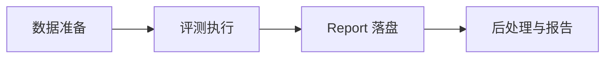
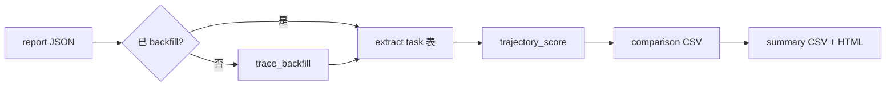
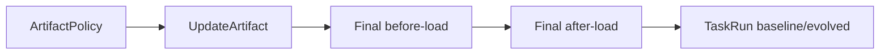

# 评测流程说明

本文描述 evolve_eval 的**抽象评测流程**：从数据准备、执行编排、结果落盘到后处理指标，不区分具体 agent 运行时实现。

---

## 1. 概述

evolve_eval 用于评测 **self-evolving agent**：在 hold-out final task 上对比 **产物未加载 / 已加载**（LIFT），由 judge 模拟用户反馈驱动多轮执行；report 中 `baseline` / `evolved` 表示加载状态对照，而非某种固定进化实现名称。

一次命令行 invocation 对应一次 **eval run**：

- 一个 `run_id`（形如 `evobench-runid-{日期}-{短 id}` 或自定义后缀）
- 一份 **report JSON**（`evobench-reports/evobench-runid-*.json`）：执行期写入评测结果；`PhaseRun.langfuse` 通常在后处理 **trace_backfill** 时再填
- 可选一套 **后处理产物**（trace_backfill 后的 JSON、对比 CSV、汇总 CSV、HTML 报告；`*_backfilled.json`）

---

## 2. 术语与层级

| 术语 | 含义 | 示例 | 模型 / CLI |
|------|------|------|------------|
| **eval run** | 一次完整评测 invocation | 某次 `python *_main.py` | `EvalReport`；`--run_id` |
| **repeat** | `--repeat` 的一轮完整执行 | 第 2 次 `--repeat 3` | `EvalReport.runs[]` → `EvalRepeat` |
| **suite** | 一份规格 JSON 文件 | `Team_Building_Planning.json` | `SuiteSpec`；`--suite`；report 里 `SuiteRun` |
| **task** | suite 内 `tasks[]` 的一条 | `Q1`、`Q2` | `SuiteTask`；report 里 `TaskRun` |
| **phase** | 单个 task 的一次 baseline 或 evolved 执行 | baseline / evolved | `PhaseRun` |
| **benchmark_dir** | 存放多个 suite JSON 的目录 | `assets/benchmarks` | `--benchmark_dir` |

### 2.1 Report 层级

```
EvalReport（一次 eval run，一份 report JSON）
  └── runs[]（EvalRepeat，--repeat 的一轮）
        └── suites[]（SuiteRun，一个 suite 的结果）
              └── tasks[]（TaskRun，Q1/Q2…）
                    ├── baseline（PhaseRun）
                    └── evolved（PhaseRun，未跑时为 null）
```

### 2.2 Suite 源数据层级

```
--benchmark_dir（目录）
  └── suite（一个 *.json，SuiteSpec）
        └── task（JSON 内的 Q1、Q2…，SuiteTask）
```

每个 `SuiteTask` 至少包含：

- `query`：交给 work agent 的任务描述
- `requirements`：技能目录、材料目录等
- `expected_result.content_reqs`：内容质量判定依据（judge 使用）
- `expected_result.trajectory_reqs`：轨迹质量判定依据（后处理 trajectory judge 使用）

---

## 3. 端到端流水线



| 阶段 | 做什么 | 入口 |
|------|--------|------|
| **数据准备** | 将 markdown 场景目录转为 suite JSON | `preprocess/convert_suite_mds_to_json.py` → `preprocess_suite_mds()` |
| **评测执行** | LIFT 编排：产生产物 → hold-out 对照 → 写 report | **`python -m src_new.cli.lift_main -r openclaw`**；legacy：根目录 `openclaw_main.py` |
| **Report 落盘** | 执行期 JSON（先填 success/score/session 等；trace 后填） | `EvalReport.write_json` → `evobench-reports/` |
| **后处理** | trace_backfill、抽指标、trajectory 打分、出报告 | `postprocess/run_post_process.py` |

主入口在跑评测前通常会调用 `preprocess_suite_mds()`，从 `assets/benchmark_mds` 生成/更新 `assets/benchmarks/*.json`。

---

## 4. 主流程：LIFT（Loaded Impact on Final Task）

框架的**目标评测协议**是 LIFT：在 hold-out final task 上，比较 **产物未加载** 与 **产物已加载** 两种状态下 agent 的表现。实现无关细节见第 12 章。

```text
ArtifactPolicy（默认：跑 Q1..Q_{n-1} 产生产物）→ UpdateArtifact
       ↓
final @ before-load（control）  → PhaseRun  → report.baseline
final @ after-load（treatment） → PhaseRun  → report.evolved
```

- **写入 report**：每个 **hold-out 题** 各一条 `TaskRun`（`baseline` + `evolved` 两个 `PhaseRun`）。默认 `holdout_count=1`（仅最后一题）；可在 suite JSON 设为最后 N 题或 `holdout_task_names`（见 [src_new/lift/README.md](../src_new/lift/README.md)）。
- **warmup 结果**：`Q1..Q_{n-1}` 用于产生产物，一般**不进 report**（仅日志）；产物也可通过非 warmup 策略获得（见 12.2）。
- **final 的 before-load**：干净 base 镜像起**新容器**（无 Δ）。
- **final 的 after-load**：从 warmup 后 `docker commit` 的 **Δ 镜像**起**新容器**；多道 hold-out **共用 Δ、workspace 按题隔离**。
- **清理**：每个 suite 评测结束 `SuiteRunResources.cleanup()` 删除容器与 Δ 镜像。

### 4.1 环境模型（`src_new`）

```text
warmup（单容器串行）→ evolve → docker commit → DeltaRef (Δ 镜像)
对每个 hold-out 题 Q_h：
  before-load: docker run base_image + workspace_h → PhaseRun → destroy
  after-load:  docker run Δ_image + workspace_h   → PhaseRun → destroy
repeat 之间默认并行；每 suite 独立 Δ 与 `SuiteRunResources` 登记簿。
```

入口：`python -m src_new.cli.lift_main -r openclaw`（见 [src_new/lift/README.md](../src_new/lift/README.md)）。

### 4.2 CLI 与历史模式

| CLI | 含义 |
|-----|------|
| `--mode exam` | 当前代码入口，语义即 **LIFT**（名称保留兼容） |
| `--mode replay` | **遗留模式**：全 suite 先跑一遍 → evolve → 再跑一遍；**不作为目标架构**，后续移除 |
| `--repeat` | 重复完整 LIFT 流程，写入 `EvalReport.runs[]` |
| `-e` / `--evaluate-only` | 执行后或仅做 **trace_backfill** 与指标后处理 |
| `--test` | **仅跑 final 一次**：只对 `tasks[-1]` 执行单次 task（冒烟/联通）；跳过 warmup、产物更新与 before/after 双对照 |

Benchmark 收集规范见 [assets/suite requirement.md](../assets/suite%20requirement.md)；机器可读规格为 `SuiteSpec` JSON。

> **实现说明**：`src_new` 已实现上表 LIFT 目标语义（容器 per task、commit Δ）；legacy 根目录 `openclaw_main.py` 仍为宿主机 toggle 模式。

**LIFT vs 遗留 `replay`（勿混淆）：**

| | **LIFT（目标）** | **replay（遗留）** |
|---|------------------|-------------------|
| 评测焦点 | 仅 hold-out **final** 的加载对照 | **全部** task 进化前后各跑一遍 |
| 产物阶段 | `Q1..Q_{n-1}` 产生产物（默认 ArtifactPolicy） | 全 suite baseline 后一次 evolve |
| report | 通常 1 条 TaskRun（final） | 每题一条 TaskRun |
| 科学问题 | 产物对 final 是否有效 | 每题进化幅度（诊断用） |

---

## 5. 最小执行单元：`run_task`

每个 **phase** 对 **一个 task** 调用一次 `run_task`（定义于 `src/eval_core.py`）。无论 baseline 还是 evolved，内核相同。

### 5.1 输入与输出

**输入：**

- `SuiteTask`（query、expected_result 等）
- `run_id`、phase 标记（`is_evolve_turn`、`is_final_task`）
- work session 与 judge session（隔离两条对话链）
- `max_turns`（默认 `EVAL_MAX_TURNS`，通常为 2）

**输出（填入 `PhaseRun`）：**

- `success`：judge 是否判定任务完成
- `content_score`：judge 给出的 0–1 分数（最后一轮为准）
- `work_session_id` / `judge_session_id`
- `workspace_dir`：该 phase 使用的工作区路径

### 5.2 单 task 内循环


每一 **turn** 包含两次 chat：

1. **work chat**：work agent 根据 `current_prompt` 执行任务，产出 `agent_result`。
2. **judge chat**：评测器根据用户原题、`content_reqs` 与 `agent_result` 输出 JSON：`success`、`reason`、`score`。

若 `success=false` 且未达 `max_turns`，将 `reason` 作为下一轮 `current_prompt` 重试；若 judge 输出无法解析，会对 judge 侧有限次重试。

### 5.3 可观测性（CustomTags）

每次 chat 前会通过 `CustomTags` 上报 run、task、content_score、是否 final task / evolve turn 等字段，供 Langfuse 等链路追踪；**不参与**任务成败判定逻辑。

---

## 6. 一次 eval run 的编排顺序

以下为逻辑顺序；具体 entrypoint 可能在 suite 或 task 粒度做进程内并发，**不改变** phase 与 evolve 的先后约束。

```mermaid
flowchart TD
  A[preprocess_suite_mds 可选] --> B[解析 benchmark_dir + suite]
  B --> C[生成 run_id，创建 EvalReport]
  C --> D{repeat 0..N-1}
  D --> E[新建 EvalRepeat]
  E --> F{每个 suite}
  F --> G[LIFT pipeline]
  G --> H[ArtifactPolicy + final before/after load]
  H --> I[写入/更新 EvalReport JSON]
  I --> F
  F --> D
  D --> J{--evaluate?}
  J -->|是| K[后处理流水线]
  J -->|否| end([结束])
  K --> end
```

**始终串行的约束：**

- 同一 suite 内：**产生产物（ArtifactPolicy）→ final before-load → final after-load**（LIFT）；遗留 `replay` 模式见 4.1
- `--repeat` 各轮：按 repeat_index 顺序执行
- 同一 eval run：只有一个 `run_id`、一份 report 文件

**每个 suite / category 完成后** 通常会重置该 category 的进化状态，以便下一轮 repeat 或下一个 suite 从干净状态开始（具体由运行时 `reset_*_evolution_state` 实现）。

---

## 7. `--repeat` 与产物份数

| 产物 | 路径 | `--repeat N` 时的份数 |
|------|------|------------------------|
| `run_id` | — | **1 个** |
| Report JSON | `evobench-reports/evobench-runid-*.json` | **1 份**（内含 `runs[0..N-1]`） |
| Outcome workspace | `results/{run_id}/outcome/run-{i}/{phase}/{category}/` | **N 套**（i = 0..N-1） |
| 后处理输出 | `results/{run_id}/*_backfilled.json` 等 | **1 套**（汇总全部 repeat，CSV 含 `run` 列） |

若要 N 份独立 report，需执行 N 次命令（不同 `--run_id`），而不是依赖 `--repeat`。

---

## 8. 目录与 Report 内容

### 8.1 Report 是什么、怎么从 task 汇进来

**一次命令行 invocation = 一个 `run_id` = 一份 report JSON**（不是「一题一文件」）。

层级（内存里边跑边 append，结束时 `write_json` 一次写出）：

```text
EvalReport（run_id）
  └── runs[]                    ← --repeat 的第 1/2/3 轮
        └── suites[]            ← 本轮跑过的每个 suite JSON
              └── tasks[]       ← TaskRun（LIFT 下通常每 suite 只有 final 一条）
                    ├── baseline: PhaseRun   ← 该题 before-load 的一次 run_task
                    └── evolved:  PhaseRun   ← 该题 after-load 的一次 run_task
```

| 层级 | 含义 | 谁产生 |
|------|------|--------|
| **eval run** | 整次 `python *_main.py` | 顶层 `EvalReport` |
| **repeat** | `--repeat` 的一轮完整 LIFT | `EvalReport.runs[i]`（`EvalRepeat`） |
| **suite** | 一个 `*.json` 规格 | `SuiteRun` |
| **task（进 report）** | 写入 report 的题；LIFT 多为 **final 一题** | `TaskRun` |
| **phase** | 单题、单加载状态的一次执行 | `PhaseRun`（`baseline` 或 `evolved`） |

**LIFT（exam）注意**：`Q1..Q(n-1)` warmup 会 `run_task`，但 **一般不写入** `suite_run.tasks[]`，只打日志；进 report 的是 final 的 `baseline` + `evolved` 两个 `PhaseRun`（见 `openclaw_main.py` `exam_mode`）。

**replay（遗留）**：每题一条 `TaskRun`（baseline 必有，evolved 在进化后再填）。

路径：`evobench-reports/evobench-runid-{run_id}.json`

#### 执行期 vs 后处理：Report 分两阶段填

勿称「轻量 report」——容易误解为「字段很少」。准确说法是：

| 阶段 | 写入内容 | `PhaseRun.langfuse` |
|------|----------|---------------------|
| **执行期**（`run_task` 结束） | `success`、`content_score`、`work_session_id`、`judge_session_id`、`workspace_dir` | 一般为 **`null`** |
| **后处理**（`trace_backfill`） | 从 Langfuse 拉 trace 并 stitch | 填 **`PhaseLangfuseBundle`** |

执行期 report 已包含完整**树形结构**与**评测结论**；缺的是 Langfuse 上的长 trace / analytics，体积主要差在这里。

#### `run_id` / `session_id` / `repeat` 各管什么

| 标识 | 作用 | 出现在哪 |
|------|------|----------|
| **`run_id`** | 标识**整次评测**；对应**一份** report 文件；Langfuse pre-chat 的 tag `run`（即 `eval_run_tag`） | `EvalReport.run_id`；`CustomTags.run` |
| **`repeat_index`** | 第几轮 repeat | **仅** report 树位置 `runs[i]`；**不**编码进 session_id |
| **`work_session_id` / `judge_session_id`** | 标识**这一次** `run_task`（单题、单 phase）的两条对话链 | 每个 `PhaseRun`；插件 trace 按 session 对齐 |
| **suite / task 名** | 逻辑分组与配对键 | `SuiteRun` / `TaskRun.task_name`；也进 Langfuse tags（`task` 等） |

**汇总进 report**：靠执行时**按层级 append**（`suite_run.tasks.append(TaskRun(...))`），**不是**事后用 Langfuse 反查拼树。

**trace_backfill 查 Langfuse**：读 report 里已有树，对每个 `PhaseRun` 用其三元组拉 trace：

```text
eval_run_tag  (= run_id)
+ work_session_id
+ judge_session_id
→ stitch → 写回 PhaseRun.langfuse
```

插件 trace 通常**不带** `run_id` tag，主要靠 **session_id** 与 `PhaseRun` 里存的 id 对齐；pre-chat span 可用 **run tag + session** 过滤（见 `PhaseLangfuseBundle` 注释）。

### 8.2 Outcome workspace

路径模式：

```text
results/{run_id}/outcome/run-{repeat_index}/{phase}/{category}/
```

agent 在该目录下读写任务产物；baseline 与 evolved 使用不同 phase 子目录。

### 8.3 后处理产物（`-e` / `--evaluate-only`）

路径：`results/{run_id}/`

| 文件 | 含义 |
|------|------|
| `{run_id}_backfilled.json` | trace_backfill 后的 report |
| `{run_id}_comparison_metrics.csv` | task 级 baseline vs evolved 对比 |
| `{run_id}_summary_metrics.csv` | 按 category / 全局汇总 |
| `{run_id}_metrics_report.html` | 可视化报告 |

---

## 9. 后处理流水线

由 `postprocess/run_post_process.py` 的 `process_report_to_outputs()` / `run_post_process_pipeline()` 执行：



1. **trace_backfill（轨迹回填）**：从 Langfuse 拉 trace 并与 pre-chat 合并（`stitch`），写入各 `PhaseRun.langfuse`。
2. **Extract**：展平为 task × phase 行（含 `run`、`suite_name`、`task_name`、`category`、token/工具/延迟等指标）。
3. **Trajectory score**：按 `trajectory_reqs` 对轨迹打分（`DO_TRAJECTORY_JUDGE=true` 走模型，否则 mock）。
4. **Comparison**：baseline 与 evolved **配对**，计算各指标及 `impr_*`（相对改进）。
5. **Summary & HTML**：按 category / 全局聚合，生成报告。

### 9.1 配对与改进率

- **配对键**：`run + suite_name + suite_path + task_name + category`
- **相对改进**：`impr_* = (evolved - baseline) / baseline`；baseline 为 0 时为 NaN

主要指标列包括：`trials`、`tool_use_num`、`content_score`、`total_tokens`、`total_latency_seconds`、`trajectory_score` 等（见 `postprocess/metrics.py`）。

---

## 10. CLI 参数与流程映射

| 参数 | 作用 |
|------|------|
| `--benchmark_dir` | suite JSON 所在目录 |
| `--suite` | 逗号分隔 suite 文件名，或 `all` |
| `--mode` | 代码层 `exam` = LIFT；`replay` 为遗留 |
| `--repeat` | 完整跑几遍所选 suite，写入 `EvalReport.runs[]` |
| `--test` | 仅跑 final 一次（见 4.1；目标语义，代码待对齐） |
| `--run_id` | 自定义 eval run 后缀 |
| `-e` / `--evaluate` | 评测结束后自动后处理 |
| `--evaluate-only` | 跳执行，仅对已有 report 后处理（需 `--run_id`） |

---

## 11. 相关代码索引

| 主题 | 位置 |
|------|------|
| Suite / Report 模型 | `src/models.py`（`SuiteSpec`、`EvalReport`、`PhaseRun` 等） |
| 单 task 执行 | `src/eval_core.py`（`run_task`） |
| 主流程编排 | `openclaw_main.py`、`hermes_main.py`（`replay_mode` / `exam_mode`） |
| Suite 路径解析 | `src/utils.py`（`resolve_suite_paths`、`outcome_workspace`、`make_run_id`） |
| Markdown → JSON | `preprocess/convert_suite_mds_to_json.py` |
| 后处理 | `postprocess/run_post_process.py` 及 `extract` / `metrics` / `judge` / `langfuse_enrich` |

---

## 12. 实现无关抽象：LIFT

**LIFT**（Loaded Impact on Final Task）：度量能力产物加载对 hold-out final task 表现的影响；通过在终测题上对比 **before-artifact-load** 与 **after-artifact-load** 的配对结果实现（隔离容器与 workspace）。不限定 agent 运行时（OpenClaw、Hermes、Claude Code…）与产物生产方式（evolve、dreaming、外部注入等）。

### 12.1 三层与部署假设

| 层 | 职责 |
|----|------|
| **协议层** | LIFT 对照语义、report schema、`ArtifactPolicy` |
| **执行层** | Docker 内 `AgentRuntime`：跑 task、挂载素材、切换加载状态 |
| **观测层** | pre-chat + runtime trace → **trace_backfill** |

当前简化假设：**agent 均在 Docker 中运行**；**暂不设计并发**（suite/task 串行即可）。

### 12.2 核心概念

- **`UpdateArtifact`**：能力产物（记忆、规则、索引、项目指令等）。
- **`ArtifactPolicy`**：如何得到产物。**默认策略** = 跑 `Q1..Q_{n-1}`（warmup）后触发更新；也可空 warmup、外部注入、仅 dreaming 等。
- **`ArtifactLoader`**：在 final 上切换产物是否对当前 runtime **生效**（见下节）；Adapter 契约里对应 **`setLoadState(before_load | after_load)`**。**代码库中没有名为 `ArtifactLoader` 或 `LoadStateController` 的类**，由各 runtime 自行实现。
- **Task 原子单元**：单 task × 单加载状态 × 完整 judge 回路 → **`PhaseRun`**。work 与 judge **同一 Docker 环境、不同 `session_id`**。
- **`MaterialResolver` / `MaterialMount`**：按 task 解析并**只读**挂载 `material_dir` / skills；pre/post 须同一 `material_digest`。

#### 12.2.1 `ArtifactLoader` 是什么？（与 `LoadStateController` 的关系）

早期文档曾并列写 **`ArtifactLoader` / `LoadStateController`**，容易读成两个不同组件。实际上**只有一层职责**，本文统一只保留 **`ArtifactLoader`** 这一称呼；**请勿再使用 `LoadStateController`**（仓库内无对应实现，亦无计划新增该类名）。

| 容易产生的误解 | 实际含义 |
|----------------|----------|
| Loader = 从磁盘读文件，Controller = 管状态机 | **同一件事**：为 LIFT 的 final 准备两种可对照的「加载状态」 |
| 两个类要分别实现 | Adapter 只需在跑 final 前切到正确状态，通常体现为**一个** `setLoadState(...)` 或等价调用序列 |
| `ArtifactLoader` 负责产生产物 | **产生产物**属于 **`ArtifactPolicy`**；Loader 只负责 **before/after 时产物是否生效** |

**在 LIFT 里它具体做什么：**

1. 产物已由 `ArtifactPolicy` 生成（`UpdateArtifact` 已存在，例如 evolve 后的 workspace / 记忆 / 规则）。
2. 对同一 hold-out final \(Q_n\) 跑两次 `runTask`：
   - **`before_load`**：产物**不**参与本次执行 → 写入 `TaskRun.baseline`
   - **`after_load`**：产物**参与**本次执行 → 写入 `TaskRun.evolved`
3. 两次 run 除加载状态外应尽量一致（同一题、同一 `material_digest`、同一 judge 协议）。

**实现方式（因 runtime 而异，均属 ArtifactLoader 职责）：**

| 加载状态 | OpenClaw（示例） | Hermes（示例） |
|----------|------------------|----------------|
| before-load | `disable_evolve()` 后跑 final | `baseline-final` workspace + 新 agent |
| after-load | `enable_evolve()` + evolved workspace | 复用 warmup 后的 agent |

契约中的 `setLoadState(before_load | after_load)` 就是对上述切换的抽象 API 名；见 §12.4、§12.7。



### 12.3 LIFT Pipeline（编排）

多 task 如何组织属于 **LIFT pipeline**，不是 task 语义的一部分（无需泛化多种「mode」产品形态；CLI 运行开关含 `repeat`、`evaluate-only`、**`test`（仅 final 单次）** 等）。

```text
1. produceArtifact(ArtifactPolicy)     # 默认 warmup Q1..Qn-1 + triggerUpdate
2. optional: awaitArtifactReady()      # 异步产物（如 dreaming）
3. runFinal(Qn, before_load) -> PhaseRun -> baseline
4. runFinal(Qn, after_load)  -> PhaseRun -> evolved
5. compare & write EvalReport
```

**Report 语义（字段名暂不改代码）：**

| 字段 | 抽象含义 |
|------|----------|
| `TaskRun.baseline` | final 的 before-load |
| `TaskRun.evolved` | final 的 after-load |
| warmup 的 `PhaseRun` | 通常不进 report |

### 12.4 最小契约（Adapter 需实现）

```text
bootstrapRuntime() -> handle
resolveMaterials(task) -> bundle
mountMaterials(handle, bundle) -> mountRef
produceArtifact(policy) -> artifact | jobRef
awaitArtifactReady(jobRef) -> artifact          # 异步产物时
setLoadState(before_load | after_load)            # ArtifactLoader：切换产物是否生效
runTask(task, load_state) -> PhaseRun           # 内含 judge 回路
emitPreChat(session_id, tags, role)
cleanupRuntime(handle)
# 后处理: trace_backfill -> PhaseRun.langfuse
```

### 12.5 trace_backfill（观测）

从 Langfuse **拉取 + 合并（stitch）** trace，写回 `PhaseRun.langfuse`（`PhaseLangfuseBundle`）。实现入口如 `stitch_phase_langfuse_traces`；模块名 `langfuse_enrich` 为遗留称呼。

| 通道 | 写入方 | 关联键 |
|------|--------|--------|
| Pre-chat | 评测框架 `emit_pre_chat_state` | `session_id` + `run_id`（eval_run_tag） |
| Runtime | 容器内 Langfuse 插件 | **同一 `session_id`**（通常无 run tag） |

Agent 插件约束：必须使用框架传入的 `work_session_id` / `judge_session_id` 上报，否则无法回填。

### 12.6 Docker 与公平对照

1. 产物通过 volume / 只读工件目录**显式**注入，避免隐式共享状态。
2. 同一 final 的 before/after：**相同 material_digest**，不同 **load_profile** / artifact 是否生效。
3. 插件与 `LANGFUSE_*` 归**镜像/环境配置**，不写入框架核心代码。
4. 复现单元建议：`run_id + repeat + suite + task + phase + artifact_digest`。

### 12.7 当前实现映射（参考）

| 抽象步骤 | OpenClaw | Hermes |
|----------|----------|--------|
| 默认 ArtifactPolicy | warmup `tasks[:-1]` + `evolve()` | 同左 |
| before-load final | `disable_evolve()` 后跑 final | `baseline-final` workspace + 新 agent |
| after-load final | `enable_evolve()` + evolved workspace | 复用 warmup agent |
| trace_backfill | `agent_source=openclaw` | `agent_source=hermes` |

### 12.8 扩展：Claude Code（dreaming）

产物来自 **dreaming** 时：warmup 后 `triggerArtifactUpdate` → **`awaitArtifactReady`**，再跑 final post-load。常是**同一项目目录**，靠 `load_profile` + `artifact_digest` 保证对照公平；LIFT 协议与 pipeline **不变**，只换 Adapter 与 `agent_source=claude_code`。

---

## 13. 相关文档

| 文档 | 用途 |
|------|------|
| [lift-framework-guide-cn.md](./lift-framework-guide-cn.md) | **LIFT 阅读与实操指南**（推荐首选）：目录结构、OpenClaw 适配、CLI、产出物 |
| [../src_new/lift/README.md](../src_new/lift/README.md) | LIFT 实现速查：CLI 参数、测试命令 |
| [paper-lift-blueprint-cn.md](./paper-lift-blueprint-cn.md) | LIFT 论文写作蓝图：论文须完成的论述/实验/图表清单 |
| [../assets/suite requirement.md](../assets/suite%20requirement.md) | Benchmark 收集规范 |
