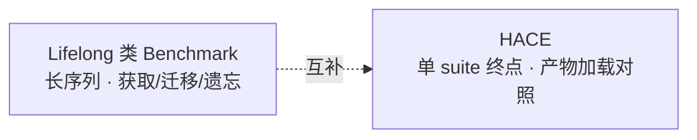
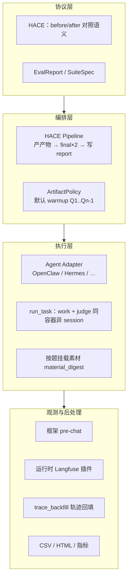
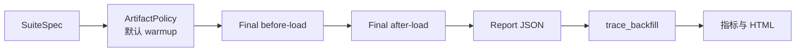
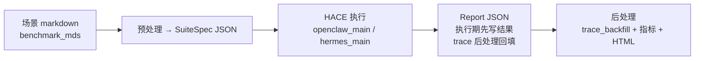

# 汇报材料：论文方向确认 & 评测框架顶层设计

> **详细技术文档**：[eval-flow.md](./eval-flow.md) · [paper-hace-blueprint-cn.md](./paper-hace-blueprint-cn.md) · [prd-eval-framework-refactor-cn.md](./prd-eval-framework-refactor-cn.md)

---

## 一、开场

**问题**：现有 Agent 评测大多只看「单次能不能做对」，回答不了「用户用了一段时间、系统更新了能力之后，是否真的更好用」。

**我们的方案**：

1. **论文**：提出 **HACE**（Hold-out Artifact-Contrast Evaluation）——在同一道 hold-out 终测题上，对比「能力产物加载前 / 加载后」的配对表现，给出可复现、可跨 Agent 实现的评测范式（**不是**推销某一种进化算法）。
2. **工程**：建设 **evolve_eval** 评测框架——Benchmark 规范 + HACE 主流程 + 可观测性回填 + 统一报告与指标，已用 OpenClaw、Hermes 两条链路验证可落地。

**需要确认的方向**：论文主打「评测方法论 + 协议」，工程作为可复现佐证；主评测协议统一为 HACE，弃用 replay 双遍全题模式作为产品目标。

---

## 二、为什么要做这件事

| 现状 | 缺口 |
|------|------|
| 主流 Benchmark 偏静态、单题单次 | 无法度量「持续使用 + 能力更新」后的**净收益** |
| 各 Agent 进化机制不同（记忆、规则、索引、项目指令…） | 缺少**实现无关**的对照协议，难以横向比较 |
| 线上观测与离线评测割裂 | 难以解释「为什么变好/变差」，复现成本高 |

**业务/研究上真正要回答的一句话**：

> 在用户连续使用、系统产生能力产物之后，**加载这些产物**，是否让 hold-out 终测任务表现**稳定变好**，且代价（token、延迟、重试）可接受？

---

## 三、结论先行

| # | 决策项 | 建议结论 | 理由（一句话） |
|---|--------|----------|----------------|
| 1 | **论文核心卖点** | **HACE 评测范式 + 实现无关协议**，而非「我们 evolve 最强」 | 可迁移、可投稿、可接多种 Agent |
| 2 | **主评测协议** | 全框架统一 **HACE**；`replay` 仅遗留、不进入论文主叙事 | HACE 直接对应「产物有没有用」；replay 是诊断型全题双遍，问题不同 |
| 3 | **工程定位** | evolve_eval = **标准评测流水线**（规范 + 执行 + 观测 + 报告） | 支撑论文实验与后续多 Agent 接入 |
| 4 | **实验规模（论文主设定）** | **20 suites × repeat=3**，白领工作场景，双 runtime（OpenClaw + Hermes） | 与英文稿一致；结果栏可先占位后填实 |

---

## 四、论文方向确认

### 4.1 论文回答什么、不回答什么

**要回答（RQ）**：

- **RQ1**：加载能力产物后，hold-out final 的质量是否优于加载前？  
- **RQ2**：上述增益在多次重复、多个 suite 上是否稳定？  
- **RQ3**：质量增益是否被成本（token、延迟、重试）抵消？

**明确不做**：

- 不宣称替代 LifelongAgentBench 等长期学习 Benchmark（我们补的是**终点对照**）。  
- 不把某一种 OpenClaw/Hermes 进化实现写成唯一贡献。  
- 不把遗留 `replay`（全 suite 进化前后各跑一遍）写进主方法。

### 4.2 方法名与核心思想：HACE

**HACE** = Hold-out **Artifact**-Contrast Evaluation（hold-out **产物**对照评测）

```text
前导任务 Q1..Q(n-1)  ──(默认策略)──►  能力产物 A（UpdateArtifact）
                                              │
同一道终测题 Qn  ◄──────────────────────────┘
    ├─ before-load（不加载 A）→ 对照组 → report.baseline
    └─ after-load （加载 A）  → 实验组 → report.evolved
```

要点：

- **固定终测题、只变加载状态** → 减少「题目难度不同」带来的噪声，更像产品关心的 A/B。  
- **产物怎么来**与**怎么评**解耦：默认用前导题 warmup 触发更新，也支持外部注入、异步 dreaming 等（`ArtifactPolicy`）。  
- 报告里的 `baseline` / `evolved` 表示**加载状态**，不是某个算法品牌名。

### 4.3 论文要交付什么（清单）

| 类型 | 交付内容 | 状态 |
|------|----------|------|
| **论述** | HACE 定义、与静态/Lifelong 定位、Adapter 契约、Benchmark 质量 checklist、观测协议 | 中文蓝图 + 英文骨架已有 |
| **实验** | 20×3 主实验、分层统计、成本权衡、judge 消融、trace 案例 | **待跑数填表** |
| **图表** | 主表（pre/post）、改进分布、方法 pipeline 图、复现说明 | 方法图可画；结果 TBD |
| **工程佐证** | 双 runtime 同一 report schema、trace_backfill 可串联 | OpenClaw 较完整；Hermes 在完善 |

更细的写作任务见 [paper-hace-blueprint-cn.md](./paper-hace-blueprint-cn.md) §0、§8。

### 4.4 与 LifelongAgentBench 的关系（对外怎么说）



| 维度 | Lifelong 类 | HACE（我们） |
|------|-------------|--------------|
| 观测粒度 | 长序列全局能力曲线 | **同一 final** 的 before/after 配对 |
| 解释目标 | 长期学习动态 | **产物加载是否带来净增益** |
| 工程重心 | 环境与任务生态 | **跨 Runtime 协议 + 统一报告 + 观测回填** |

**一句话定位**：HACE 可作为 lifelong 流水线里的**终点对照模块**，而不是替代者。

---

## 五、评测框架顶层设计（evolve_eval）

### 5.1 一句话架构

**evolve_eval = Benchmark 规范（requirement + SuiteSpec）+ HACE 协议（final 产物加载对照）+ Task 执行器（同环境双 session + 素材挂载 + judge 回路）+ ArtifactPolicy（默认 Warmup 产产物）+ trace_backfill（双通道 Langfuse）。**

### 5.2 四层分工（自上而下）



| 层 | 职责 | 可理解的表述 |
|----|------|------------------|
| **协议层** | 定义「什么叫变好」、报告长什么样 | 统一尺子，换 Agent 不换尺子 |
| **编排层** | 一次 eval run 里先干什么后干什么 | 固定主流程，避免模式泛滥 |
| **执行层** | 真正跑题、进化、判定 | 接 OpenClaw/Hermes，未来可接 Claude Code 等 |
| **观测层** | 过程可追溯、可算 token/轨迹 | 能复盘「为什么这次升/降」 |

### 5.3 双轨接入（扩展性设计）

| 轨道 | 接入什么 | 规范入口 |
|------|----------|----------|
| **Benchmark 轨** | 新任务集、新领域 | [assets/suite requirement.md](../assets/suite%20requirement.md) → `SuiteSpec` JSON |
| **Agent 轨** | 新运行时 | 实现最小 Adapter（产产物、双加载状态、统一 `PhaseRun`） |

目标：**加题主要是补数据和 checklist，加 Agent 主要是实现 Adapter，不改主流程代码。**

### 5.4 HACE 主流程（框架唯一产品级路径）



与 **遗留 replay** 的区别：

| | **HACE（目标）** | **replay（遗留，拟弃用）** |
|---|------------------|----------------------------|
| 评什么 | 只评 **最后一题** 加载前/后 | **每题** 进化前后各跑一遍 |
| 回答的问题 | 产物对终测有没有用 | 每题进化幅度（偏诊断） |

### 5.5 三个容易混淆的概念

| 概念 | 干什么 | 不干什么 |
|------|--------|----------|
| **ArtifactPolicy** | 决定**如何得到**能力产物（默认跑 Q1..Qn-1 再更新） | 不负责 final 上的 A/B 对照 |
| **ArtifactLoader**（`setLoadState`） | final 上切换 **before-load / after-load** | 不负责「造」产物；代码里无独立类名，由各 Adapter 实现 |
| **trace_backfill** | 评测后从 Langfuse **拉回 trace** 并与框架 pre-chat **合并** | 不是训练时的数据增强 |

### 5.6 部署与执行约束

- Agent 在 **Docker** 内运行；当前 **串行** 即可，暂不做并发调度。  
- **work agent** 与 **judge** 同一容器/同一 runtime，**不同 session_id**（两条对话链隔离，观测可分别回填）。  
- final 两次对照使用 **相同素材 digest**，仅改变产物是否生效，保证公平。

---

## 六、端到端流水线（工程视角一张图）



| 阶段 | 产出 | 说明 |
|------|------|------|
| 数据准备 | `assets/benchmarks/*.json` | 规范驱动，可审计 |
| 评测执行 | `evobench-runid-*.json` | 执行中可增量落盘 |
| 后处理 | enriched JSON、对比/汇总 CSV、HTML | 文件名部分仍沿用历史命名 |

---

## 七、当前进展与差距（实话实说）

| 模块 | 进展 | 差距 / 风险 |
|------|------|-------------|
| HACE 文档与抽象 | ✅ eval-flow §4/§12、论文蓝图 | — |
| OpenClaw 链路 | ✅ 主路径可跑、后处理较完整 | — |
| Hermes 链路 | 🟡 可跑，部分观测与 OpenClaw 不一致 | 需对齐 pre-chat / 回填 |
| 论文实验 20×3 | 🔴 主表多为占位 | **算力与时间** |
| CLI 与目标语义 | 🟡 `--mode exam`≈HACE；`replay` 仍在代码中 | `--test`、默认仅 HACE 待对齐 |
| Claude Code dreaming | 📋 架构预留 `awaitArtifactReady` | 实现与失败策略未定 |

---

## 八、建议的里程碑（供讨论）

| 阶段 | 目标 | 产出 |
|------|------|------|
| **M1 方向冻结** | 确认 HACE + 论文卖点 + 弃 replay 为产品目标 | 本汇报纪要 + 文档定稿 |
| **M2 实验就绪** | 20 suite 清单锁定、repeat=3 跑通双 runtime | 可填主表的真实结果 |
| **M3 论文初稿** | 英文稿方法/系统/实验章节 + 图表 | 内审版 PDF |
| **M4 框架收敛** | CLI 默认 HACE、trace_backfill 命名统一、Hermes 观测对齐 | 对外可演示的一键流水线 |

---

## 九、建议确认的问题

1. **论文定位**：是否同意以 **HACE 方法论** 为主、工程为实现佐证（而非「框架系统论文」）？  
2. **资源**：20 suites × 3 repeats × 2 runtimes 的 **GPU/调用预算** 与 **目标会议时间**（如 EMNLP/ACL 周期）。  
3. **场景边界**：首期白领工作场景 20 suites 是否足够代表「能力产物有价值」的叙事？是否需要加 1 个非白领 pilot？  
4. **judge 策略**：主实验是否固定 **同档 judge**，强 judge 仅作消融（成本与叙事权衡）。  
5. **产品路线**：是否同意 **下线 replay 为一等模式**，避免团队继续按双遍全题理解「官方评测」？

---

## 十、附录：术语速查

| 术语 | 一句话 |
|------|--------|
| **HACE** | 同一终测题，产物加载前 vs 加载后的配对评测 |
| **UpdateArtifact** | 能力产物实体（记忆、规则、索引等） |
| **ArtifactPolicy** | 产物怎么来（默认前导题 warmup） |
| **ArtifactLoader** | 终测时产物开/关（`setLoadState`） |
| **PhaseRun** | 单题、单加载状态、含 judge 的一次执行 |
| **trace_backfill** | 评测后 Langfuse 轨迹回填进 report |
| **SuiteSpec** | 机器可读的 benchmark 规格 JSON |

---

## 十一、延伸阅读

| 文档 | 适合谁 |
|------|--------|
| [executive-brief-hace-framework-cn.md](./executive-brief-hace-framework-cn.md) | 管理层汇报（本文） |
| [prd-eval-framework-refactor-cn.md](./prd-eval-framework-refactor-cn.md) | 框架负责人：重构 PRD、里程碑与验收标准 |
| [../src_new/hace/README.md](../src_new/hace/README.md) | **已实现**：HACE 入口、hold-out 多题、OpenClaw Docker |
| [paper-hace-blueprint-cn.md](./paper-hace-blueprint-cn.md) | 论文作者：要写什么、实验清单 |
| [eval-flow.md](./eval-flow.md) | 工程：流水线、CLI、抽象与实现映射 |
| [paper-full-emnlp-draft.md](./paper-full-emnlp-draft.md) | 英文投稿骨架 |
