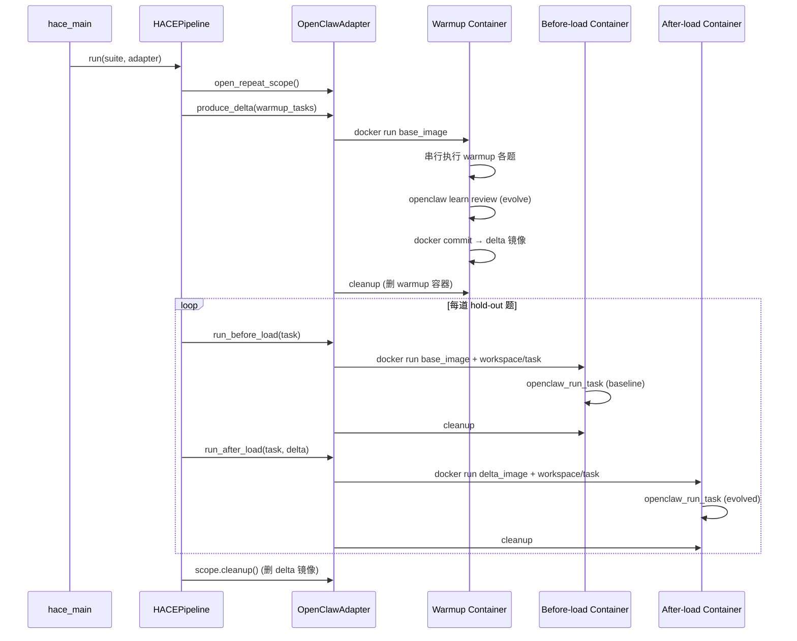
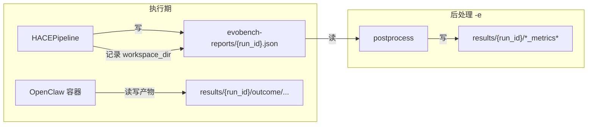

# HACE 框架阅读指南

本文面向第一次接触 `src_new/hace/` 的开发者，说明**如何阅读代码**、**OpenClaw 如何做适配**，以及一次完整评测从 CLI 到容器的执行路径。

> 相关文档：[eval-flow.md](./eval-flow.md)（抽象流程）、[suite_requirement.md](../assets/suite_requirement.md)（数据集规范）、[agents/openclaw/README.md](../agents/openclaw/README.md)（镜像构建）

---

## 1. HACE 在测什么？

**HACE** = Hold-out Artifact-Contrast Evaluation（留出集产物对照评测）。

核心问题：**Agent 在前序任务中学到的「产物」（偏好、规则、技能更新等），能否在最终测试题上带来可衡量的提升？**

做法是对比同一道 **hold-out 题** 在两种状态下的表现：

| 状态 | 含义 | OpenClaw 实现 |
|------|------|---------------|
| **baseline**（before-load） | 干净环境，无进化产物 | 从 **base 镜像** 起新容器 |
| **evolved**（after-load） | 已加载 warmup 阶段产出的产物 | 从 **delta 镜像**（`docker commit`）起新容器 |

前序题（**warmup**）用于让 Agent 做题并触发 **evolve**（`openclaw learn review`），产物固化进 delta 镜像；最终题单独评测，workspace 按题隔离，避免答案串扰。

---

## 2. `src_new/hace/` 目录地图

按**阅读优先级**排列（从上到下先读）：

```
src_new/hace/
├── pipeline/           # 编排入口：HACE 主流程
│   ├── hace_pipeline.py    ← 从这儿开始读
│   └── run_options.py      ← CLI 选项的数据结构
├── suite/              # Suite 加载与 hold-out 切分
│   ├── spec_extensions.py  ← 读 JSON + holdout_count 等扩展字段
│   └── holdout.py          ← warmup / hold-out 切分逻辑
├── adapters/           # 运行时适配层（可插拔 Agent 后端）
│   ├── base.py             ← RuntimeAdapter 协议（接口契约）
│   ├── registry.py         ← --runtime 工厂注册
│   ├── mock_adapter.py     ← 无 Docker 的单元测试替身
│   └── openclaw/           ← OpenClaw 具体实现（见第 4 节）
├── policies/           # 策略（产物如何产生、容器如何编排）
│   ├── artifact.py         ← WarmupThenUpdatePolicy
│   └── container.py        ← warmup 容器策略（serial_single 等）
├── runtime/            # 资源生命周期
│   ├── repeat_scope.py     ← 一次 repeat 内所有容器的清理边界
│   ├── delta_ref.py        ← delta 镜像引用
│   ├── environment_cleaner.py  ← docker rm / commit / rmi
│   └── disposable.py         ← 可清理资源协议
└── tests/              # 单元测试（理解行为的好材料）
```

**不在 `hace/` 内、但强相关的包：**

| 路径 | 作用 |
|------|------|
| `src_new/cli/hace_main.py` | CLI 入口：`--runtime openclaw` |
| `src_new/eval_core.py` | 单题多轮执行：`openclaw_run_task`（work agent + judge） |
| `src_new/models.py` | `SuiteSpec`、`SuiteTask`、`PhaseRun`、`EvalReport` |
| `src_new/agents.py` | `OpenClawAgent` 基类（宿主机版） |
| `agents/openclaw/` | Docker 镜像、插件、gateway 配置 |
| `assets/benchmarks/*.json` | 机器可读评测集 |

---

## 3. 建议阅读顺序（约 30–60 分钟）

### 第一步：搞清「谁调用谁」

1. `src_new/cli/hace_main.py` — 参数解析 → `create_adapter()` → `HACEPipeline.run()`
2. `pipeline/hace_pipeline.py` — 对每个 suite / repeat 的循环骨架
3. `suite/holdout.py` + `suite/spec_extensions.py` — 题目如何分成 warmup 与 hold-out

### 第二步：理解适配器契约

4. `adapters/base.py` — `RuntimeAdapter` 四个方法：
   - `open_repeat_scope` — 打开一次 repeat 的资源作用域
   - `produce_delta` — warmup + evolve → 产出 delta
   - `run_before_load` — baseline 阶段跑 hold-out
   - `run_after_load` — evolved 阶段跑 hold-out

5. `adapters/registry.py` — 目前仅注册 `openclaw`；换运行时在这里扩展

### 第三步：深入 OpenClaw 实现

6. `adapters/openclaw/adapter.py` — 把协议映射到容器操作
7. `adapters/openclaw/delta_producer.py` — warmup 容器 → evolve → `docker commit`
8. `adapters/openclaw/container_session.py` — `docker run`、端口、卷挂载
9. `adapters/openclaw/task_runner.py` — 容器内 `docker exec openclaw …`
10. `src_new/eval_core.py` — `openclaw_run_task`：多轮 work/judge 循环

### 第四步：对照测试

```bash
python -m src_new.hace.tests.test_holdout   # hold-out 切分
python -m src_new.hace.tests.test_runtime    # 清理 / delta 命名
python -m src_new.hace.tests.test_pipeline    # MockAdapter 端到端
```

---

## 4. OpenClaw 适配层详解

### 4.1 设计原则：Host 编排，Container 执行

```
┌─────────────────────────────────────────────────────────────┐
│  Host（Python / HACEPipeline / OpenClawAdapter）              │
│  - 读 suite JSON、切分 warmup/hold-out                       │
│  - docker run / exec / commit / rm                          │
│  - 写 evobench-reports/*.json                               │
└──────────────────────────┬──────────────────────────────────┘
                           │ docker exec openclaw …
┌──────────────────────────▼──────────────────────────────────┐
│  Container（evolve-eval-openclaw:latest）                    │
│  - openclaw gateway run                                     │
│  - work agent + judge agent（agents add / chat）              │
│  - self-evolving-plugin-pro（learn review）                 │
│  - langfuse-tracer（轨迹上报）                               │
└─────────────────────────────────────────────────────────────┘
```

HACE **不**在宿主机直接跑 OpenClaw CLI（legacy `openclaw_main.py` 才是旧模式）。`src_new` 通过 **`ContainerOpenClawAgent`** 把 `OpenClawAgent.chat()` 转成 `docker exec`。

### 4.2 `OpenClawAdapter` 方法 → 文件映射

| 协议方法 | 实现位置 | 行为摘要 |
|----------|----------|----------|
| `open_repeat_scope` | `adapter.py` | 创建 `RepeatScope`（跟踪容器与 delta） |
| `produce_delta` | `delta_producer.py` | 单 warmup 容器串行跑 Q1…Q_{n-1} → `evolve_in_container` → `docker commit` |
| `run_before_load` | `adapter.py` → `task_runner.py` | base 镜像 + 独立 workspace → 跑 hold-out → 销毁容器 |
| `run_after_load` | 同上 | delta 镜像 + 独立 workspace → 跑 hold-out → 销毁容器 |

### 4.3 一次 repeat 的容器时间线



要点：

- **warmup 共用一个容器**（默认 `serial_single` 策略），状态连续，便于 evolve 积累产物。
- **每道 hold-out 的 baseline/evolved 各起一个全新容器**，workspace 挂载到宿主机 `results/{run_id}/outcome/...`，题间隔离。
- **多道 hold-out 共用同一份 delta 镜像**，只换 workspace。

### 4.4 卷挂载（`material_mount.py`）

容器内路径约定：

| 容器路径 | 来源 | 模式 |
|----------|------|------|
| `/workspace/task` | 当前 phase 的宿主机 workspace | rw |
| `/workspace/materials` | `task.requirements.material_dir` | ro |
| `/workspace/skills` | `task.requirements.extra_skills_dir` | ro |
| `/workspace/outcome` | `results/{run_id}/outcome` | rw |
| `/workspace/benchmarks` | `assets/benchmarks` | ro |
| `/workspace/evobench-reports` | `evobench-reports/` | rw |

任务 markdown 里写的 `materials/`、`result/` 路径，对应容器内 `/workspace/materials` 与 `/workspace/task/result/`。

### 4.5 单题执行（`task_runner.py` + `eval_core.py`）

每道题在容器内会：

1. **`create_agents_for_task`** — 创建两个 OpenClaw agent：
   - **work agent**：执行用户 query
   - **judge agent**：按 `content_reqs` 打分，失败则反馈「你再试一次…」
2. **`openclaw_run_task`** — 最多 `eval_max_turns` 轮，直到 judge 判定 success 或耗尽轮次
3. 返回 **`PhaseRun`**：`success`、`content_score`、`work_session_id`、`judge_session_id`、`workspace_dir`

`is_evolve_turn=True`（after-load）会写入 Langfuse 标签，供后处理区分 evolved 轨迹。

### 4.6 Delta 镜像命名与清理

- 命名：`evolve-eval-delta:{run_id}-r{repeat}:{suite_name}`（见 `environment_cleaner.py`）
- `RepeatScope.cleanup()`：逆序销毁 tracked 容器，再 `docker rmi` delta 镜像
- warmup 容器 commit 后立即删除，只保留 delta 镜像供 hold-out 使用

---

## 5. `HACEPipeline` 主流程（代码级）

`pipeline/hace_pipeline.py` 的 `_run_repeat` 是核心：

```text
for suite_path in suite_paths:
    config = load_hace_suite(suite_path)
    warmup_tasks, holdout_tasks = split_suite_tasks(config)

    scope = await adapter.open_repeat_scope(ctx)
    try:
        delta = await adapter.produce_delta(scope, policy, warmup_tasks, ctx)

        if not options.warmup_only:
            for holdout_task in holdout_tasks:
                baseline = await adapter.run_before_load(...)
                evolved  = await adapter.run_after_load(...)
                suite_run.tasks.append(TaskRun(baseline=..., evolved=...))
    finally:
        await scope.cleanup()
```

**`--warmup-only` 模式**：只跑 warmup 题 + evolve + `docker commit` 产 delta，**跳过** hold-out 的 baseline/evolved 对照；report 里 `tasks[]` 为空。

---

## 6. Suite 数据如何进入框架

### 6.1 人类可读 → 机器可读

```
assets/benchmark_mds/<场景>/
  q1_xxx/q1_xxx.md + materials/
  q2_xxx/...
  skills/（可选）
        ↓ preprocess_suite_mds()
assets/benchmarks/<场景>.json   ← SuiteSpec + holdout 扩展字段
```

### 6.2 Hold-out 配置（`spec_extensions.py`）

Suite JSON 在标准 `SuiteSpec` 之外可带：

| 字段 | 默认 | 含义 |
|------|------|------|
| `holdout_count` | `1` | `tasks` 数组**最后 N 题**为 hold-out |
| `holdout_task_names` | 无 | 显式指定 hold-out 题名（优先于 count） |

切分结果：

- **warmup** = 非 hold-out 题 → 进入 `produce_delta`
- **hold-out** = 终测题 → 每题一条 `TaskRun`（baseline + evolved）

详见 [assets/suite_requirement.md](../assets/suite_requirement.md)。

---

## 7. 如何扩展新运行时（非 OpenClaw）

1. 在 `adapters/` 下实现 `RuntimeAdapter` 四个方法（可参考 `mock_adapter.py` 最小实现）
2. 在 `adapters/registry.py` 的 `SUPPORTED_RUNTIMES` 和 `create_adapter()` 中注册
3. 若需要 Docker 镜像，在 `default_docker_image()` 增加解析逻辑
4. 为 pipeline 行为添加测试（参照 `tests/test_pipeline.py`）

**关键约束**：HACE 只关心「能否产出一个可加载的 delta」以及「before/after 两种状态下跑 hold-out」；具体 evolve 机制由适配器决定。OpenClaw 选择 **docker commit 容器文件系统** 作为 delta 载体。

---

## 8. 快速运行与产出物

### 准备阶段（跑 HACE CLI 之前）

以下属于**环境/数据准备**，HACE 主流程本身不负责 build 镜像，也不会在没有 JSON 的情况下凭空造 benchmark：

| 步骤 | 命令 / 产物 | 说明 |
|------|-------------|------|
| **1. Build OpenClaw 镜像** | `bash agents/openclaw/build-image.sh` | 产出 `evolve-eval-openclaw:latest`；HACE 运行时直接 `docker run` 该镜像，不存在则失败 |
| **2. 配置 `.env`** | 仓库根目录 | 模型 API、Langfuse 等；容器启动时 `--env-file` 挂载 |
| **3. 转换 benchmark** | 见下方 | 将 `assets/benchmark_mds/` 下的 md 场景转为 `assets/benchmarks/*.json` |

**Benchmark 预处理**把人类可读的 md 任务目录转成机器可读的 suite JSON（现在已与评测 CLI 解耦，需单独运行）：

```bash
python -m src_new.cli.preprocess
# 或指定目录
python -m src_new.cli.preprocess --input-root assets/benchmark_mds --output-root assets/benchmarks
```

```text
assets/benchmark_mds/<场景>/q1_xxx/*.md
        ↓ preprocess
assets/benchmarks/<场景>.json   ← HACE CLI --suite 实际读取的文件
```

只需在**首次使用**或 **md 有改动**后重新运行一次；JSON 未变时重复跑是幂等的。

**Delta 镜像**（`evolve-eval-delta:...`）**不需要**提前准备——warmup 结束后由 `docker commit` 在运行期动态生成。

**Workspace 人设**：镜像内 `agents/openclaw/workspace_seed/`（`IDENTITY.md` / `USER.md` / `SOUL.md`，无 `BOOTSTRAP.md`）会在 **hold-out**（baseline/evolved）阶段挂载前复制进工作区，避免 OpenClaw 首次上线问名字/emoji；warmup 不 seed，以免干扰 `openclaw learn review` 的 onboard。改 seed 后需 `bash agents/openclaw/build-image.sh` 重建镜像。

### 运行阶段

```bash
# 只跑 warmup（如 hello.json 的 Q1）+ evolve，不跑 hold-out 终测
python -m src_new.cli.hace_main --runtime openclaw --suite hello.json --warmup-only

# 完整 HACE（warmup + hold-out baseline/evolved 对照）
python -m src_new.cli.hace_main --runtime openclaw --suite hello.json

# 评测 + 后处理
python -m src_new.cli.hace_main --runtime openclaw --suite hello.json -e
```

完整推荐顺序：

```bash
# 准备阶段（首次或变更后执行）
bash agents/openclaw/build-image.sh          # 1. 构建 OpenClaw 镜像
python -m src_new.cli.preprocess             # 2. md → JSON

# 运行阶段
python -m src_new.cli.hace_main --runtime openclaw --suite hello.json --warmup-only
```

### 两个输出目录：`evobench-reports` 与 `results`

一次评测 invocation 对应一个 `run_id`（形如 `evobench-runid-20260608-xxxx`），产出落在**两个根目录**，职责不同：

| 目录 | 存什么 | 类比 |
|------|--------|------|
| **`evobench-reports/`** | 结构化评测 report JSON | 考试阅卷记录（分数、session、树形结构） |
| **`results/`** | Agent 工作区文件 + 后处理分析产物 | 考生答卷 + 统计分析报告 |

二者通过 **`run_id`** 关联；report 里每个 `PhaseRun.workspace_dir` 指向 `results/.../outcome/...` 下的具体路径。



#### `evobench-reports/` — 结构化 Report

- **路径**：`evobench-reports/{run_id}.json`
- **谁写**：`HACEPipeline` 执行期边跑边 append，结束时 `write_json` 一次写出（见 `pipeline/hace_pipeline.py`）
- **内容**：`EvalReport` 树形结构

```text
EvalReport（run_id）
  └── runs[]                    ← --repeat 的第 1/2/3 轮
        └── suites[]            ← 每个 suite JSON
              └── tasks[]       ← hold-out 题（通常每 suite 一题）
                    ├── baseline: PhaseRun
                    └── evolved:  PhaseRun
```

每个 `PhaseRun` 含：`success`、`content_score`、`work_session_id`、`judge_session_id`、`workspace_dir`；后处理 `-e` 后再填 `langfuse` trace。

**特点**：一次命令 = **一个** JSON 文件；`--repeat N` 也在同一文件内，用 `runs[0..N-1]` 区分各轮。

#### `results/{run_id}/outcome/` — Agent 工作区（执行期）

Agent 在容器内读写任务产物的宿主机目录，由 `src_new/utils.py` 的 `outcome_workspace()` 生成：

```text
results/{run_id}/outcome/
  run-{repeat_index}/
    warmup/{category}/              ← warmup 阶段共用工作区
    baseline/{category}/{task}/   ← hold-out baseline 产物
    evolved/{category}/{task}/    ← hold-out evolved 产物
```

- 挂载进容器为 `/workspace/task`（见 `adapters/openclaw/container_session.py`）
- 任务 md 里要求的 `result/result_q{n}/` 等文件会落在此目录下
- warmup 题**不进 report**，但产物会写在 `warmup/` 子目录（并参与 evolve / delta commit）

#### `results/{run_id}/` — 后处理产物（`-e` / `--evaluate-only`）

后处理读 `evobench-reports/{run_id}.json`，结合 Langfuse trace，输出到同 `run_id` 下的 `results/`：

| 文件 | 含义 |
|------|------|
| `{run_id}_backfilled.json` | 补全 Langfuse trace 后的 report |
| `{run_id}_comparison_metrics.csv` | 题级 baseline vs evolved 对比 |
| `{run_id}_summary_metrics.csv` | 分类 / 全局汇总 |
| `{run_id}_metrics_report.html` | 可视化 HTML 报告 |

#### `--repeat` 时各产物份数

| 产物 | 路径 | `--repeat N` 时的份数 |
|------|------|------------------------|
| Report JSON | `evobench-reports/{run_id}.json` | **1 份**（内含 `runs[0..N-1]`） |
| Outcome workspace | `results/{run_id}/outcome/run-{i}/...` | **N 套**（i = 0..N-1） |
| 后处理输出 | `results/{run_id}/*_backfilled.json` 等 | **1 套**（汇总全部 repeat） |

若要 N 份独立 report，需执行 N 次命令（不同 `--run_id`），而不是单靠 `--repeat`。

#### 查问题时该看哪个目录？

| 你想知道… | 去看 |
|-----------|------|
| 某题是否通过、分数多少 | `evobench-reports/{run_id}.json` |
| Agent 生成的文件（代码、报告、PPT 等） | `results/{run_id}/outcome/...`，或 report 里该 `PhaseRun.workspace_dir` |
| baseline vs evolved 对比表、HTML 报告 | `results/{run_id}/` 下后处理文件（需 `-e`） |

两个目录均在 `.gitignore` 中，属于运行时产物，一般不提交 git。更完整的 report 字段说明见 [eval-flow.md §8](./eval-flow.md#8-目录与-report-内容)。

**文件属主**：OpenClaw 容器内以 root 写挂载目录（`.git`、`.openclaw` 等）。`ContainerSession.cleanup()` 会在销毁容器前对 `/workspace/task`、`/workspace/outcome` 执行 `chown` 回宿主机用户，正常跑完后应可直接 `rm -rf results/*`。

若仍有历史 root 文件删不掉：

```bash
bash scripts/clean-results.sh
```

---

## 9. 与 legacy 的关系

| 项目 | `src_new`（HACE） | legacy（`openclaw_main.py`） |
|------|-------------------|------------------------------|
| 执行位置 | 容器内 `docker exec` | 宿主机直接调 OpenClaw |
| 产物隔离 | delta 镜像 + per-task 容器 | 宿主机 toggle 加载 |
| 官方入口 | `python -m src_new.cli.hace_main` | `openclaw_main.py --mode exam` |

新开发与论文级复现应使用 **`src_new`** 路径。

---

## 10. 常见问题

**Q：为什么 warmup 和 hold-out 用不同容器策略？**  
Warmup 需要状态连续以触发 evolve；hold-out 需要严格对照（baseline 必须「无产物」），且每题 workspace 独立，故每 phase 起新容器。

**Q：`MockAdapter` 生产环境会用吗？**  
不会。仅用于 `test_pipeline.py` 验证编排逻辑，不依赖 Docker。

**Q：轨迹评分在哪？**  
执行期 `PhaseRun` 主要记录 success/score/session；轨迹相关指标在 **postprocess**（`src_new/postprocess/`）结合 Langfuse trace 计算，需 `-e` 触发。

**Q：OpenClaw 镜像里有什么？**  
见 `agents/openclaw/`：`self-evolving-plugin-pro`（evolve）、`langfuse-tracer`（观测）、gateway 配置片段。构建与环境变量见 [agents/openclaw/README.md](../agents/openclaw/README.md)。

**Q：`evobench-reports` 和 `results` 有什么区别？**  
`evobench-reports` 存结构化 report（分数、session、树形结构）；`results` 存 Agent 实际工作区文件（`outcome/`）和后处理分析（CSV/HTML）。通过 `run_id` 与 `PhaseRun.workspace_dir` 关联。详见本文 §8。

**Q：为什么 `results/` 删不掉（Permission denied）？**  
容器内 root 创建的文件在宿主机上属主也是 root。新跑评测会在容器销毁前自动 `chown` 修复；历史残留用 `bash scripts/clean-results.sh` 清理。

---

## 11. 一页纸总结

```text
CLI (hace_main)
  → HACEPipeline：切 warmup / hold-out
  → RuntimeAdapter（OpenClawAdapter）
       warmup：1 容器 × 多题 → learn review → docker commit → Δ
       hold-out：每题 × (base 容器 baseline, Δ 容器 evolved)
  → eval_core.openclaw_run_task：work + judge 多轮
  → evobench-reports/{run_id}.json（结构化 report）
  → results/{run_id}/outcome/...（Agent 工作区产物）
  → （可选）postprocess → results/{run_id}/*_metrics*（CSV/HTML）
```

**读代码时记住一条线**：`hace_pipeline` 管编排，`openclaw/adapter` 管容器，`task_runner` 管单题，`eval_core` 管评测语义。
