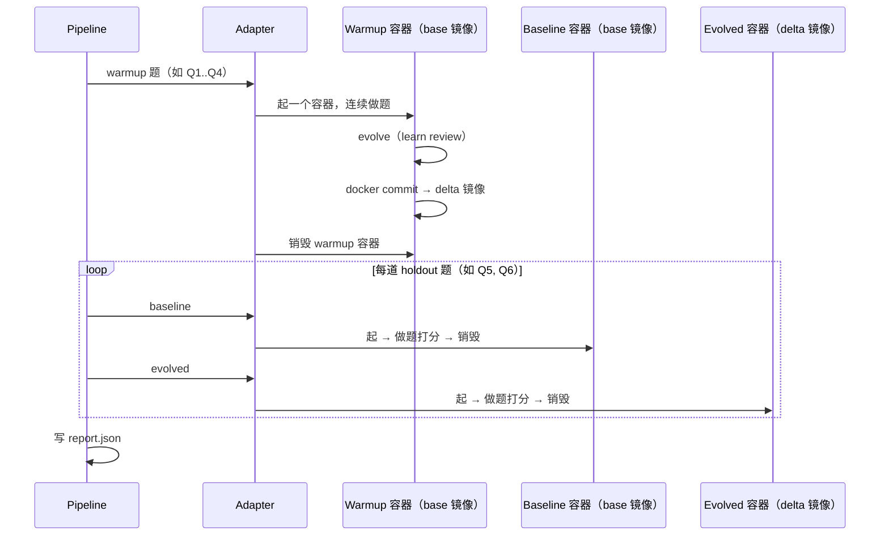

# LIFT 框架讲稿

> 面向内部分享：先把故事讲清楚，再按需深挖。
> 演讲幻灯片：[index.html](./index.html)（图示为主，配 speaker notes）。
> 更细的协议与字段说明见 [eval-flow.md](./eval-flow.md)；镜像与运行时见 [agent-runtimes/openclaw/README.md](../agent-runtimes/openclaw/README.md)；同主题深度可视化见 [lift-framework-visualization.html](./lift-framework-visualization.html)。

---

## 开场：我们到底想回答一个什么问题？

大模型本身是**静态**的——同一份权重，今天答对的题，明天还是这么答；昨天踩过的坑，明天还会再踩。

但我们做的 Agent，被设计成**会进化**的：跑完一批任务之后，它会沉淀经验、更新自己的 SOUL、MEMORY、技能库。问题来了——

> 这种「进化」**真的有用吗**？我们怎么**科学地**证明它有用，而不是听起来很有用？

LIFT 就是为了回答这个问题。

**LIFT**（Loaded Impact on Final Task），一句话：

> Agent 做完「练习题」并进化之后，**期末考**能不能考得更好？

做法很朴素——**同一道 holdout 题考两遍**：

- 一遍不加载进化产物（baseline，对照组）；
- 一遍加载（evolved，实验组）。

看分数差，就是「进化」给这个 Agent 带来的 LIFT（提升）。这是一种典型的 **A/B 对照实验**思路，只是受试者从「用户」换成了「Agent」。

---

## 为什么这件事不容易做

把上面这件事真正做对，有三个工程难点：

1. **「记忆」长在哪？怎么搬？**
   Agent 的状态分散在文件系统里——SOUL.md、MEMORY.md、技能目录、向量库……如何把进化前和进化后的 Agent **整体**冻结成一个可复现的"快照"？
   👉 我们用 **Docker commit**：进化后的容器直接 `docker commit` 出 delta 镜像，Agent 的所有状态被原子地打包。
2. **怎么保证「对照」是干净的？**
   baseline 不能受 evolved 污染，evolved 不能复用 baseline 的环境。题与题之间也必须互不干扰。
   👉 每道 holdout 题、每一相位（baseline / evolved）都**从镜像起新容器**，workspace 按题隔离。
3. **怎么让框架既支持 OpenClaw，也支持未来的别的 Agent？**
   评测内核（怎么阅卷）不应该绑死在 OpenClaw 上。
   👉 三层架构：**Pipeline 编排 / Adapter 接入运行时 / eval 阅卷**。每一层都不知道下一层的具体实现细节。

LIFT 框架的本质，就是把这三件事打包成一个**可一键复现的科学实验**。

---

## 第一部分：框架长什么样（大视角）

### 用考试来类比（核心心智模型）

| 概念                  | 类比                          | 在代码里对应谁                                                |
| --------------------- | ----------------------------- | ------------------------------------------------------------- |
| **Suite**       | 一张卷子（多道题）            | 一个 suite JSON，如`hello.json`                             |
| **Warmup 题**   | 平时的练习题，让 Agent 「学」 | `warmup_tasks` → `produce_delta`                         |
| **Holdout 题**  | 期末考，严格对照              | `holdout_tasks` → `run_before_load` / `run_after_load` |
| **Delta（Δ）** | 进化后的「记忆快照」          | `docker commit` 出来的临时镜像                              |
| **Report**      | 成绩单                        | `results/{run_id}/report.json`                              |

Suite JSON 显式分为 **`warmup_tasks`**（对应 benchmark `train/`）与 **`holdout_tasks`**（对应 benchmark `test/`），训练/测试分离从数据规范层面就被强制约束。

### 三层分工（这条线讲清楚，听众就懂一半了）

```text
CLI / Pipeline          ← 编排：切题、循环、写 report
    ↓
AgentRuntimeAdapter     ← 运行时适配：容器、进化、chat 怎么调
    ↓
lift/eval               ← 评测内核：单题 work + judge 多轮（跟 OpenClaw 无关）
```

- **Pipeline** 不知道 OpenClaw 是什么——它只知道有"warmup"和"holdout"两类相位；
- **eval** 不知道 Docker 是什么——它只知道怎么让 work agent 答题、让 judge 打分；
- **Adapter** 只负责一件事：「在这个特定运行时里，怎么把题跑起来」。

这种解耦带来的好处：**接一个新 Agent 运行时，只用写一个 Adapter**，Pipeline 和 eval 不用动。

### 一次完整 LIFT 的时间线



讲到这里把四个设计取舍点出来：

1. **Warmup 共用一个容器**——状态要连续，进化才有意义；
2. **Holdout baseline 和 evolved 是两个独立容器**——不是同一容器加不加产物，而是分别从 base / delta 镜像新起，对照才干净；
3. **每道 holdout 题之间也起新容器**——题与题 workspace 互不污染；
4. **多道 holdout 共用同一份 delta 镜像**——只换 workspace，不重复进化（进化是昂贵的）。

镜像血缘一句话总结：**base 起两类容器（warmup + holdout baseline），delta 起一类（holdout evolved）**——三类容器实例、两个镜像。

### 代码入口（不用背目录，知道从哪读就行）

| 想看什么   | 打开哪个文件                           |
| ---------- | -------------------------------------- |
| 主流程     | `src/lift/pipeline/lift_pipeline.py` |
| 适配器契约 | `src/lift/adapters/base.py`          |
| 单题评测   | `src/lift/eval/run_task.py`          |
| CLI        | `src/cli/lift_main.py`               |

---

## 第二部分：OpenClaw 是怎么接进来的

核心原则：**宿主机编排，容器内执行**。Python 不直接跑 OpenClaw CLI，而是 `docker run` 起容器 + `docker exec` 调 agent。

### OpenClaw Adapter 只填 4 件事

`OpenClawAdapter`（[src/lift/adapters/openclaw/adapter.py](file:///root/workspace/agent_evolve_evaluation/src/lift/adapters/openclaw/adapter.py)）很薄，继承通用 Docker 层后，只需要填这 4 个钩子：

| 钩子                      | 干什么                                                                                                                                           |
| ------------------------- | ------------------------------------------------------------------------------------------------------------------------------------------------ |
| `resolve_docker_image`  | 用哪个镜像（基础`evolve-eval-openclaw-base:latest`，不带进化插件）                                                                             |
| `start_container`       | 起 gateway、挂卷、记录 session_id                                                                                                                |
| `worker_judger_factory` | 容器里怎么跑 chat（work agent + judge agent）                                                                                                    |
| `evolve_after_warmup`   | 基础 adapter 是 no-op；`OpenClawWithEvolveAdapter`（镜像 `evolve-eval-openclaw-with-evolve:latest`）在 warmup 后跑 `openclaw learn review` |

**Docker commit 产 delta 镜像**是上层 `ContainerAgentRuntimeAdapter` 已经写好的，OpenClaw 不用重复实现——这是分层带来的红利。

### Workspace 设计：让"记忆"真正进入 delta

这是最近的一个重要演进，演讲时值得讲一下：

**问题**：早期 OpenClaw 的工作区在宿主机的 bind mount（`/workspace/task`）下，warmup 阶段 Agent 写的 MEMORY.md、SOUL.md 修改、技能更新……**全都不在容器层**，`docker commit` 根本捕获不到，delta 镜像里其实没有「学到的东西」。

**解决**：

- OpenClaw 默认工作区移到容器内的 `/root/.openclaw/workspace`；
- 种子文件（IDENTITY、USER、SOUL、AGENTS.md……）通过 `Dockerfile COPY` 在**构建期就 baked 进镜像**；
- 任务素材通过 bind mount `/workspace/task` 暴露给容器，用**软链**桥接到工作区；
- 产物路径同样用软链回写到 bind mount，让宿主机能直接看到。

这样：

- **能进化的状态**（记忆 / 技能）在容器内 → 被 `docker commit` 一并打入 delta；
- **任务素材 / 产物**仍在 bind mount → 宿主机和评测系统可以观察。

一句话总结：**该进 delta 的东西就让它进 delta，不该进的就让它别进**。

### 胶水模块（让 OpenClaw 跑起来的零件）

| 模块                               | 解决什么问题                                                                      |
| ---------------------------------- | --------------------------------------------------------------------------------- |
| `openclaw/session.py`            | gateway 端口（随机映射避冲突）、卷挂载、容器 entrypoint                           |
| `openclaw/chat_agent.py`         | `docker exec openclaw agent --local --json` 调 work / judge                     |
| `openclaw_with_evolve/evolve.py` | warmup 后的`openclaw learn review`                                              |
| `openclaw/json_output.py`        | 解析`--json` stdout                                                             |
| `agent-runtimes/openclaw/`       | 镜像构建：self-evolving 插件、langfuse-tracer、gateway 配置、baked workspace 种子 |

### 和 legacy 的区别（一句话）

|      | **LIFT（src）**     | **legacy**            |
| ---- | ------------------------- | --------------------------- |
| 执行 | 容器内                    | 宿主机直跑                  |
| 产物 | delta 镜像 + 每题独立容器 | 宿主机 toggle 加载          |
| 入口 | `lift_main -r openclaw` | `legacy/openclaw_main.py` |

**新开发只走 src 这条线**。

### 接新 runtime 要做什么？

继承 `AgentRuntimeAdapter`，实现上面那 4 个钩子，在 `registry.py` 注册即可。需要 Docker 就再继承 `ContainerAgentRuntimeAdapter`。无 Docker 的测试替身参考 `tests/mock_adapter.py`。

---

## 第三部分：`hello.json` 端到端走一遍（具象化）

### 卷子长什么样

[assets/benchmarks_demo/hello.json](file:///root/workspace/agent_evolve_evaluation/assets/benchmarks_demo/hello.json) 是最小冒烟集，两道题：

| 题           | 内容                   | 在 LIFT 里扮演                                   |
| ------------ | ---------------------- | ------------------------------------------------ |
| **Q1** | 「回复一下你好」       | **Warmup**（`warmup_tasks`）——练习题   |
| **Q2** | 「自我介绍一下你自己」 | **Holdout**（`holdout_tasks`）——期末考 |

Q2 是关键——它能直观验证 Q1 的练习是否让 Agent **更了解自己**（baseline 时只是普通自我介绍，evolved 时会带上从 Q1 沉淀的人格 / 偏好）。

### 跑之前准备什么

```bash
# 1. 构建 OpenClaw 镜像（首次或镜像变更后）
bash agent-runtimes/openclaw/build-image.sh

# 2. 配置仓库根目录 .env（MODEL_NAME 须与 agent-runtimes/openclaw/config/models.fragment.json 对齐）

# hello.json 直接跑；完整 benchmark 需先 preprocess
# python -m src.cli.preprocess
```

### 两条命令，两种粒度

```bash
# 冒烟：只跑 warmup + evolve，不跑 holdout 对照
python -m src.cli.lift_main -r openclaw \
  --benchmark_dir assets/benchmarks_demo --suite hello.json --warmup-only

# 完整 LIFT：Q1 warmup → evolve → Q2 baseline vs evolved → 后处理
python -m src.cli.lift_main -r openclaw \
  --benchmark_dir assets/benchmarks_demo --suite hello.json --run_id hello-full
```

### 执行时发生了什么（按顺序讲，听众能跟上）

1. **读卷** → `load_lift_suite`：分出 `warmup_tasks`（Q1）+ `holdout_tasks`（Q2）
2. **Warmup** → 一个容器跑 Q1（work agent 答题，judge 给反馈，可多轮）
3. **Evolve** → 容器内 `openclaw learn review`，把进化状态写进文件系统
4. **Commit** → `docker commit` 得到临时 delta 镜像，删掉 warmup 容器
5. **Q2 baseline** → 从 **base 镜像**起全新容器，跑题打分
6. **Q2 evolved** → 从 **delta 镜像**起全新容器，再跑一遍
7. **落盘** → 写 `results/{run_id}/report.json`；默认触发后处理（CSV、HTML）

### 跑完看哪里

```text
results/{run_id}/
├── report.json              ← 结构化成绩单：Q2 的 baseline / evolved 分数、session_id
├── outcome/run-0/
│   ├── warmup/Hello/        ← Q1 的产物 + learn review 痕迹
│   ├── baseline/Hello/Q2/   ← 没加载进化产物时的 workspace
│   └── evolved/Hello/Q2/    ← 加载进化产物后的 workspace
├── {run_id}_comparison_metrics.csv   ← baseline vs evolved 对比（后处理）
└── {run_id}_metrics_report.html      ← 可视化报告
```

**查分**看 `report.json`；**查 Agent 写了什么 / 想了什么**看 `outcome/` 对应目录。

`report.json` 结构（演讲时一句话带过）：

```text
EvalReport
  └── runs[0]
        └── suites[0]          ← hello.json
              └── tasks[0]     ← Q2（holdout）
                    ├── baseline: PhaseRun   ← success、content_score、workspace_dir
                    └── evolved:  PhaseRun
```

> Delta 镜像是临时中间产物，suite 跑完会被 `docker rmi` 删掉——`docker images` 里看不到是正常的。要调试进化过程，看 `outcome/.../warmup/`。

---

## 讲稿收尾：一张幻灯片的版本

```text
[问题] Agent 进化到底有没有用？怎么科学地证明？

[答案] LIFT —— 同一道题考两遍，看分数差
       warmup 练习 → docker commit 固化记忆 → holdout 期末考 baseline vs evolved

[架构] 三层解耦
       CLI / Pipeline  →  Adapter  →  eval 内核
       谁都不知道下一层的细节，新 runtime 只需写 Adapter

[实现要点]
       · 记忆要在容器内（baked workspace + bind mount 桥接），才能被 docker commit
       · baseline / evolved 每相位起新容器，保证对照干净
       · 多道 holdout 共用 delta，省一次进化

[产物] results/{run_id}/
       报告 (report.json) + 痕迹 (outcome/) + 可视化 (CSV / HTML)
```

---

## 附录 A：常被问到的问题

**Q：为什么 warmup 和 holdout 容器策略不一样？**
A：Warmup 要状态连续才能进化；holdout 要干净对照，每相位必须新容器。本质是两种相反的需求。

**Q：Warmup / Holdout 串行还是并行？**
A：默认都是**多题并行**：warmup `parallel_single`（同容器并发）、holdout `parallel_multi`（每题独立容器）。同题内部 baseline → evolved 顺序执行。所有并发开关与已知限制集中在 [eval-flow.md §4.5](./eval-flow.md#45-并发模型与限制)；策略枚举详情见 [§4.3](./eval-flow.md#43-warmup-容器策略warmupcontainerpolicy) / [§4.4](./eval-flow.md#44-holdout-容器策略holdoutcontainerpolicy)。

**Q：轨迹分在哪？**
A：执行期 `PhaseRun` 记 success / score；轨迹相关指标在后处理结合 Langfuse trace 算（默认 `--evaluate` 开启）。

**Q：benchmark 从哪来？**
A：`hello.json` 在 `assets/benchmarks_demo/`（随仓库提供，与 `assets/benchmarks/` 分离）。`assets/benchmark_mds/` 与 `assets/benchmarks/` 不纳入 git；完整 benchmark 需 `python -m src.cli.preprocess`（从 TOS 下载 md 并转成 JSON）。与 `lift_main` 解耦，源数据更新后要单独 preprocess（可用 `--force-download`）。

**Q：为什么要把 workspace baked 进镜像？bind mount 不香吗？**
A：bind mount 路径不在容器层，`docker commit` 不会捕获——意味着 Agent 在 warmup 期间写的 MEMORY / 修改的 SOUL 进不了 delta，进化等于白做。baked-in 方案让"记忆"落在容器层，commit 才能把它打进 delta。任务素材和产物仍走 bind mount，宿主机一样能看见。

**Q：results 目录删不掉？**
A：容器内 root 写的文件；新跑会自动 chown，历史残留用 `bash scripts/clean-results.sh`。

---

## 附录 B：详细参考（需要时再翻）

| 主题                                            | 文档 / 路径                                                               |
| ----------------------------------------------- | ------------------------------------------------------------------------- |
| 抽象流程与 report 字段                          | [eval-flow.md](./eval-flow.md)                                               |
| Agent 模型配置契约（fragment ↔`MODEL_NAME`） | [eval-flow.md §12.6](./eval-flow.md#126-agent-模型配置契约lift--容器运行时) |
| Suite JSON 规范                                 | [assets/suite_requirement.md](../assets/suite_requirement.md)                |
| 英文 README                                     | [src/lift/README.md](../src/lift/README.md)                                  |
| 单元测试（理解行为）                            | `src/lift/tests/`                                                       |
| OpenClaw 镜像（含字节内网构建）                 | [agent-runtimes/openclaw/README.md](../agent-runtimes/openclaw/README.md)    |

### 完整目录地图（阅读代码时用）

```text
src/lift/
├── pipeline/lift_pipeline.py     # 主流程
├── suite/                        # 读 JSON、切 warmup/holdout
├── eval/                         # run_task、stage、task_exec（runtime 无关）
├── adapters/
│   ├── base.py                   # AgentRuntimeAdapter 模板
│   ├── container/                # 通用 Docker + docker commit delta
│   ├── openclaw/                 # OpenClaw 薄实现（基础）
│   └── openclaw_with_evolve/     # OpenClaw + learn review
├── policies/                     # 产物策略、warmup/holdout 容器策略
└── runtime/                      # 资源登记与清理
```
