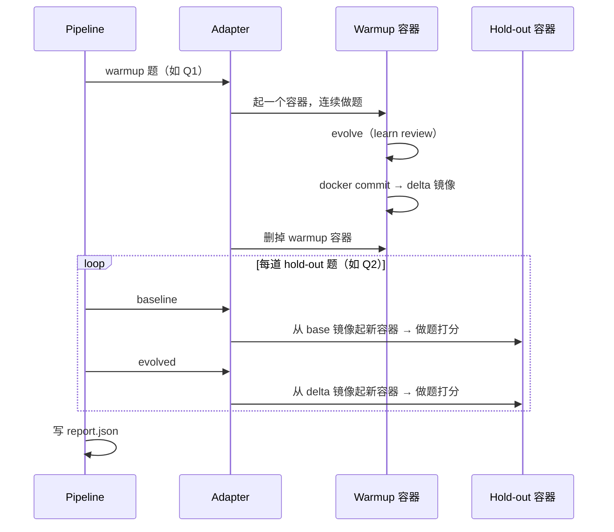

# LIFT 框架讲稿

> 面向内部分享：先抓住重点，再按需深挖。  
> 更细的协议与字段说明见 [eval-flow.md](./eval-flow.md)；镜像构建见 [agent-runtimes/openclaw/README.md](../agent-runtimes/openclaw/README.md)。

---

## 一句话

**LIFT**（Loaded Impact on Final Task）回答一个问题：

> Agent 做完「练习题」并进化之后，**期末考**能不能考得更好？

做法很直接：同一道 hold-out 题跑两遍——**没加载进化产物**（baseline）和**加载了**（evolved）——看分数差。

---

## 第一部分：框架长什么样（大视角）

### 用考试来类比

| 概念 | 类比 | 代码里谁管 |
|------|------|------------|
| **Suite** | 一张卷子（多道题） | `hello.json` |
| **Warmup 题** | 练习题，用来触发进化 | `produce_delta` |
| **Hold-out 题** | 期末考，严格对照 | `run_before_load` / `run_after_load` |
| **Delta（Δ）** | 进化后的「记忆快照」 | `docker commit` 出的临时镜像 |
| **Report** | 成绩单 | `results/{run_id}/report.json` |

默认规则：**每套卷子最后一题是 hold-out**，前面都是 warmup（`holdout_count` 默认 `1`）。

### 三层分工（记住这条线就够了）

```text
CLI / Pipeline          ← 编排：切题、循环、写 report
    ↓
AgentRuntimeAdapter     ← 运行时适配：容器、进化、chat 怎么调
    ↓
lift/eval               ← 评测内核：单题 work + judge 多轮（跟 OpenClaw 无关）
```

**Pipeline 不管 OpenClaw 细节**；**eval 不管 Docker**；**Adapter 只管「怎么在这个 runtime 里跑起来」**。

### 一次完整 LIFT 的时间线



三个设计取舍，讲的时候顺带提一句：

1. **Warmup 共用一个容器**——状态要连续，进化才有意义。
2. **Hold-out 每轮起新容器**——baseline 必须是「干净环境」，题与题 workspace 也要隔离。
3. **多道 hold-out 共用同一份 delta**——只换 workspace，不重复进化。

### 代码入口（不用背目录，知道从哪读就行）

| 想看什么 | 打开哪个文件 |
|----------|--------------|
| 主流程 | `src/lift/pipeline/lift_pipeline.py` |
| 适配器契约 | `src/lift/adapters/base.py` |
| 单题评测 | `src/lift/eval/run_task.py` |
| CLI | `src/cli/lift_main.py` |

---

## 第二部分：OpenClaw 接入做了哪些事

核心原则：**宿主机编排，容器内执行**。Python 不直接跑 OpenClaw CLI，而是 `docker run` + `docker exec`。

### OpenClaw 只实现了 4 件事

`OpenClawAdapter`（`src/lift/adapters/openclaw/adapter.py`）很薄，继承通用 Docker 层，自己只填：

| 钩子 | 干什么 |
|------|--------|
| `resolve_docker_image` | 用哪个镜像（默认 `evolve-eval-openclaw:latest`） |
| `start_container` | 起 gateway、挂卷、可选 workspace seed |
| `worker_judger_factory` | 怎么在容器里 chat（work agent + judge agent） |
| `apply_evolve` | warmup 结束后跑 `openclaw learn review` |

**Docker commit 产 delta** 是上层 `ContainerAgentRuntimeAdapter` 已经写好的，OpenClaw 不用重复实现。

### 为了跑通，额外做了几块「胶水」

| 模块 | 解决什么问题 |
|------|--------------|
| `openclaw/session.py` | Gateway 端口、卷挂载、容器 entrypoint |
| `openclaw/chat_agent.py` | `docker exec openclaw agent --local --json` |
| `openclaw/evolve.py` | warmup 后的 `learn review` |
| `openclaw/workspace_seed.py` | Hold-out 跳过 OpenClaw 首次上线问名字/emoji（warmup 不 seed，避免干扰 onboard） |
| `openclaw/json_output.py` | 解析 `--json`  stdout |
| `agent-runtimes/openclaw/` | 镜像：self-evolving 插件、langfuse-tracer、gateway 配置 |

### 和 legacy 的区别（一句话）

| | **LIFT（src）** | **legacy** |
|--|-----------------|------------|
| 执行 | 容器内 | 宿主机直跑 |
| 产物 | delta 镜像 + 每题独立容器 | 宿主机 toggle 加载 |
| 入口 | `lift_main --agent-runtime openclaw` | `legacy/openclaw_main.py` |

新开发走 **src** 这条线。

### 接新 runtime 要做什么？

继承 `AgentRuntimeAdapter`，实现上面那 4 个钩子，在 `registry.py` 注册。需要 Docker 就再继承 `ContainerAgentRuntimeAdapter`。参考 `tests/mock_adapter.py`（无 Docker 的测试替身）。

---

## 第三部分：`hello.json` 端到端走一遍

### 卷子长什么样

`assets/benchmarks_demo/hello.json` 两道题（与 `assets/benchmarks/` 分离，跑时指定 `--benchmark_dir assets/benchmarks_demo`）：

| 题 | 内容 | 在 LIFT 里扮演 |
|----|------|----------------|
| **Q1** | 「回复一下你好」 | **Warmup**——练习题 |
| **Q2** | 「自我介绍一下你自己」 | **Hold-out**——期末考（默认最后一题） |

### 跑之前准备什么

```bash
# 1. 构建 OpenClaw 镜像（首次或镜像变更后）
bash agent-runtimes/openclaw/build-image.sh

# 2. 配置仓库根目录 .env（模型 API、Langfuse 等）

# hello.json 可直接跑；完整 benchmark 需 preprocess
# python -m src.cli.preprocess
```

### 两条命令，两种粒度

```bash
# 冒烟：只跑 warmup + evolve，不跑 hold-out 对照
python -m src.cli.lift_main --agent-runtime openclaw --benchmark_dir assets/benchmarks_demo --suite hello.json --warmup-only

# 完整 LIFT：Q1 warmup → evolve → Q2 baseline vs evolved → 后处理
python -m src.cli.lift_main --agent-runtime openclaw --benchmark_dir assets/benchmarks_demo --suite hello.json --run_id hello-full
```

### 执行时发生了什么（按顺序讲）

1. **读卷** → `load_lift_suite` + `split_suite_tasks`：Q1 → warmup，Q2 → hold-out  
2. **Warmup** → 一个容器跑 Q1（work agent 答题，judge 给反馈，可多轮）  
3. **Evolve** → 容器内 `openclaw learn review`，把进化状态写进文件系统  
4. **Commit** → `docker commit` 得到临时 delta 镜像，删掉 warmup 容器  
5. **Q2 baseline** → 从 **base 镜像**起全新容器，seed workspace，跑题打分  
6. **Q2 evolved** → 从 **delta 镜像**起全新容器，同样 seed，再跑一遍  
7. **落盘** → `results/{run_id}/report.json`；默认触发后处理（CSV、HTML）

### 跑完看哪里

```text
results/{run_id}/
├── report.json              ← 结构化成绩：Q2 的 baseline / evolved 分数、session_id
├── outcome/run-0/
│   ├── warmup/Hello/        ← Q1 产物 + learn review 痕迹
│   ├── baseline/Hello/Q2/   ← 没加载进化产物时的 workspace
│   └── evolved/Hello/Q2/    ← 加载进化产物后的 workspace
├── {run_id}_comparison_metrics.csv   ← baseline vs evolved 对比（后处理）
└── {run_id}_metrics_report.html      ← 可视化报告
```

**查分**看 `report.json`；**查 Agent 写了什么**看 `outcome/` 对应目录。

`report.json` 结构：

```text
EvalReport
  └── runs[0]
        └── suites[0]          ← hello.json
              └── tasks[0]     ← Q2（hold-out）
                    ├── baseline: PhaseRun   ← success、content_score、workspace_dir
                    └── evolved:  PhaseRun
```

> Delta 镜像是临时中间产物，suite 跑完会被 `docker rmi` 删掉——`docker images` 里看不到是正常的。要调试进化过程，看 `outcome/.../warmup/`。

---

## 讲稿收尾

```text
LIFT = warmup 进化 → 同一道 hold-out 题考两遍 → 看有没有 LIFT

框架：Pipeline 编排 + eval 阅卷 + adapter 接 runtime

OpenClaw：4 个钩子 + 容器/chat/evolve/seed 胶水

hello.json：Q1 练 → Q2 对照 → report + outcome
```

---

## 附录：常问两句

**为什么 warmup 和 hold-out 容器策略不一样？**  
Warmup 要状态连续才能进化；hold-out 要干净对照，每 phase 必须新容器。

**轨迹分在哪？**  
执行期 `PhaseRun` 记 success/score；轨迹相关指标在后处理结合 Langfuse trace 算（默认 `--evaluate` 开启）。

**benchmark 从哪来？**  
`hello.json` 在 `assets/benchmarks_demo/`（随仓库提供，与 `assets/benchmarks/` 分离）。`assets/benchmark_mds/` 与 `assets/benchmarks/` 不纳入 git；完整 benchmark 需 `python -m src.cli.preprocess`（从 TOS 下载 md 并转成 JSON）。与 `lift_main` 解耦，源数据更新后要单独 preprocess（可用 `--force-download`）。

**results 删不掉？**  
容器内 root 写的文件；新跑会自动 chown，历史残留用 `bash scripts/clean-results.sh`。

---

## 附录：详细参考（需要时再翻）

| 主题 | 文档 / 路径 |
|------|-------------|
| 抽象流程与 report 字段 | [eval-flow.md](./eval-flow.md) |
| Suite JSON 规范 | [assets/suite_requirement.md](../assets/suite_requirement.md) |
| 英文 README | [src/lift/README.md](../src/lift/README.md) |
| 单元测试（理解行为） | `src/lift/tests/` |
| OpenClaw 镜像 | `agent-runtimes/openclaw/` |

### 完整目录地图（阅读代码时用）

```text
src/lift/
├── pipeline/lift_pipeline.py     # 主流程
├── suite/                        # 读 JSON、切 warmup/hold-out
├── eval/                         # run_task、stage、task_exec（runtime 无关）
├── adapters/
│   ├── base.py                   # AgentRuntimeAdapter 模板
│   ├── container/                # 通用 Docker + docker commit delta
│   └── openclaw/                 # OpenClaw 薄实现
├── policies/                     # 产物策略、warmup 容器策略
└── runtime/                      # 资源登记与清理
```
