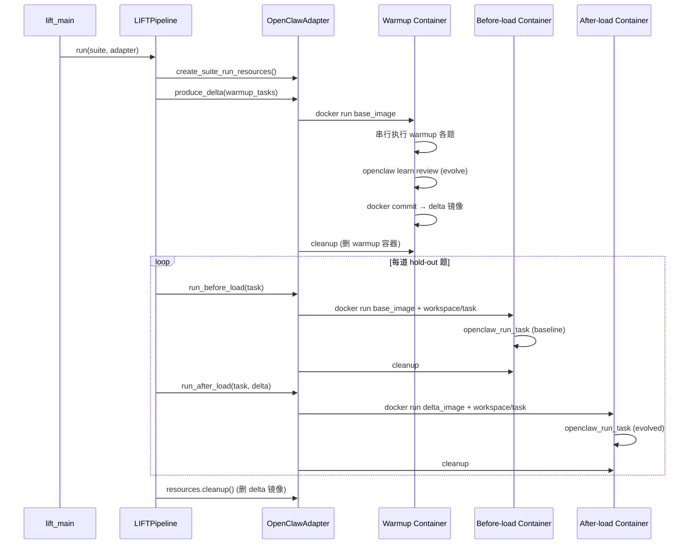
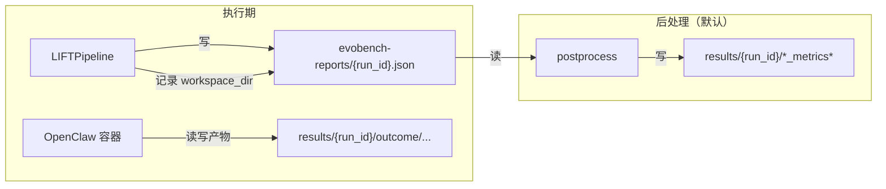

# LIFT 框架阅读指南

本文面向第一次接触 `src_new/lift/` 的开发者，说明**如何阅读代码**、**OpenClaw 如何做适配**，以及一次完整评测从 CLI 到容器的执行路径。

> 相关文档：[eval-flow.md](./eval-flow.md)（抽象流程）、[suite_requirement.md](../assets/suite_requirement.md)（数据集规范）、[agents/openclaw/README.md](../agents/openclaw/README.md)（镜像构建）

---

## 1. LIFT 在测什么？

**LIFT** = Loaded Impact on Final Task（终测加载效应评测）。

核心问题：**加载能力产物后，hold-out 终测题的表现有没有被抬起来（LIFT）？**

协议实现上，通过在 hold-out final task 上做**隔离的配对加载态对照**（before-load / after-load，每题独立容器与 workspace）来度量该效应。

做法是对比同一道 **hold-out 题** 在两种状态下的表现：

| 状态 | 含义 | OpenClaw 实现 |
|------|------|---------------|
| **baseline**（before-load） | 干净环境，无进化产物 | 从 **base 镜像** 起新容器 |
| **evolved**（after-load） | 已加载 warmup 阶段产出的产物 | 从 **delta 镜像**（`docker commit`）起新容器 |

前序题（**warmup**）用于让 Agent 做题并触发 **evolve**（`openclaw learn review`），产物固化进 delta 镜像；最终题单独评测，workspace 按题隔离，避免答案串扰。

---

## 2. `src_new/lift/` 目录地图

按**阅读优先级**排列（从上到下先读）：

```
src_new/lift/
├── pipeline/           # 编排入口：LIFT 主流程
│   ├── lift_pipeline.py    ← 从这儿开始读
│   └── run_options.py      ← CLI 选项的数据结构
├── suite/              # Suite 加载与 hold-out 切分
│   ├── lift_suite.py       ← 读 JSON + holdout_count 等扩展字段
│   └── holdout.py          ← warmup / hold-out 切分逻辑
├── eval/               # 单题评测内核（runtime 无关）
│   ├── run_task.py         ← work + judge 多轮循环
│   └── phase.py            ← execute_phase / execute_phase_batch
├── adapters/           # 运行时适配层（三层继承）
│   ├── base.py             ← AgentRuntimeAdapter 模板方法 + 抽象钩子
│   ├── environment.py      ← ExecutionEnvironment
│   ├── registry.py         ← --agent-runtime 工厂注册
│   ├── container/          ← 通用 Docker 层
│   │   ├── adapter.py          ← ContainerAgentRuntimeAdapter（commit delta 默认实现）
│   │   ├── session.py          ← 参数化 docker run / cleanup
│   │   ├── volumes.py          ← 卷挂载
│   │   └── delta.py            ← commit_delta_image
│   └── openclaw/           ← OpenClaw 薄实现（镜像 / chat / evolve / 容器启动）
│       ├── adapter.py
│       ├── session.py          ← gateway 端口、seed、OpenClaw entrypoint
│       ├── agent.py            ← ContainerOpenClawAgent + factory
│       ├── evolve.py           ← learn review
│       └── workspace_seed.py
├── policies/           # 策略（产物如何产生、容器如何编排）
│   ├── artifact.py         ← ArtifactPolicy（ABC）+ WarmupThenUpdatePolicy
│   └── container.py        ← warmup 容器策略（serial_single 等）
├── runtime/            # 资源生命周期
│   ├── suite_run_resources.py  ← 单次 suite 评测的资源登记与释放
│   ├── delta_ref.py        ← delta 镜像引用
│   ├── environment_cleaner.py  ← docker rm / commit / rmi
│   └── disposable.py         ← Disposable 抽象基类
└── tests/              # 单元测试（理解行为的好材料）
    ├── mock_adapter.py     ← 无 Docker 的测试替身（参考 AgentRuntimeAdapter 最小实现）
```

**不在 `lift/` 内、但强相关的包：**

| 路径 | 作用 |
|------|------|
| `src_new/cli/lift_main.py` | CLI 入口：`--agent-runtime openclaw` |
| `src_new/lift/eval/` | 单题多轮执行：`run_task`（work + judge）；多题编排：`execute_phase` / `execute_phase_batch` |
| `src_new/eval_core.py` | **Deprecated shim**，兼容旧 `openclaw_run_task` / Hermes `run_task` 签名 |
| `src_new/models.py` | `Suite`、`SuiteTask`、`PhaseRun`、`EvalReport` |
| `src_new/agents.py` | `OpenClawAgent` 基类（宿主机版） |
| `agents/openclaw/` | Docker 镜像、插件、gateway 配置 |
| `assets/benchmarks/*.json` | 机器可读评测集 |

---

## 3. 建议阅读顺序（约 30–60 分钟）

### 第一步：搞清「谁调用谁」

1. `src_new/cli/lift_main.py` — 参数解析 → `create_adapter()` → `LIFTPipeline.run()`
2. `pipeline/lift_pipeline.py` — 对每个 suite / repeat 的循环骨架
3. `suite/holdout.py` + `suite/lift_suite.py` — 题目如何分成 warmup 与 hold-out

### 第二步：理解适配器三层继承

4. `adapters/base.py` — **`AgentRuntimeAdapter` 模板方法**（已实现 `produce_delta` / `_run_holdout`），子类只需实现钩子：
   - `create_agent_pair_factory` — 如何 chat
   - `start_warmup_environment` / `start_holdout_environment` — 执行环境
   - `apply_evolve` — warmup 后进化
   - `materialize_delta` — 产物物化
   - `baseline_image` — before-load 运行时标识

5. `adapters/container/adapter.py` — **`ContainerAgentRuntimeAdapter`**：容器启停 + **默认 docker commit** 物化 delta；抽象 `start_container` + `resolve_docker_image`

6. `adapters/openclaw/adapter.py` — **OpenClaw 仅 4 件事**：读镜像配置、`start_container`、`create_agent_pair_factory`、`apply_evolve`

7. `adapters/registry.py` — 目前仅注册 `openclaw`

### 第三步：评测内核与 OpenClaw 细节

8. `lift/eval/run_task.py` + `phase.py` — 单题 / 多题执行（与 runtime 无关）
9. `openclaw/session.py` — OpenClaw gateway 启动、端口、workspace seed
10. `openclaw/agent.py` — 容器内 `docker exec openclaw` 实现 chat

### 第四步：对照测试

```bash
python -m pytest src_new/lift/tests -q
# 或按文件：pytest src_new/lift/tests/test_holdout.py
```

---

## 4. OpenClaw 适配层详解

### 4.1 设计原则：Host 编排，Container 执行

```
┌─────────────────────────────────────────────────────────────┐
│  Host（Python / LIFTPipeline / OpenClawAdapter）              │
│  - 读 suite JSON、切分 warmup/hold-out                       │
│  - docker run / exec / commit / rm                          │
│  - 写 evobench-reports/*.json                               │
└──────────────────────────┬──────────────────────────────────┘
                           │ docker exec openclaw …
┌──────────────────────────▼──────────────────────────────────┐
│  Container（evolve-eval-openclaw:latest）                    │
│  - openclaw gateway run                                     │
│  - work agent + judge agent（agents add / chat）              │
│  - self-evolving-plugin-pro（learn review）                 │
│  - langfuse-tracer（轨迹上报）                               │
└─────────────────────────────────────────────────────────────┘
```

LIFT **不**在宿主机直接跑 OpenClaw CLI（legacy `openclaw_main.py` 才是旧模式）。`src_new` 通过 **`ContainerOpenClawAgent`** 把 `OpenClawAgent.chat()` 转成 `docker exec`。

### 4.2 三层职责 → 文件映射

| 层 | 模块 | 职责 |
|----|------|------|
| **AgentRuntimeAdapter** | `base.py` | 模板：`produce_delta`、`_run_holdout`；调 `lift/eval` |
| **ContainerAgentRuntimeAdapter** | `container/adapter.py` | 容器启停；默认 `materialize_delta` = docker commit |
| **OpenClawAdapter** | `openclaw/adapter.py` | `resolve_docker_image`、`start_container`、`create_agent_pair_factory`、`apply_evolve` |
| **OpenClaw chat** | `openclaw/agent.py` | `ContainerOpenClawAgent` + `OpenClawAgentPairFactory` |
| **OpenClaw 容器** | `openclaw/session.py` | gateway 端口、volume、workspace seed |

### 4.3 一次 repeat 的容器时间线



要点：

- **warmup 共用一个容器**（默认 `serial_single` 策略），状态连续，便于 evolve 积累产物。
- **每道 hold-out 的 baseline/evolved 各起一个全新容器**，workspace 挂载到宿主机 `results/{run_id}/outcome/...`，题间隔离。
- **多道 hold-out 共用同一份 delta 镜像**，只换 workspace。

### 4.4 卷挂载（`container/volumes.py`）

容器内路径约定：

| 容器路径 | 来源 | 模式 |
|----------|------|------|
| `/workspace/task` | 当前 phase 的宿主机 workspace | rw |
| `/workspace/materials` | `task.requirements.material_dir` | ro |
| `/workspace/skills` | `task.requirements.extra_skills_dir` | ro |
| `/workspace/outcome` | `results/{run_id}/outcome` | rw |
| `/workspace/benchmarks` | `assets/benchmarks` | ro |
| `/workspace/evobench-reports` | `evobench-reports/` | rw |

任务 markdown 里写的 `materials/`、`result/` 路径，对应容器内 `/workspace/materials` 与 `/workspace/task/result/`。

### 4.5 单题执行（`lift/eval/` + adapter factory）

职责分层：

| 层 | 模块 | 粒度 |
|----|------|------|
| **单题内核** | `lift/eval/run_task.py` | 1 task：work chat → judge chat → 解析 → 重试 |
| **单题包装** | `lift/eval/phase.py` `execute_phase` | factory 创建 agent pair → `run_task` → `PhaseRun` |
| **多题编排** | `lift/eval/phase.py` `execute_phase_batch` | `parallel` 控制串行 / 并行 |
| **OpenClaw 特化** | `openclaw/agent.py` `OpenClawAgentPairFactory` | 容器内 `docker exec openclaw` 实现 `chat` |

warmup 与 hold-out **共用** `run_task`；差异仅在 adapter 的容器 / workspace / evolve。

`is_evolve_turn=True`（after-load）会写入 Langfuse 标签，供后处理区分 evolved 轨迹。

### 4.6 Workspace 人设预置（`workspace_seed.py`）

hold-out 每题使用**全新空 workspace**，OpenClaw 默认会走 `BOOTSTRAP.md` 首次上线流程（问名字、emoji 等），干扰评测。

| 阶段 | 是否 seed | 原因 |
|------|-----------|------|
| **warmup** | 否 | 避免干扰 `openclaw learn review` 的 onboard |
| **baseline / evolved** | 是 | 从 `agents/openclaw/workspace_seed/` 复制 `IDENTITY.md` / `USER.md` / `SOUL.md`，删除 `BOOTSTRAP.md` |

seed 在宿主机挂载前写入 `results/.../outcome/...`，容器启动后再从镜像内 `/opt/evolve-eval/workspace_seed` 同步一次。修改 seed 后需重建 OpenClaw 镜像。

### 4.7 进化产物与 Delta 镜像

**warmup 结束后**执行 `openclaw learn review`，再 `docker commit` 得到临时 **delta 镜像**：

| 产物类型 | 内容 | 是否持久保留 |
|----------|------|--------------|
| **Delta 镜像** | 容器文件系统（主要是 `/root/.openclaw/` 下插件进化状态）；**不含** bind mount 的 `/workspace/task` | suite 跑完后由 `resources.cleanup()` **`docker rmi` 删除** |
| **Warmup workspace** | 宿主机 `results/{run_id}/outcome/run-{i}/warmup/{category}/`；含 learn review 的 git 快照（`openclaw baseline` 提交） | **保留**，可调试 |
| **Hold-out workspace** | `baseline/`、`evolved/` 各题独立目录 | **保留** |

evolved 阶段从 delta 镜像起新容器，但挂载**新的** hold-out workspace（已 seed 人设）；进化状态靠镜像内插件状态传递，而非拷贝 warmup 目录。

### 4.8 Delta 镜像命名与清理

- 命名：`evolve-eval-delta:{run_id}-r{repeat_index}-{suite_name}`（Docker 只允许一个 `:`，见 `environment_cleaner.py`）
  - 示例：`evolve-eval-delta:evobench-runid-hello-full-seed2-r0-Hello`
- `SuiteRunResources.cleanup()`：逆序销毁已登记容器，再 `docker rmi -f` delta 镜像
- warmup 容器 commit 后立即删除；delta 镜像仅在一次 repeat 的 hold-out 期间存在，**跑完后 `docker images` 里看不到是正常现象**

---

## 5. `LIFTPipeline` 主流程（代码级）

`pipeline/lift_pipeline.py` 的 `_run_suites` 是核心：

```text
for suite_path in suite_paths:
    config = load_lift_suite(suite_path)
    warmup_tasks, holdout_tasks = split_suite_tasks(config)

    resources = await adapter.create_suite_run_resources(ctx)
    try:
        delta = await adapter.produce_delta(resources, policy, warmup_tasks, ctx)

        if not options.warmup_only:
            for holdout_task in holdout_tasks:
                baseline = await adapter.run_before_load(...)
                evolved  = await adapter.run_after_load(...)
                suite_run.tasks.append(TaskRun(baseline=..., evolved=...))
    finally:
        await resources.cleanup()
```

**`--warmup-only` 模式**：只跑 warmup 题 + evolve + `docker commit` 产 delta，**跳过** hold-out 的 baseline/evolved 对照；report 里 `tasks[]` 为空。

---

## 6. Suite 数据如何进入框架

### 6.1 人类可读 → 机器可读

```
assets/benchmark_mds/<场景>/
  q1_xxx/q1_xxx.md + materials/
  q2_xxx/...
  skills/（可选）
        ↓ python -m src_new.cli.preprocess
assets/benchmarks/<场景>.json   ← Suite + holdout 扩展字段
```

### 6.2 Hold-out 配置（`lift_suite.py`）

Suite JSON 在标准 `Suite` 之外可带：

| 字段 | 默认 | 含义 |
|------|------|------|
| `holdout_count` | `1` | `tasks` 数组**最后 N 题**为 hold-out |
| `holdout_task_names` | 无 | 显式指定 hold-out 题名（优先于 count） |

切分结果：

- **warmup** = 非 hold-out 题 → 进入 `produce_delta`
- **hold-out** = 终测题 → 每题一条 `TaskRun`（baseline + evolved）

详见 [assets/suite_requirement.md](../assets/suite_requirement.md)。

---

## 7. 如何扩展新运行时（非 OpenClaw）

1. 在 `adapters/` 下 **继承** `AgentRuntimeAdapter`，用 `@override` 实现四个抽象方法（参考 `tests/mock_adapter.py`）
2. 在 `adapters/registry.py` 的 `SUPPORTED_RUNTIMES` 和 `create_adapter()` 中注册
3. 若需要 Docker 镜像，继承 `ContainerAgentRuntimeAdapter` 并实现 `resolve_docker_image()`（参考 `OpenClawAdapter`）
4. 为 pipeline 行为添加测试（参照 `tests/test_pipeline.py`、`tests/test_abc_contracts.py`）

相关 ABC：`ArtifactPolicy`（产物策略）、`Disposable`（容器 / delta 清理）。实现类同样继承并在重写方法上使用 `@override`。

**关键约束**：LIFT 只关心「能否产出一个可加载的 delta」以及「before/after 两种状态下跑 hold-out」；具体 evolve 机制由适配器决定。OpenClaw 选择 **docker commit 容器文件系统** 作为 delta 载体。

---

## 8. 快速运行与产出物

### 准备阶段（跑 LIFT CLI 之前）

以下属于**环境/数据准备**，LIFT 主流程本身不负责 build 镜像，也不会在没有 JSON 的情况下凭空造 benchmark：

| 步骤 | 命令 / 产物 | 说明 |
|------|-------------|------|
| **1. Build OpenClaw 镜像** | `bash agents/openclaw/build-image.sh` | 产出 `evolve-eval-openclaw:latest`；LIFT 运行时直接 `docker run` 该镜像，不存在则失败 |
| **2. 配置 `.env`** | 仓库根目录 | 模型 API、Langfuse 等；容器启动时 `--env-file` 挂载 |
| **3. 转换 benchmark** | 见下方 | 将 `assets/benchmark_mds/` 下的 md 场景转为 `assets/benchmarks/*.json` |

**Benchmark 预处理**把人类可读的 md 任务目录转成机器可读的 suite JSON（现在已与评测 CLI 解耦，需单独运行）：

```bash
python -m src_new.cli.preprocess
# 或指定目录
python -m src_new.cli.preprocess --input-root assets/benchmark_mds --output-root assets/benchmarks
```

```text
assets/benchmark_mds/<场景>/q1_xxx/*.md
        ↓ preprocess
assets/benchmarks/<场景>.json   ← LIFT CLI --suite 实际读取的文件
```

只需在**首次使用**或 **md 有改动**后重新运行一次；JSON 未变时重复跑是幂等的。

**Delta 镜像**（`evolve-eval-delta:...`）**不需要**提前准备——warmup 结束后由 `docker commit` 在运行期动态生成。

**Workspace 人设**：镜像内 `agents/openclaw/workspace_seed/`（`IDENTITY.md` / `USER.md` / `SOUL.md`，无 `BOOTSTRAP.md`）会在 **hold-out**（baseline/evolved）阶段挂载前复制进工作区，避免 OpenClaw 首次上线问名字/emoji；warmup 不 seed，以免干扰 `openclaw learn review` 的 onboard。改 seed 后需 `bash agents/openclaw/build-image.sh` 重建镜像。

### CLI 参数（`lift_main.py`）

| 参数 | 默认 | 含义 |
|------|------|------|
| `-r` / `--agent-runtime` | **必填** | Agent 运行时适配器（当前仅 `openclaw`） |
| `--suite` | `all` | suite JSON 文件名，逗号分隔 |
| `--benchmark_dir` | `assets/benchmarks` | suite JSON 目录 |
| `--warmup-only` | off | 只跑 warmup + evolve + delta，跳过 hold-out |
| `--run_id` | 自动生成 | 自定义 `run_id` 后缀（如 `hello-full`） |
| `--repeat` | `1` | 重复完整 LIFT 流程 N 次（写入同一 report 的 `runs[]`） |
| `--serial-repeats` | off | repeat 串行（默认并行） |
| `-p` / `--parallel` | off | warmup 题并行（受容器策略约束） |
| `--warmup-container-policy` | `serial_single` | warmup 容器编排策略 |
| `-e` / `--evaluate` | **on** | 评测结束后自动后处理（默认开启） |
| `--no-evaluate` | — | 跳过后处理（调试或 Langfuse 不可用时） |
| `--evaluate-only` | off | 仅后处理已有 report（需 `--run_id`） |

> 已移除 legacy 的 `--test`；冒烟可改用 `--warmup-only`。`--agent-runtime` 无默认值，必须显式指定。

### 运行阶段

```bash
# 只跑 warmup（如 hello.json 的 Q1）+ evolve，不跑 hold-out 终测
python -m src_new.cli.lift_main --agent-runtime openclaw --suite hello.json --warmup-only

# 完整 LIFT（warmup + hold-out 对照 + 默认后处理：trace_backfill、CSV、HTML）
python -m src_new.cli.lift_main --agent-runtime openclaw --suite hello.json --run_id hello-full

# 跳过后处理（调试长跑、或 Langfuse 未配置时）
python -m src_new.cli.lift_main --agent-runtime openclaw --suite hello.json --run_id hello-full --no-evaluate

# 仅后处理已有 run
python -m src_new.cli.lift_main --agent-runtime openclaw --evaluate-only --run_id hello-full
```

完整推荐顺序：

```bash
# 准备阶段（首次或变更后执行）
bash agents/openclaw/build-image.sh          # 1. 构建 OpenClaw 镜像
python -m src_new.cli.preprocess             # 2. md → JSON（与 lift_main 解耦，需单独跑）

# 运行阶段
python -m src_new.cli.lift_main --agent-runtime openclaw --suite hello.json --warmup-only
python -m src_new.cli.lift_main --agent-runtime openclaw --suite hello.json --run_id hello-full
```

也可使用等价入口：`python -m src_new.cli`（转发到 `lift_main`）。

### 两个输出目录：`evobench-reports` 与 `results`

一次评测 invocation 对应一个 `run_id`（形如 `evobench-runid-20260608-xxxx`），产出落在**两个根目录**，职责不同：

| 目录 | 存什么 | 类比 |
|------|--------|------|
| **`evobench-reports/`** | 结构化评测 report JSON | 考试阅卷记录（分数、session、树形结构） |
| **`results/`** | Agent 工作区文件 + 后处理分析产物 | 考生答卷 + 统计分析报告 |

二者通过 **`run_id`** 关联；report 里每个 `PhaseRun.workspace_dir` 指向 `results/.../outcome/...` 下的具体路径。



#### `evobench-reports/` — 结构化 Report

- **路径**：`evobench-reports/{run_id}.json`
- **谁写**：`LIFTPipeline` 执行期边跑边 append，结束时 `write_json` 一次写出（见 `pipeline/lift_pipeline.py`）
- **内容**：`EvalReport` 树形结构

```text
EvalReport（run_id）
  └── runs[]                    ← --repeat 的第 1/2/3 轮
        └── suites[]            ← 每个 suite JSON
              └── tasks[]       ← hold-out 题（通常每 suite 一题）
                    ├── baseline: PhaseRun
                    └── evolved:  PhaseRun
```

每个 `PhaseRun` 含：`success`、`content_score`、`work_session_id`、`judge_session_id`、`workspace_dir`；后处理（默认自动）后再填 `langfuse` trace。

**特点**：一次命令 = **一个** JSON 文件；`--repeat N` 也在同一文件内，用 `runs[0..N-1]` 区分各轮。

#### `results/{run_id}/outcome/` — Agent 工作区（执行期）

Agent 在容器内读写任务产物的宿主机目录，由 `src_new/utils.py` 的 `outcome_workspace()` 生成：

```text
results/{run_id}/outcome/
  run-{repeat_index}/
    warmup/{category}/              ← warmup 阶段共用工作区
    baseline/{category}/{task}/   ← hold-out baseline 产物
    evolved/{category}/{task}/    ← hold-out evolved 产物
```

- 挂载进容器为 `/workspace/task`（见 `adapters/openclaw/container_session.py`）
- 任务 md 里要求的 `result/result_q{n}/` 等文件会落在此目录下
- warmup 题**不进 report**，但产物会写在 `warmup/` 子目录（并参与 evolve / delta commit）

#### `results/{run_id}/` — 后处理产物（默认 / `--evaluate-only`）

后处理读 `evobench-reports/{run_id}.json`，结合 Langfuse trace，输出到同 `run_id` 下的 `results/`：

| 文件 | 含义 |
|------|------|
| `{run_id}_backfilled.json` | 补全 Langfuse trace 后的 report |
| `{run_id}_comparison_metrics.csv` | 题级 baseline vs evolved 对比 |
| `{run_id}_summary_metrics.csv` | 分类 / 全局汇总 |
| `{run_id}_metrics_report.html` | 可视化 HTML 报告 |

#### `--repeat` 时各产物份数

| 产物 | 路径 | `--repeat N` 时的份数 |
|------|------|------------------------|
| Report JSON | `evobench-reports/{run_id}.json` | **1 份**（内含 `runs[0..N-1]`） |
| Outcome workspace | `results/{run_id}/outcome/run-{i}/...` | **N 套**（i = 0..N-1） |
| 后处理输出 | `results/{run_id}/*_backfilled.json` 等 | **1 套**（汇总全部 repeat） |

若要 N 份独立 report，需执行 N 次命令（不同 `--run_id`），而不是单靠 `--repeat`。

#### 查问题时该看哪个目录？

| 你想知道… | 去看 |
|-----------|------|
| 某题是否通过、分数多少 | `evobench-reports/{run_id}.json` |
| Agent 生成的文件（代码、报告、PPT 等） | `results/{run_id}/outcome/...`，或 report 里该 `PhaseRun.workspace_dir` |
| baseline vs evolved 对比表、HTML 报告 | `results/{run_id}/` 下后处理文件（默认生成；`--no-evaluate` 跳过） |

两个目录均在 `.gitignore` 中，属于运行时产物，一般不提交 git。更完整的 report 字段说明见 [eval-flow.md §8](./eval-flow.md#8-目录与-report-内容)。

**文件属主**：OpenClaw 容器内以 root 写挂载目录（`.git`、`.openclaw` 等）。`ContainerSession.cleanup()` 会在销毁容器前对 `/workspace/task`、`/workspace/outcome` 执行 `chown` 回宿主机用户，正常跑完后应可直接 `rm -rf results/*`。

若仍有历史 root 文件删不掉：

```bash
bash scripts/clean-results.sh
```

---

## 9. 与 legacy 的关系

| 项目 | `src_new`（LIFT） | legacy（`openclaw_main.py`） |
|------|-------------------|------------------------------|
| 执行位置 | 容器内 `docker exec` | 宿主机直接调 OpenClaw |
| 产物隔离 | delta 镜像 + per-task 容器 | 宿主机 toggle 加载 |
| 官方入口 | `python -m src_new.cli.lift_main --agent-runtime openclaw` | `openclaw_main.py --mode exam` |
| CLI | `--warmup-only`、无 `--test` | `--mode replay` / `--test` 等遗留参数 |
| 适配器契约 | `AgentRuntimeAdapter`（ABC + `@override`） | 无统一抽象 |

新开发与论文级复现应使用 **`src_new`** 路径；`openclaw_main.py` 仅作历史对照。

---

## 10. 常见问题

**Q：为什么 warmup 和 hold-out 用不同容器策略？**  
Warmup 需要状态连续以触发 evolve；hold-out 需要严格对照（baseline 必须「无产物」），且每题 workspace 独立，故每 phase 起新容器。

**Q：`MockAdapter` 生产环境会用吗？**  
不会。位于 `tests/mock_adapter.py`，仅用于 `test_pipeline.py` 验证编排逻辑，不依赖 Docker。

**Q：轨迹评分在哪？**  
执行期 `PhaseRun` 主要记录 success/score/session；轨迹相关指标在 **postprocess**（`src_new/postprocess/`）结合 Langfuse trace 计算，评测结束后**默认**自动触发（`--no-evaluate` 可跳过）。

**Q：OpenClaw 镜像里有什么？**  
见 `agents/openclaw/`：`self-evolving-plugin-pro`（evolve）、`langfuse-tracer`（观测）、gateway 配置片段。构建与环境变量见 [agents/openclaw/README.md](../agents/openclaw/README.md)。

**Q：`evobench-reports` 和 `results` 有什么区别？**  
`evobench-reports` 存结构化 report（分数、session、树形结构）；`results` 存 Agent 实际工作区文件（`outcome/`）和后处理分析（CSV/HTML）。通过 `run_id` 与 `PhaseRun.workspace_dir` 关联。详见本文 §8。

**Q：为什么 `results/` 删不掉（Permission denied）？**  
容器内 root 创建的文件在宿主机上属主也是 root。新跑评测会在容器销毁前自动 `chown` 修复；历史残留用 `bash scripts/clean-results.sh` 清理。

**Q：为什么 `docker images` 看不到 delta 镜像？**  
delta 是单次评测的临时中间产物；`SuiteRunResources.cleanup()` 在每个 suite 跑完后会 `docker rmi` 删除。持久调试请看 `results/.../warmup/` 工作区。

**Q：benchmark JSON 在哪？**  
正式数据在仓库根目录 `assets/benchmarks/`（非 `src_new/assets/benchmarks/`）。`--benchmark_dir` 默认指向前者。

---

## 11. 一页纸总结

```text
CLI (lift_main)
  → LIFTPipeline：切 warmup / hold-out
  → AgentRuntimeAdapter（OpenClawAdapter）
       warmup：1 容器 × 多题 → learn review → docker commit → Δ（临时镜像）
       hold-out：每题 × (base 容器 baseline, Δ 容器 evolved)；workspace seed 跳过人设 onboarding
  → lift/eval.run_task：单题 work + judge 多轮（runtime 无关）
  → evobench-reports/{run_id}.json（结构化 report）
  → results/{run_id}/outcome/...（Agent 工作区产物）
  → （可选）postprocess → results/{run_id}/*_metrics*（CSV/HTML）
```

**读代码时记住一条线**：`lift_pipeline` 管 suite 循环 → `AgentRuntimeAdapter` 模板 → `ContainerAgentRuntimeAdapter` 管 Docker → `OpenClawAdapter` 只管 chat/evolve/镜像 → `lift/eval` 管单题语义。
