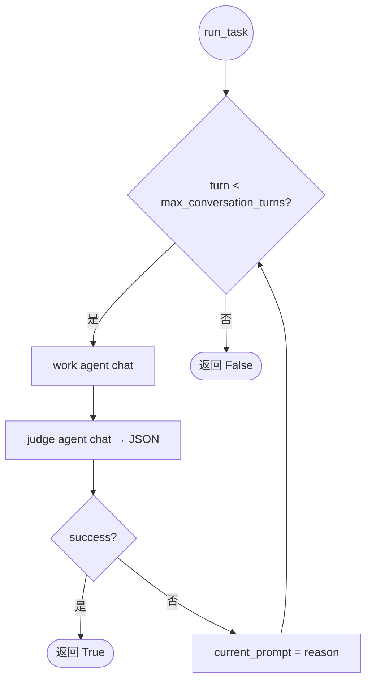
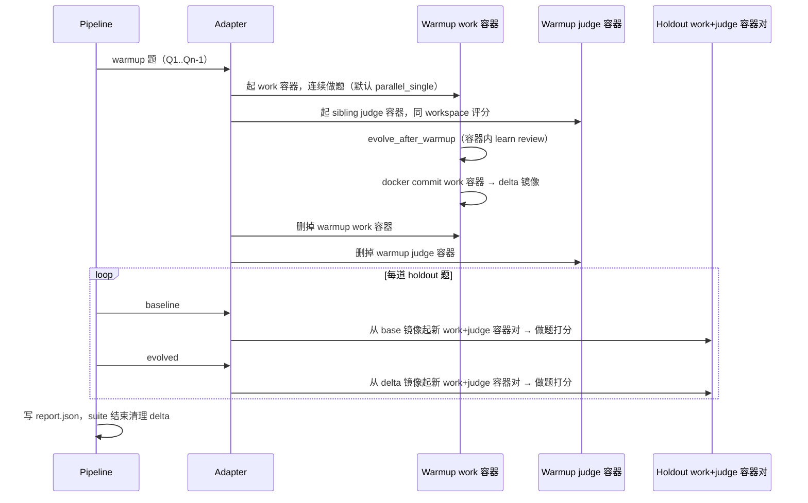

# 在自进化 Agent 时代评估"产物有没有用"：LIFT 框架与 Benchmark 套件

> 论文初稿 / 内部讨论版本。本文聚焦评测框架本身的设计动机与抽象。Benchmark 设计规范由姊妹篇主笔，本文只做最小契约说明。实验数据见第 6 节，待补。

## 摘要

随着 Agent 系统从单轮对话升级为可加载 Skill / Memory / SOP 等"配置/知识资产"（以下简称**产物**）的复杂体，一个本应朴素的问题反而被忽略：这些产物到底有没有用？

现有 Agent 评测体系——无论是 AgentBench 类通用 benchmark、SWE-bench / GAIA 类任务 benchmark，还是 SkillsBench / EvolveTool-Bench 类产物 benchmark——大多停留在"看 Agent 在某个静态任务集上的最终通过率"这一层。对"加载产物 vs 不加载产物"的因果对照、"训练任务和测试任务的分离"的归因控制以及"运行时环境的可复现隔离"三件事处理得都不充分。

我们提出 **LIFT（Loaded Impact on Final Task）** 评测框架：以 holdout final task 上的 *Base vs Loaded* 对照为唯一科学问题，以容器快照（docker commit → delta 镜像）作为产物固化与回放载体，以 *work agent + judge agent* 的 review loop 作为单题评分内核，以 *adapter / pipeline / eval kernel* 三层解耦支持多种 Agent runtime（OpenClaw、带进化插件的 OpenClaw、群体记忆 OpenClaw、GenericAgent、Hermes、OpenHuman、EvoScientist 等），并在工程层支持 repeat / suite / phase 的多级并发与可观测性（Langfuse trace backfill）。配套的 benchmark 套件按 *warmup_tasks / holdout_tasks* 两段式组织，对应训练/测试分离的实验设计。

---

## 1 引言：Agent 评估为什么走到现在仍然没解决问题

### 1.1 背景：从模型评测到 Agent 评测的范式漂移

LLM 评测最早是"输入一个 prompt，看输出对不对"。Agent 把这件事彻底打散了：一次任务变成 *规划 → 工具调用 → 文件系统操作 → 多轮反馈 → 最终交付物* 的长链路，模型只是其中一个节点。一个看起来"答对了"的 Agent，可能：

- 因为题目本身设计有缺陷（ABC Checklist 在 NeurIPS 2025 测得性能高估幅度可达 100%）；
- 因为它把上一道题的输出**记忆复用**到下一道题（伪进化）；
- 因为评分器是同一家 LLM（self-preference 偏差）；
- 因为环境保真度太低，沙箱里通过的安全测试到了真实环境就崩（Safety Benchmarks Taxonomy 报告 Kendall's W=0.10，跨 benchmark 安全排名几乎随机）。

### 1.2 自进化 Agent 把问题再放大一层

近一年自进化 Agent 让 Agent 自己在交互中**沉淀**出 Skill / Memory / SOP / MCP Box / Persona 等可加载产物。商业上"持续学习的 Agent"是核心叙事；学术上四组件闭环（System Inputs → Agent System → Environment → Optimisers）也已经成形。

但一个朴素现实是：SkillsBench 在 86 个任务上实测，curated Skill 平均带来 +16.2pp 提升，**自生成 Skill 平均无效甚至有害**。也就是说：

> 「Agent 进化出了一堆产物」 ≠ 「这些产物对下游任务有用」

这两件事必须分开评，且评的方法必须是**因果对照**——不是看 Agent 进化后绝对得分多高，而是看*同一道题、同一个 Agent、同一种工具集，加载 vs 不加载产物，分数差是多少*。

### 1.3 现有评测的三个断层

我们盘点了 32 个开源工作（综述 / benchmark / SDK），按"能不能回答《产物有没有用》"维度对齐，发现三个共性断层：

| 断层 | 现象 | 代表工作 |
|---|---|---|
| **没有"加载/不加载"对照** | 大部分 benchmark 只测裸 Agent 在任务集上的通过率，没有产物维度的 A/B | AgentBench、GAIA、SWE-bench、REAL、tau-bench |
| **训练任务和测试任务混在一起** | 进化型评测让 Agent 在 Q1..Qn 上学，再在同一组 Q1..Qn 上测，分不清是"真学到了"还是"记忆复用" | 多数自进化论文的 episodic 设定 |
| **运行时不可复现 / 不可隔离** | 多步文件系统操作、并发执行、trace 关联缺失，导致 delta 不稳定，重复实验方差巨大 | 大部分宿主机直跑式评测脚本 |

第三个断层最被低估。一旦评测要"反复跑"——商业化产物认证的反复跑、迭代进化能力的反复跑、横向对比多个 Agent runtime 的反复跑——可复现性就从锦上添花变成了刚需。REAL 在 NeurIPS 2025 拿 Oral 的核心贡献正是把"确定性模拟"提到 Web Agent 评测的一等公民地位，可见这件事在社区共识上的份量。

### 1.4 本文工作

我们提出 **LIFT 框架**，核心论点一句话：

> 评测自进化 Agent，应该问的是「加载产物后，在没见过的题上做得更好吗」，而不是「Agent 跑完所有题以后总分多高」。

围绕这个论点，LIFT 给出了一组配套设计：

1. **科学协议**：训练/测试分离（warmup_tasks / holdout_tasks） + 同题双跑（baseline / evolved） + work-judge review loop；
2. **工程载体**：容器快照（docker commit → delta image）作为产物固化形式，每道 holdout 题各起独立 work+judge 容器对，runtime / pipeline / eval 三层解耦；
3. **可观测性**：pre-chat 上报 + Langfuse trace backfill，让评测**结论**和**过程**都可回查；
4. **配套 benchmark**：以 warmup_tasks / holdout_tasks 两段式组织的 suite JSON。

---

## 2 相关工作

### 2.1 通用 Agent benchmark

AgentBench、GAIA、REAL、tau-bench、SWE-bench、PinchBench、WildClawBench、ZClawBench 等解决的是"Agent 在某个静态任务集上能不能干活"，回答的是任务侧的问题，是 LIFT 的**任务来源**而非对照对象。

其中 WildClawBench 和 ZClawBench 已经在做"跨 harness 对比"和"三级评测"（脚本验证 / 逐点验证 / 配对比较），思路可以复用，但仍未触及产物维度的因果对照。

### 2.2 产物 benchmark

SkillsBench、EvolveTool-Bench、EvoMemBench、Evo-Memory 开始关注产物维度，但各自停留在产物形态绑定（Skill / Tool / Memory 各自一套）。它们提供了直接证据——"自生成 Skill 平均无效"是 LIFT 立项的关键 motivation。

LIFT 的**产物来源无关**立场是对它们的一个抽象：无论产物是 Skill 还是 Memory 还是 SOP，验证逻辑都是 Base vs Loaded。

### 2.3 终身 / 序列学习

LifeLongAgentBench、SEA-Eval 提供了 FWT / BWT / RecoveryRate 等学习曲线指标。LIFT 把它们定位为**进化专属诊断工具**：动态测试通过的话不需要画曲线，没通过时再用学习曲线排查是遗忘还是不迁移。这与原工作把它们作为主指标的立场不同，是为了避免在评测主链路里耦合进化机制相关的复杂度。

### 2.4 评测方法论

ABC Checklist、Agent-as-a-Judge、MAJ-Eval 回答"评测怎么评才靠谱"。LIFT 的 review loop 设计借鉴了 Agent-as-a-Judge 的"工具增强验证"思想；规则评分 0.7 + LLM rubric 0.3 的混合策略是对其偏差缓解建议的具体落地。

### 2.5 评测 SDK

DeepEval、Opik、Promptfoo 面向 LLM API 层的开发者评测，工作粒度是 prompt × model。LIFT 的工作粒度是 *work/judge 容器对 × holdout 题 × baseline/evolved*，层级不同。Langfuse 在 LIFT 中扮演 Opik 的 trace 角色——只用 trace 能力，不用 evaluator 能力，因为 evaluator 在我们这里由 work-judge review loop 承担。

### 2.6 安全评测

OS-Harm、RAS-Eval 提示了一个事实：产物加载后会引入新安全风险。LIFT 把 SafetyRegression 留在动态测试横切维度里，但默认不强制（避免与产物功能性评测纠缠）。完整安全协议作为正交工作。

---

## 3 LIFT 评测框架

LIFT = **L**oaded **I**mpact on **F**inal **T**ask。回答的科学问题：**产物加载后，在 final task（holdout）上是否带来正向 impact？**

### 3.1 设计原则

我们把调研得出的几条结论作为硬约束，所有工程设计必须服从：

| 原则 | 含义 |
|---|---|
| **P1 因果对照唯一** | 唯一被试问题是"加载 vs 不加载"，其余变量必须一致 |
| **P2 训练/测试分离** | 进化用的题（warmup）和测试用的题（holdout）不能重叠 |
| **P3 产物来源无关** | 不论产物是 Skill / Memory / SOP / MCP Box，评测逻辑相同 |
| **P4 运行时可复现** | 同一 run_id 在任意机器上重跑应能产出一致结构（含 trace） |
| **P5 进化诊断可选** | FWT / BWT 等学习曲线只在 P1 没结论时使用 |

### 3.2 协议层：什么是一次"LIFT run"

**Suite** 由两段任务组成，这是 P2 在数据结构层的强制：

```text
SuiteSpec
├── warmup_tasks[]   ← 触发产物生成（learn / evolve）
└── holdout_tasks[]  ← final task，被试题
```

warmup 和 holdout 在 suite JSON 里**显式**字段分开，不再让运行时按题号切。

**对照组**：每道 holdout 题各跑两遍，组成一个 TaskRun：

```text
TaskRun
├── baseline   PhaseRun  ← 从 base 镜像起干净容器，无产物
└── evolved    PhaseRun  ← 从 delta 镜像起干净容器，含产物
```

**关键工程取舍**：

- **Warmup 容器编排可选**：单 Agent 进化场景下默认所有 warmup 题共用一个 work 容器（`PARALLEL_SINGLE`，文件系统状态连续是进化插件的天然要求），并配一个同 workspace 的 judge sibling 容器；多用户/群体记忆场景（`multi_user_openclaw`）下切到 `PARALLEL_MULTI`，每题独立 work+judge 容器对、产物落外部群体记忆，commit 行为退化为 no-op。两种形态对上层 pipeline 透明；
- **Holdout 每题起新容器对**：与 warmup 不同，holdout 是协议层硬约束——baseline 必须是"未污染环境"，work 与 judge 的记忆要隔离，题与题 workspace 也要隔离，所以 [`HoldoutContainerPolicy`](../src/lift/policies/container.py#L34-L50) 只提供 `SERIAL_MULTI` / `PARALLEL_MULTI` 两种"多容器"形态，没有"单容器"选项；
- **多道 holdout 共用同一份 delta**：产物是 suite 级常量，不应该随 holdout 题变化。

**报告层级**：

```text
EvalReport
└── runs[]              ← --repeat 重复
      └── suites[]      ← --suite 多 suite
            └── tasks[]
                  ├── baseline: PhaseRun
                  └── evolved:  PhaseRun
```

### 3.3 抽象层：runtime / pipeline / eval 三层解耦

LIFT 的代码组织遵循三层抽象，每一层只处理一个关注点：

```text
CLI / Pipeline           ← 切题、循环、并发、写 report（不知道 OpenClaw 是什么）
        ↓
AgentRuntimeAdapter      ← 容器、产物固化、chat 怎么调（不知道 holdout / repeat 是什么）
        ↓
lift/eval (work + judge) ← 单题 review loop（不知道 Docker 是什么）
```

这样切的直接好处是**接入新 runtime 几乎零成本**。当前已注册多种 runtime：

| runtime | 镜像 | evolve 行为 |
|---|---|---|
| `openclaw` | base 镜像，不带进化插件 | warmup 后 no-op，仅 docker commit |
| `openclaw_with_evolve` | with-evolve 镜像 | warmup 后容器内 `openclaw learn review`，再 commit |
| `multi_user_openclaw` | base 镜像 + GroupMemoryMixin | 多容器 warmup（模拟多用户），产物落到外部群体记忆系统 |
| `genericagent` / `genericagent_active_evolve` | `lift-genericagent:latest` | baseline 文件 I/O；active 变体通过 reflection chat 主动复盘 |
| `hermes` | `lift-hermes:latest` | Hermes review 流程写入 `/opt/hermes-state` 后 commit |
| `openhuman` | `lift-openhuman:latest` | Rust JSON-RPC runtime，长期记忆 / wiki 路径进入 delta |
| `evoscientist` / `evoscientist_active_evolve` | `lift-evoscientist:latest` | baseline 捕获自然状态变化；active 变体触发 EvoMemory AutoSkills 后 commit |

新接 runtime 只需实现 4 个钩子：`resolve_docker_image` / `start_container` / `worker_judger_factory` / `evolve_after_warmup`。整个 docker commit / holdout 编排逻辑在父类 `ContainerAgentRuntimeAdapter` 里复用。

这一设计直接呼应 P3（产物来源无关）：不同 runtime 把产物放到镜像里 / 群体记忆里 / 文件系统里，对上层 pipeline 完全透明。

**反例**：早期宿主机实现把 OpenClaw 直接绑在评测脚本里。当我们尝试接入第二个 runtime（Hermes）时，整个 pipeline 几乎重写——这就是当前三层抽象诞生的直接动因。

### 3.4 单题内核：work + judge review loop

单题是 LIFT 评分的最小单元。我们采用 *执行→审查→反馈→重试* 的循环：



设计决策：

1. **Judge 用同 runtime 的独立容器与独立 session**——模拟真实用户审查，不引入跨模型偏差，同时避免 work 侧记忆/observation 污染 judge，并且能调用真实工具验证输出（呼应 Agent-as-a-Judge 的"可执行验证"原则）。
2. **首轮通过率与最终通过率分开报**——FirstRoundPassRate 反映"产物让 Agent 一次做对的能力"，FinalPassRate 反映"产物 + 反馈回路"的合力。好的产物主要体现在前者。
3. **baseline / evolved 的 max_turns 必须一致**——否则 evolved 多给两轮反馈就赢了，不是产物的功劳。
4. **Token 含 Judge 消耗**——Loaded 如果重试更少，Judge 的 token 节省也算在产物贡献里。

### 3.5 产物固化：为什么用 docker commit

产物的载体形式是工程上一个 *看似无关紧要、实则决定可复现性* 的选择。我们考察了三种方案：

| 方案 | 优点 | 致命缺点 |
|---|---|---|
| 宿主机 toggle 加载 | 实现简单 | 状态依赖 host 文件系统；并发会互相污染；不可异机回放 |
| 结构化导出（YAML/JSON 产物包） | 可读、可版本化 | 难以覆盖文件系统级别的进化（OpenClaw 的 `~/.openclaw/` 整棵树） |
| 容器快照（docker commit） ✓ | 完整捕获文件系统；天然可异机回放；天然可并发隔离 | delta 镜像有体积，需要清理 |

LIFT 选 docker commit。一次完整 LIFT 的时间线对应：



注意几个隐含约束：

- **Delta 是 suite 级临时产物**：suite 跑完就 `docker rmi` 掉，不污染本地镜像列表；
- **Holdout workspace 必须显式 seed**：避免 OpenClaw 首次上线问名字/emoji 把判分搞乱；
- **Group memory runtime** 用同一接口 `DeltaRef(image_tag=base_image, owned=False)`，把"产物在外部"统一到同一抽象。

### 3.6 并发与隔离：把"反复跑"做便宜

评测从"出一份报告"演进到"持续迭代"再到"商业化产物认证"，工程投入要求是不一样的——目标越靠后，反复跑的成本越敏感。LIFT 在三个层级都做了并发 + 隔离：

| 层级 | 参数 | 默认 |
|---|---|---|
| 矩阵 cell 间（repeat × suite 笛卡尔积） | `--max-parallel-suites` | 3 |
| Task 间（同一 phase 内） | `--max-concurrent-tasks` | 不限 |
| Phase 间（同一 task 内） | `--holdout-phase-policy` | parallel |
| Warmup 容器策略 | `--warmup-container-policy` | parallel_single |
| Holdout 容器策略 | `--holdout-container-policy` | parallel_multi |

每层并发都建立在容器隔离之上：每道 holdout 题独立 work+judge 容器对、独立 workspace 子目录、独立端口；work 容器承载可进化状态，judge 容器只负责验收。clean-up 由 `CompositeDisposable` + `SuiteRunResources` 登记簿统一管理。

### 3.7 可观测性：执行期 + 后处理双链

LIFT 的报告分两次写：

| 阶段 | 内容 | 文件 |
|---|---|---|
| 执行期 | 评测结论：success、score、session、workspace 路径 | `report.json` |
| 后处理 | Langfuse trace 回填、对比 CSV、轨迹评判、HTML 报告 | `*_backfilled.json`、`*_comparison_metrics.csv` |

为什么分两次：

- 执行期 trace 还在 Langfuse worker 队列里没消化完，强行同步等会拖慢主链路；
- 后处理可独立重跑（`--evaluate-only`），便于诊断问题或补充新指标。

执行期通过 `emit_pre_chat_state` 在每次 chat 前打 session_id 和 phase 元数据；后处理 `stitch_phase_langfuse_traces` 按 session_id + 时间窗将 Agent 的 `*_agent` trace 与插件 `openclaw-plugin` trace 合并写入 PhaseRun.langfuse。这套契约保证了**报告里能直接点开 trace** 看到那道题当时实际发生了什么。

### 3.8 指标体系

落地到指标表：

- **必报**：`DownstreamPassDelta = PassRate(Loaded) − PassRate(Base)`、FirstRoundPassRate、FinalPassRate、AvgAttempts、`Outcome_i = 0.7·RuleScore + 0.3·LLMRubricScore`、TotalTokens（含 Judge）、TotalLatency
- **序列必报**：Pass@k、RecoveryRate
- **进化专属（可选）**：归因三组 *No-Evo / Only-Products / Evo-On*，曲线诊断 FWT / BWT
- **横切**：静态 DistillateConflictRate / SafetyConcernCount，动态 SafetyRegression，成本 ColdStartTTV / EvolutionROI

LIFT 框架本身只产出**结构化执行记录（ExecutionRecord，Pydantic）**，具体哪些指标必报由 benchmark 决定。这也是把 benchmark 单列的原因——评测协议和 benchmark 是正交的。

### 3.9 与 replay 模式的对照

早期 replay 模式（全 suite baseline → 一次 evolve → 全 suite evolved）不是主评测路径，只适合作为消融对照：

|  | LIFT（本文） | replay |
|---|---|---|
| 评测焦点 | holdout final 的加载对照 | 全部 task 进化前后各跑一遍 |
| 产物阶段 | warmup 产 Δ 镜像，再开始测 | 全 suite baseline 跑完后一次性 evolve |
| 风险 | 无 | Q5 的 baseline 可能受 Q1..Q4 状态污染；Q5 的 evolved 可能直接复用 Q1..Q4 输出 |
| 科学问题 | 产物对未见过的题是否有效（**外推**） | 每题进化幅度（**内插**，诊断用） |

LIFT 选外推作为**主**协议，正是为了排除 §1.3 的第二个断层。

---

## 4 Benchmark 套件（最小契约）

> Benchmark 设计规范由姊妹篇主笔，本节只描述 LIFT 协议对 benchmark 的最小契约。

LIFT 协议要求 benchmark 满足以下最小契约：

1. **两段式 schema**：`warmup_tasks[]` 和 `holdout_tasks[]` 显式分开，每条任务含 `query` / `requirements` / `expected_result.{content_reqs, trajectory_reqs}`；
2. **judge-friendly**：`content_reqs` 必须是 judge agent 能机器化判定的 checklist（确定性要求用规则，开放部分用 LLM rubric）；
3. **跨 runtime 中立**：query 不绑定特定 Agent 的工具命名，避免给某个 runtime 送分；
4. **场景多样性**：当前已就绪 11 套数据集，涵盖团建 / 销售运营 / 写作 / 代码等场景。

最小冒烟集 `assets/benchmarks_demo/hello.json` 提供 1 道 warmup（Q1：「回复一下你好」）+ 1 道 holdout（Q2：「自我介绍一下你自己」），用于框架级回归测试。

完整 benchmark 由 `python -m src.cli.preprocess` 从外部存储拉取 markdown 源，转为 LIFT suite JSON。详细 schema、出题原则、rubric 设计参见姊妹篇。

---

## 5 实现要点

| 主题 | 关键文件 | 一句话 |
|---|---|---|
| Pipeline 编排 | `src/lift/pipeline/lift_pipeline.py` | repeat × suite × phase 多级并发 |
| 适配器契约 | `src/lift/adapters/base.py` | 4 钩子 + 默认 docker commit |
| 单题内核 | `src/lift/eval/run_task.py` | work + judge review loop |
| 容器策略 | `src/lift/policies/container.py` | warmup / holdout 三种编排 |
| 状态可视化 | `src/lift/status/` | TUI（rich） + HTTP dashboard |
| Trace 回填 | `src/postprocess/trace_backfill.py` | session_id 关联 |
| 镜像构建 | `agent-runtimes/openclaw/build-image.sh` | base / with-evolve 双产物 |

---

## 6 实验结果

待补。规划如下：

- **6.1 同一 Agent 的 Base vs Loaded**：跨 11 套场景的 DownstreamPassDelta 主表
- **6.2 OpenClaw 不开插件 vs 开插件**：进化插件本身的增量
- **6.3 同一数据集 ×3 次 repeat**：delta 方差稳定性
- **6.4 跨 runtime 横向**：同一 benchmark 上 OpenClaw / Hermes / OpenHuman / EvoScientist 等 runtime 的裸基线和 Loaded delta
- **6.5 跨场景迁移**（A 场景产物 → B 场景任务）的 ablation
- **6.6 成本视角**：TotalTokens / EvolutionROI

---

## 7 讨论与局限

LIFT 不解决但需要明确的几件事：

1. **Benchmark 数据污染**：LIFT 协议无法防止 Gold 集被 LLM 训练数据污染，靠 ABC Checklist 类工具在 benchmark 设计阶段把关；
2. **跨 Agent 直接对比**：我们刻意**不**支持 *OpenClaw+插件 vs Hermes* 的直接横向比较，因为变量太多结论不可归因；正确做法是各自做 Base vs Loaded，再比 delta 幅度；
3. **进化 ≠ 产物**：LIFT 协议默认产物来源无关。如果要单独证明"进化机制本身有价值"，需要走归因三组（No-Evo / Only-Products / Evo-On），这是可选附录而非必报；
4. **Judge 偏差**：work 和 judge 都用 LLM 时存在 self-preference 风险。当前缓解策略是规则评分占 0.7、LLM rubric 占 0.3，并要求 rubric 版本号、温度 0、固定模型；
5. **环境保真**：容器仍是 *受控 Linux 环境*，与桌面 GUI Agent / 浏览器 Agent 的真实环境保真度有差距，未来工作；
6. **进化成本归属**：evolve_after_warmup 的 token 属于训练成本，不应算到 Loaded 推理成本里，否则 EvolutionROI 会被低估。这一点在指标计算时严格分账。

---

## 8 结论

我们用一句话再概括 LIFT 的立场：**评测自进化 Agent 的关键不是测它在已见过的题上变好了多少，而是测它在没见过的题上凭沉淀产物变好了多少**。

LIFT 用训练/测试分离 + 同题双跑 + 容器快照 + 三层抽象 + 多级并发 + trace 回填把这一立场落到可工程化的协议中。配合姊妹篇的 benchmark 套件，我们希望提供一个可被复用、可被批评、可被对比的基础评测设施。

---

## 附录 A：调研过的 32 个开源工作（按类型）

**综述（6）**：Survey: Eval LLM Agents (2503.16416)、Survey: Eval & Benchmarking (2507.21504)、Self-Evolving Agents Survey (2507.21046)、Self-Evolving AI Agents Survey (2508.07407)、Self-Evolution of LLMs Survey (2404.14387)、Safety Benchmarks Taxonomy (2605.16282)。

**方法 / Judge（4）**：ABC Checklist (2507.02825, NeurIPS 2025)、Agent-as-a-Judge (2601.05111, ICML 2025)、MAJ-Eval (2507.21028)、AgentDistill (2506.14728)。

**进化 / 产物 benchmark（5）**：SEA-Eval (2604.08988)、EvolveTool-Bench、SkillsBench (2602.12670)、EvoMemBench、Evo-Memory (2511.20857)。

**终身 / 序列（1）**：LifeLongAgentBench (2505.11942, TPAMI 2026)。

**通用任务 benchmark（10）**：REAL (2504.11543, NeurIPS 2025 Oral)、MLR-bench (2505.19955, NeurIPS 2025)、AgentIF (NeurIPS 2025)、tau-bench / tau2-bench、AgentBench (ICLR 2024)、GAIA、SWE-bench (ICLR 2024 Oral)、PinchBench、WildClawBench、ZClawBench。

**安全 benchmark（3）**：OS-Harm (2506.14866, NeurIPS 2025)、RAS-Eval (2506.15253)、MultiBreak (2605.01687, ICML 2026)。

**SDK（3）**：DeepEval、Opik、Promptfoo。

完整逐篇解读见调研目录 `temp/agent_eval_research/`。

---

## 附录 B：LIFT 与现有工作的关系矩阵

| 维度 | LIFT 的立场 | 直接对照 |
|---|---|---|
| 产物来源 | 来源无关，看产物本身有没有用 | SkillsBench 已实证自生成 Skill 多无效，LIFT 提供测这件事的基础设施 |
| 因果对照 | Base vs Loaded 同题双跑 | 大部分 benchmark 缺这一组对照 |
| 训练 / 测试 | 显式分离（warmup_tasks / holdout_tasks） | 多数自进化论文混跑 |
| 单题评分 | work + judge review loop | 借鉴 Agent-as-a-Judge 工具增强验证 |
| 产物固化 | docker commit → delta image | 比 toggle 加载更可复现，比结构化导出更完整 |
| 学习曲线 | 进化专属诊断（可选） | LifeLongAgentBench 把 FWT/BWT 做主指标，LIFT 把它做诊断 |
| 跨 Agent 对比 | 各自做 Base vs Loaded 比 delta，不直接横比 | WildClawBench 做了跨 harness，但仍是裸 Agent 对比 |
| 安全 | 横切维度，可选 | OS-Harm / RAS-Eval 提供专项安全 benchmark，LIFT 不重做 |
| Trace | Langfuse backfill | 类似 Opik，但只用 trace 不用 evaluator |
