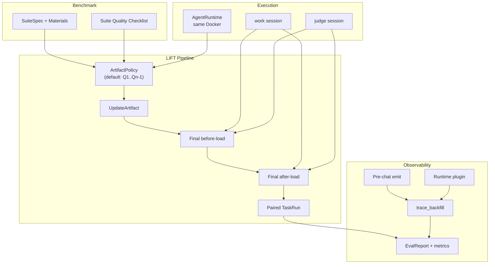

# LIFT 论文写作蓝图（中文）

> **文件用途**：指导 EMNLP/ACL 风格论文「写什么、证明什么、跑什么实验、交什么图表」。  
> **英文正文草稿**：见 [paper-full-emnlp-draft.md](./paper-full-emnlp-draft.md) / [paper-full-emnlp-draft.tex](./paper-full-emnlp-draft.tex)。  
> **实现与流水线细节**：见 [eval-flow.md](./eval-flow.md)。  
> **请勿**将本文档与已弃用的 `replay` 全 suite 双遍评测混为一谈；论文主协议仅为 **LIFT**。

---

## 0. 论文真正要完成什么

本节是全文「任务说明书」。写稿、做实验、画表时，优先对照本节勾选完成度。

### 0.1 一句话主张

**在 hold-out final task 上，通过 before-artifact-load 与 after-artifact-load 的配对对照（LIFT），回答：能力产物（UpdateArtifact）加载后，Agent 是否在可复现协议下带来可度量的净增益。**

论文**不是**在证明某一种进化算法（OpenClaw evolve、Hermes 策略等）最优，而是在证明**一种可迁移的评测范式 + 配套协议**能否稳定识别「加载产物是否有用」。

### 0.2 必须交付的学术产出（论述层）

| # | 交付物 | 读者应带走什么 |
|---|--------|----------------|
| A1 | **LIFT 范式定义** | 问题形式化、对照单元（同题双加载状态）、与静态评测 / Lifelong 评测的定位差异 |
| A2 | **ArtifactPolicy 抽象** | `UpdateArtifact` 是产物实体；**如何得到产物**由策略决定；默认策略 = warmup `Q1..Q_{n-1}` + 触发更新，**非唯一路径** |
| A3 | **实现无关契约** | Adapter 最小接口 + `SuiteSpec` schema + `EvalReport` 语义（`baseline`/`evolved` = 加载状态，非算法名称） |
| A4 | **可观测性协议** | 双通道（框架 pre-chat + 运行时插件）+ **trace_backfill（轨迹回填）** + `session_id` 对齐 |
| A5 | **执行约束** | work agent 与 judge **同一 Docker/runtime、不同 `session_id`**；素材 `material_digest` 在 final 两次对照中一致 |
| A6 | **Benchmark 质量方法论** | Suite Quality Checklist：可判定性、递进性、hold-out、素材完备性等 |
| A7 | **边界与威胁** | 配对对照 ≠ 严格因果；judge 偏置；域覆盖；trace 形态依赖插件 |

### 0.3 必须交付的实证产出（实验层）

主设定（与英文稿一致，结果栏可先占位，正式投稿前填实）：

| # | 实验内容 | 目的 |
|---|----------|------|
| E1 | **20 suites × repeat=3** 的 LIFT 主实验 | RQ1：post-load 是否优于 pre-load（success、content_score、trajectory_score） |
| E2 | **配对改进与成本** | RQ3：增益是否被 token/延迟/重试代价抵消；报告 `impr_*` 与绝对值 |
| E3 | **跨 repeat 稳定性** | RQ2：3 次重复的均值、标准差、95% CI；可选配对检验 |
| E4 | **分层统计** | 按 suite / category 汇报，避免全局平均掩盖异质性 |
| E5 | **双 runtime 佐证可移植性** | 至少 OpenClaw + Hermes 映射到同一契约与 report schema（不必比谁的 evolve 更强） |
| E6 | **judge 消融（附录或主文一小节）** | 同底模 judge vs 更强 judge：结论是否稳健 |
| E7 | **可解释案例** | 2–4 个 suite：trace_backfill 后的 trace 解释「为何升/降」 |

**不在主实验范围**：遗留 `replay`（全 suite 进化前后各跑一遍）——仅可作代码历史对照，**不写入论文主叙事**。

### 0.4 必须交付的图表与附录（呈现层）

| 类型 | 内容 |
|------|------|
| 主表 | pre-load vs post-load：success、content_score、trajectory_score、tokens、latency、trials |
| 辅图 | 按 category 的 `impr_content_score` / `impr_success` 分布 |
| 方法图 | LIFT pipeline：ArtifactPolicy → final 双对照 → report → trace_backfill |
| 系统图 | 双通道观测 + session 对齐（可选放附录） |
| 复现说明 | 20 suite 列表、repeat、judge 模板版本、runtime 版本、Langfuse 字段约定 |

### 0.5 明确不在本文范围内

- 不宣称替代 LifelongAgentBench；定位为**终点对照子协议**或互补方法。  
- 不把「模拟用户 judge 回路」等同于真实用户研究；需写清边界。  
- 不绑定 Claude Code dreaming 的完整实现（可写 future work / ArtifactPolicy 扩展）。  
- 不讨论 `replay` 模式的产品价值。  
- 代码层面 `--mode exam` 命名、`*_enriched.json` 文件名等遗留兼容**不必**在论文展开。

### 0.6 与 evolve_eval 代码的关系

| 论文概念 | 代码现状（写作时注意） |
|----------|------------------------|
| LIFT | `--mode exam`（目标默认路径） |
| ArtifactPolicy 默认 warmup | `tasks[:-1]` + `evolve()` 等 adapter 实现 |
| `--test` = 仅 final 一次 | **文档已定、代码待对齐**；论文不写进主实验 |
| trace_backfill | `postprocess/langfuse_enrich.py`（模块名遗留） |
| report `baseline`/`evolved` | before-load / after-load 的 `PhaseRun` |

---

## 1. 建议论文结构（章节与每章要完成的任务）

| 章节 | 本章必须完成的事 |
|------|------------------|
| **摘要** | 问题（静态评测缺口）→ LIFT 一句定义 → 实现无关 + 20×3 设定 → 主要指标类型 → 结论句（占位可写 TBD） |
| **1 引言** | 动机四点（对照、防泄露、可比较、可复现）；贡献列表 4–5 条；**避免**把贡献写成「我们实现了 OpenClaw」 |
| **2 相关工作** | 静态评测局限；Lifelong 启发；**差异表**：序列级 lifelong vs hold-out final 配对对照 |
| **3 方法 LIFT** | 问题定义；`UpdateArtifact` + `ArtifactPolicy`；pipeline；因果解释边界；最小契约 |
| **4 系统** | Adapter 轨；Benchmark 轨；trace_backfill；Docker/同环境双 session |
| **5 实验** | 协议 + 指标 + judge 设定 + 统计建议 |
| **6 结果** | 填 E1–E7 产出；案例 trace |
| **7 讨论** | 实践意义、威胁、与 lifelong 关系 |
| **8 结论** | 收束范式价值，不夸大因果 |

---

## 2. 方法：LIFT（Load-state Isolated Final-task Test）

### 2.1 研究问题（写入 §3 开头）

给定 suite 中 hold-out final \(q_f\)，在执行某种 **ArtifactPolicy** 得到能力产物 \(A\) 后：

> 在同一 \(q_f\) 上，**before-load**（不加载 \(A\)）与 **after-load**（加载 \(A\)）的配对表现差异，是否显著、稳定、可解释？

对应 RQ1–RQ3 见 §0.3。

### 2.2 核心抽象（论文符号与实现映射）

| 抽象 | 含义 | 论文中强调 |
|------|------|------------|
| `UpdateArtifact` | 规则、记忆、索引、项目指令等能力产物 | **实体**，不等于 warmup |
| `ArtifactPolicy` | 产物如何产生/刷新 | **默认** = 跑 \(Q_1..Q_{n-1}\) 后 `triggerUpdate`；亦可空 warmup、外部注入、仅 dreaming 等 |
| `ArtifactLoader` | 控制产物是否对当前 runtime 生效（`setLoadState`）；**不是**产生产物，也**不是**单独的 `LoadStateController` 类 | before-load / after-load |
| `PhaseRun` | 单 task × 单加载状态 × 完整 judge 回路 | 最小评测单元 |
| `TaskRun` | 同一 final 的 pre/post 两个 `PhaseRun` | report 字段 `baseline` / `evolved` |

**Warmup 的正确定位（必写清，避免审稿误解）：**

```text
UpdateArtifact                    # 产物实体

ArtifactPolicy（策略，非 Warmup 本身）:
  - default:  WarmupTasks = Q1..Q_{n-1} → triggerUpdate (evolve / dreaming / ...)
  - optional: noop_warmup + inject_external_artifact
  - optional: dreaming_only_after_idle
  - optional: manual_artifact_seed
```

> Warmup 是 **ArtifactPolicy 的默认实现路径**，不是「Warmup = UpdateArtifact」，也不是「产物只能靠前导题产生」。前导题可为 **零题**，只要 adapter 仍能 `triggerArtifactUpdate` / `awaitArtifactReady` 得到合法产物。

### 2.3 LIFT 评测段（与产物生产解耦）

```text
produceOrRefreshArtifact(policy) → UpdateArtifact
finalEval(q_f, before_load)  → PhaseRun  →  report.baseline
finalEval(q_f, after_load)   → PhaseRun  →  report.evolved
compare → TaskRun + 聚合指标
trace_backfill → PhaseRun.langfuse
```

**与遗留 replay 的区别（内部写作备忘，正文可放一句 footnote）：**

| | **LIFT（本文）** | **replay（不写入主文）** |
|---|------------------|-------------------------|
| 评测焦点 | 仅 final 的加载对照 | 全 suite 进化前后各跑一遍 |
| 科学问题 | 产物对 final 是否有效 | 每题进化幅度（诊断） |

### 2.4 因果与解释边界

- **可声称**：同题、同协议、同素材 digest、仅加载状态不同的配对增益。  
- **不声称**：严格因果识别、跨模型族迁移因果、长期遗忘的完整刻画。  
- **控制项**：固定 judge 模板、repeat、工具可用性、runtime 版本、随机种子（若适用）。

### 2.5 最小 Adapter 契约（论文可放 Algorithm/Box）

```text
bootstrapRuntime() -> handle
resolveMaterials(task) -> bundle
mountMaterials(handle, bundle) -> mountRef
produceArtifact(ArtifactPolicy) -> artifact | jobRef
awaitArtifactReady(jobRef) -> artifact          # 异步产物（如 dreaming）
setLoadState(before_load | after_load)
runTask(task, load_state) -> PhaseRun           # 内含 judge；work/judge 异 session
emitPreChat(session_id, tags, role)
cleanupRuntime(handle)
# 后处理: trace_backfill(session/run) -> PhaseRun.langfuse
```

---

## 3. 系统设计（论文 §4 素材）

### 3.1 Agent Adapter：新 Agent 接入要证明什么

论文只需证明：**存在**映射到上述契约的参考实现（OpenClaw、Hermes），而非穷尽所有 Agent。

接入四能力（写入正文 bullet）：

1. 按 `ArtifactPolicy` 产生产物（默认 warmup + update）。  
2. 在 before-load 下跑 final。  
3. 在 after-load 下对**同一** final 再跑。  
4. 输出统一 `PhaseRun`（含 `work_session_id` / `judge_session_id`）。

### 3.2 Benchmark 轨：新任务集接入要证明什么

- 规范层：`assets/suite requirement.md` → 运行层 `SuiteSpec` + `benchmark_mds`。  
- 字段：`query`、`content_reqs`、`trajectory_reqs`、素材目录。  
- 论文贡献点：**checklist 把「加题」变成可审计流程**，而非 ad-hoc 堆任务。

### 3.3 可观测性：trace_backfill（轨迹回填）

| 现名（代码遗留） | 论文统一用语 | 含义 |
|------------------|--------------|------|
| `enrich` / `langfuse_enrich` | **trace_backfill** | 按 session/run 拉 Langfuse trace，与 pre-chat **stitch**，写入 `PhaseRun.langfuse` |
| `stitch_phase_langfuse_traces` | stitch（动词） | 实现细节，不必在摘要出现 |

**双通道：**

- **框架通道**：`emit_pre_chat_state`（带 `run_id` tag）+ 后处理 trace_backfill。  
- **运行时通道**：容器内 Langfuse 插件（prompt/response/tool/token/latency）。  
- **对齐键**：`work_session_id` / `judge_session_id`；插件必须使用框架下发的 session，否则无法回填。

### 3.4 Judge 与 work：同环境、异 session

- 同一 Docker 容器 / 同一 `AgentRuntime` 句柄。  
- `run_task` 内：`switch_session(work_session_id)` 跑 agent，`switch_session(judge_session_id)` 跑 judge。  
- Langfuse：两路 session **分别** stitch；judge trace **不参与** work 侧 token 全局汇总（与 eval-flow 一致）。  
- 论文**不需要**主张 judge 独立容器，除非 future work 讨论强隔离。

### 3.5 Docker 与公平对照（简短写入 §4 或 §5）

1. 产物经 volume/只读工件**显式**注入。  
2. final 的 before/after：**相同 `material_digest`**，不同 load profile。  
3. 复现单元：`run_id + repeat + suite + task + phase + artifact_digest`。

---

## 4. 实验协议（论文 §5 要写死的参数）

### 4.1 主设定

- **Benchmark**：20 suites（白领工作场景任务集）。  
- **重复**：`repeat = 3`。  
- **对照**：每 suite 一条 hold-out final 的 before-load vs after-load。  
- **Judge**：主实验 **固定** judge prompt 模板；自定义 prompt 仅附录消融。  
- **Judge 模型**：主设定建议 **同底模/同档**；更强 judge 作消融（§4.3）。

### 4.2 指标（主表列名建议）

| 维度 | 字段 |
|------|------|
| 有效性 | `success`, `content_score` |
| 轨迹 | `trajectory_score`（相对 `trajectory_reqs`） |
| 成本 | `trials`, `tool_use_num`, `total_tokens`, `total_latency_seconds` |
| 改进 | `impr_* = (post - pre) / pre`（pre=0 时约定 NaN 或平滑规则） |

配对键：`run + suite_name + suite_path + task_name + category`。

### 4.3 Judge 消融（论文必须交代的设计选择）

- **同底模 judge**：贴近普通用户能力上限，成本低，主设定。  
- **更强 judge**：可能降噪声，但引入「评测者过强」威胁；放消融。  
- 报告：主结论 + 消融结论是否方向一致。

### 4.4 统计建议

- 报告均值、标准差、95% CI。  
- 配对差值：配对 t 检验或 Wilcoxon（视分布）。  
- 避免只报一个全局平均 `impr_*`。

---

## 5. Benchmark 质量标准（方法论贡献 §6）

论文应把下列 checklist 写成表格或附录，并说明**如何用其审计新 suite**：

1. **可判定性**：`content_reqs` / `trajectory_reqs` 可操作。  
2. **递进性**：warmup 对 final 有合理能力依赖。  
3. **hold-out 有效性**：final 不泄露答案到 warmup。  
4. **素材完备性**：关键材料可访问。  
5. **难度分层**：避免全 trivial 或全 impossible。  
6. **场景代表性**：白领工作流（本文域）。

---

## 6. 结果章节写作模板（§6 填空用）

按顺序写，缺数据处标 `TBD`：

1. **主结果表**：20 suites 聚合 + 分 category 子表。  
2. **改进分布**：`impr_content_score`、`impr_success` 按 suite 箱线或条形图。  
3. **稳定性**：repeat 维度的方差/CI。  
4. **成本权衡**：scatter 或表格：Δquality vs Δtokens。  
5. **案例**：2–4 个 suite 的 trace_backfill 截图/链路说明。  
6. **judge 消融**：同底模 vs 强 judge 对比表。

---

## 7. 讨论与局限（§7–§8 必写点）

### 7.1 实践意义

LIFT 直接对应产品问题：「用户连续使用后，加载能力产物是否让**最后一道 hold-out 题**更好做？」同题配对降低任务难度混淆。

### 7.2 威胁与缓解

| 威胁 | 缓解 |
|------|------|
| 评测泄露 | hold-out final + 素材隔离 |
| judge 偏置 | 双 judge 设定 + spot-check |
| 运行时不一致 | 容器化、版本固定、trace 审计 |
| 指标单一 | 有效性 + 轨迹 + 成本联合报告 |

### 7.3 与 Lifelong 的关系

LIFT 可作为 lifelong 流水线中的**终点对照模块**，而非替代全序列评测。

### 7.4 局限与未来工作

- 域覆盖（白领为主）。  
- `trajectory_score` / judge 的模型噪声。  
- trace 形态依赖插件；`agent_source` 扩展协议待标准化。  
- Claude Code dreaming：`awaitArtifactReady` 失败时 skip vs failed phase（**开放**，实现未统一，论文可列 future work）。

---

## 8. 写作任务清单（作者勾选）

### 8.1 方法与系统

- [ ] 摘要与引言中 **LIFT** 全称与缩写首次出现一致  
- [ ] 写清 **ArtifactPolicy** 与 **Warmup 默认路径** 的区别  
- [ ] 画 LIFT pipeline 图（含 trace_backfill 节点）  
- [ ] 写 Adapter 契约 Box；注明 `baseline`/`evolved` 语义  
- [ ] 写 trace_backfill 双通道与 session 约束  
- [ ] 写 work/judge 同容器异 session（一句即可，配系统图更佳）  
- [ ] Lifelong 对比表入正文  

### 8.2 实验与结果

- [ ] 锁定 20 suite 列表与版本号  
- [ ] 跑通 repeat=3 主实验（OpenClaw + Hermes）  
- [ ] 填主表 + 分层统计  
- [ ] 完成 judge 消融  
- [ ] 准备 2–4 个 trace 案例  
- [ ] 统计检验与 CI 写入正文  

### 8.3 英文稿同步

- [ ] [paper-full-emnlp-draft.md](./paper-full-emnlp-draft.md) 与本文 §2–§4 术语一致  
- [ ] [paper-full-emnlp-draft.tex](./paper-full-emnlp-draft.tex) 同步投稿用图表编号  

### 8.4 勿做

- [ ] 不把 replay 写成第二种主方法  
- [ ] 不把「实现了 evolve_eval」当唯一贡献  
- [ ] 主实验不依赖未对齐的 `--test` 代码路径  

---

## 9. 摘要草稿（可直接改写入英文稿）

现有大模型 Agent 评测多聚焦单次任务完成率，难以回答 Agent 在持续使用与能力更新后是否「变得更好」。本文提出实现无关的评测范式 **LIFT**（Load-state Isolated Final-task Test）：在 hold-out final task 上，对 **before-artifact-load** 与 **after-artifact-load** 两种状态进行配对对照，衡量能力产物加载带来的可度量增益。产物由可扩展的 **ArtifactPolicy** 产生（默认通过前导任务 warmup 触发更新，亦支持外部注入与异步产物）。方法通过统一 Adapter 契约与 SuiteSpec 规范支持异构运行时接入，并以框架 pre-chat 与运行时插件双通道观测、**trace_backfill** 轨迹回填保证可复现与可追溯。实验采用 20 个 suites、每配置 repeat=3，报告任务完成、效率成本、轨迹质量及配对改进率，并在 OpenClaw 与 Hermes 上验证协议可移植性；同时讨论 judge 设定边界与模拟用户反馈机制的作用。

**关键词**：LLM Agent 评测；hold-out 产物对照；持续学习；可复现性；轨迹回填；Benchmark 规范化

---

## 10. 结论草稿

本文提出 **LIFT**，将「Agent 是否因能力产物加载而变好」转化为 hold-out final 上的配对对照问题，并通过 **ArtifactPolicy** 将产物生产与评测段解耦。配合实现无关 Adapter、Benchmark checklist 与 trace_backfill 观测协议，该方法在不绑定特定进化实现的前提下，为跨运行时、可复现的 Agent 改进评测提供清晰路径。实证部分以 20 suites、repeat=3 的主设定验证增益与成本权衡，并讨论 judge 与域覆盖边界。

---

## 附录 A：候选标题

1. **LIFT：面向可演进 Agent 的实现无关 hold-out 产物对照评测**  
2. **从静态正确率到加载对照：评估 Agent 能力产物净增益的可复现协议**  
3. **Load-state Isolated Final-task Test for Self-Evolving Agents**

---

## 附录 B：方法总览图（mermaid，投稿可重绘）



---

## 附录 C：贡献—证据—审稿回应

| 贡献主张 | 论文中给出的证据 | 常见质疑 | 建议回应 |
|----------|------------------|----------|----------|
| LIFT 范式 | 形式化 + pipeline + 与 replay/lifelong 区分 | 只是 baseline/evolved 改名？ | 强调**同题双加载状态**的识别目标与 ArtifactPolicy 解耦 |
| 实现无关 | 双 runtime + 契约 Box | 只验证两种系统 | 契约可扩展；第三 runtime 作 future work |
| Benchmark 规范 | SuiteSpec + checklist + 白领域 20 suites | checklist 主观 | 给失败案例与审计流程 |
| 可复现观测 | trace_backfill + session 字段 | 依赖插件形态 | 双通道职责拆分 + `agent_source` 扩展 |
| 模拟用户 judge | 结构化 reason 驱动多轮 | judge 偏置 | 固定模板 + 同底模/强 judge 消融 |

---

## 附录 D：与英文稿 / 代码文档索引

| 文档 | 角色 |
|------|------|
| [eval-flow.md](./eval-flow.md) | 流水线、CLI、LIFT vs replay、§12 抽象 |
| [paper-full-emnlp-draft.md](./paper-full-emnlp-draft.md) | 英文投稿骨架 |
| [paper-full-emnlp-draft.tex](./paper-full-emnlp-draft.tex) | LaTeX 源 |
| [../assets/suite requirement.md](../assets/suite%20requirement.md) | Benchmark 收集规范 |
