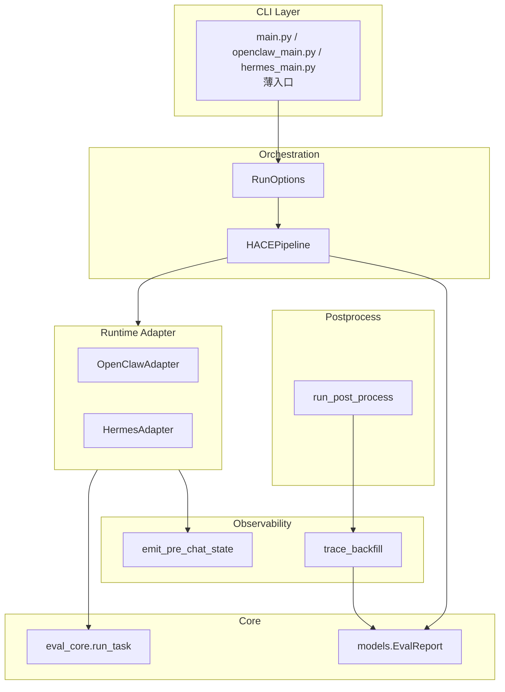

# PRD：evolve_eval 评测框架重构

| 字段 | 内容 |
|------|------|
| **文档版本** | v0.1 |
| **状态** | Draft（待评审） |
| **产品名称** | evolve_eval |
| **实现位置** | 新代码在 [`src_new/`](../src_new/)（legacy `src/`、`openclaw_main.py` 路径不变） |
| **关联文档** | [src_new/hace/README.md](../src_new/hace/README.md) · [eval-flow.md](./eval-flow.md) · [executive-brief-hace-framework-cn.md](./executive-brief-hace-framework-cn.md) |
| **目标读者** | 框架负责人、Agent 接入方、Benchmark 维护方、论文实验执行方 |

---

## 1. 背景与问题陈述

### 1.1 业务背景

团队需要一套可复现的 **self-evolving Agent 评测流水线**，支撑：

- **论文（HACE）**：在 hold-out final 上对比能力产物 **加载前 / 加载后** 的配对增益；
- **工程迭代**：OpenClaw、Hermes 及后续 runtime 以统一协议接入、统一 report 与指标；
- **Benchmark 扩展**：按 [suite requirement.md](../assets/suite%20requirement.md) 持续扩充任务集。

架构与论文方向已在文档层对齐（HACE、ArtifactPolicy、trace_backfill、弃用 replay 为产品目标），**代码仍停留在「双 main + 双 mode + 大量重复编排」阶段**，与目标架构存在系统性偏差。

### 1.2 当前痛点

| # | 痛点 | 影响 |
|---|------|------|
| P1 | `openclaw_main.py` / `hermes_main.py` 各维护 `replay_mode` + `exam_mode`，逻辑高度重复 | 修 bug / 加特性需改两处，易漂移 |
| P2 | CLI 默认 `--mode replay`，与文档「HACE 为唯一主流程」相反 | 新同学误用遗留模式，report 语义与论文不一致 |
| P3 | `--test` 在 exam 下被忽略；replay 下语义为「只跑首题 baseline」 | 与文档「仅 final 单次冒烟」不一致 |
| P4 | 术语混乱：`exam` / `replay` / `enrich` / `轻量 report` | 沟通成本高，对外与 HACE 叙事不一致 |
| P5 | Hermes 与 OpenClaw 在 pre-chat、trace_backfill 行为不完全一致 | 论文双 runtime 佐证可信度下降 |
| P6 | 无显式 `ArtifactPolicy` / `ArtifactLoader` 抽象，能力散落在各 main 与 Agent 静态方法 | 难以接 Claude Code dreaming、外部产物注入 |
| P7 | warmup 执行结果不进 report，排障依赖日志 | 产物质量与 final 对照关系难审计 |
| P8 | Report 分两阶段填（执行期 vs trace_backfill），文档曾误称「轻量」 | 对 report 生命周期理解错误 |

### 1.3 重构原则

1. **协议优先**：以 HACE pipeline 为唯一一等编排路径。  
2. **Adapter 隔离**：运行时差异收敛到 Adapter，编排层 runtime 无关。  
3. **最小破坏**：report schema（`baseline`/`evolved`）与现有后处理指标尽量兼容。  
4. **分阶段交付**：先收敛编排与 CLI，再统一观测与命名，最后扩展 Policy/Adapter。

---

## 2. 目标与非目标

### 2.1 产品目标（Must Have）

| ID | 目标 | 可验收标准 |
|----|------|------------|
| G1 | **单一 HACE 编排内核** | OpenClaw/Hermes 共用同一 pipeline 模块；main 仅负责 CLI + Adapter 注入 |
| G2 | **CLI 与文档语义一致** | 默认跑 HACE；`--test` = 仅 final 一次；移除或 deprecated `replay` |
| G3 | **RunOptions 显式化** | `repeat` / `evaluate-only` / `test` / `parallel` 为运行开关，不再称「mode」 |
| G4 | **双 runtime 观测对齐** | 同一 `PhaseRun` 字段；trace_backfill 对 openclaw/hermes 行为一致或可配置 |
| G5 | **论文实验可一键跑** | 20 suites × repeat=3 × agent_source 有稳定入口与文档化命令 |
| G6 | **可维护的扩展点** | `ArtifactPolicy`（默认 warmup）、`setLoadState`（ArtifactLoader）在代码中有明确接口/协议类 |

### 2.2 非目标（Out of Scope，首期不做）

| ID | 非目标 | 说明 |
|----|--------|------|
| NG1 | suite/task 级并发调度 | 文档假定串行；`--parallel` 可保留现状，不设计集群调度 |
| NG2 | 替代 LifelongAgentBench | HACE 仅为终点对照协议 |
| NG3 | 完整 Claude Code dreaming 生产实现 | 仅预留 `awaitArtifactReady` 与 Adapter 槽位 |
| NG4 | 修改 `TaskRun.baseline`/`evolved` 字段名 | 与历史 report、CSV 兼容，论文语义在文档说明 |
| NG5 | Langfuse 替代方案 | 仍依赖双通道 + 插件 |
| NG6 | 真实用户在线 A/B | judge 仍为协议内模拟用户 |

---

## 3. 用户与典型场景

| 角色 | 场景 | 期望 |
|------|------|------|
| **实验执行** | 跑论文主实验 20×3 | 一条命令、明确 `run_id`、自动后处理可选 |
| **Agent 开发** | 接入新 runtime | 实现 Adapter，不改 HACE pipeline |
| **Benchmark 编辑** | 新增 suite | 只改 JSON/素材，不改 Python 主流程 |
| **调试** | 冒烟 final | `--test` 快速验证联通与 judge |
| **分析** | 只看指标 | `--evaluate-only` + 已有 report |
| **维护者** | 排查某题为何退化 | report 内 session_id + trace_backfill 可定位 |

---

## 4. 目标架构

### 4.1 分层（重构后）



| 层 | 职责 | 新增/变更 |
|----|------|-----------|
| **CLI** | 解析参数、选 Adapter、调 pipeline | 统一 `RunOptions`；默认 HACE |
| **Orchestration** | repeat × suite × ArtifactPolicy × final 双对照 | **新** `src/pipeline/hace.py`（名可议） |
| **Adapter** | 产产物、setLoadState、run_task 绑定、workspace | **新** `src/adapters/base.py` + 实现 |
| **Core** | `run_task`、模型、工具函数 | 基本保留，少改 |
| **Observability** | pre-chat + trace_backfill | 模块重命名别名；行为对齐 |
| **Postprocess** | 指标、HTML | 输入仍为 report JSON；兼容 `*_enriched.json` |

### 4.2 HACE Pipeline（唯一主流程）

```text
for each repeat in RunOptions.repeat:
  for each suite in suites:
    artifact = adapter.produce_artifact(policy=DefaultWarmupPolicy)  # Q1..Qn-1 + update
    optional: adapter.await_artifact_ready()
    baseline = adapter.run_final(task=final, load_state=BEFORE_LOAD)
    evolved  = adapter.run_final(task=final, load_state=AFTER_LOAD)
    append TaskRun(baseline, evolved) to SuiteRun
    optional: incremental EvalReport.write_json
optional: postprocess(trace_backfill, metrics, html)
```

### 4.3 RunOptions（取代「mode」产品概念）

| 开关 | 类型 | 行为 |
|------|------|------|
| `repeat` | int ≥1 | 写入 `EvalReport.runs[]` |
| `test` | bool | **仅**对 `tasks[-1]` 跑 **1 次** `run_task`（默认 before-load 或文档约定一种）；跳过 warmup、双对照、evolve |
| `evaluate_only` | bool | 跳过执行，仅后处理 |
| `evaluate` | bool | 执行后立即后处理 |
| `parallel` | bool | suite 内多 task 并行（仅影响 warmup 批跑等；final 仍串行推荐） |
| `suite` / `benchmark_dir` / `run_id` | 现有 | 保留 |

**移除或 deprecated**：`--mode replay`；`--mode exam` → 默认行为即 HACE（可保留 `--mode exam` 别名一个版本周期并打 deprecation warning）。

---

## 5. 现状 vs 目标对照

| 维度 | 现状 | 目标 |
|------|------|------|
| 主入口默认 | `replay` | HACE only |
| 编排代码位置 | `*_main.py` 内 200+ 行 ×2 | `HACEPipeline` 单处 |
| exam / replay | 两套函数 | replay 删除或 `scripts/legacy_replay.py` |
| `--test` | exam 忽略；replay 仅首题 baseline | 仅 final 一次 |
| 产物生产 | 内联 warmup + `evolve()` | `ArtifactPolicy` 接口；默认 `WarmupThenUpdatePolicy` |
| 加载状态切换 | `disable_evolve` / workspace 硬编码 | `adapter.set_load_state(BEFORE\|AFTER)` |
| 观测模块名 | `langfuse_enrich` | `trace_backfill` 为主模块名 + 兼容 import |
| Report 表述 | 「轻量」 | 「执行期 report / 后处理回填 trace」 |
| Hermes pre-chat | 与 OpenClaw 不一致处 | 对齐 eval_core / reporting 调用点 |

---

## 6. 功能需求

### 6.1 编排层（P0）

| 需求 ID | 描述 | 验收标准 |
|---------|------|----------|
| F-ORCH-01 | 实现 `HACEPipeline.run(eval_report, suite_paths, adapter, options)` | OpenClaw、Hermes 共用；单测可 mock adapter |
| F-ORCH-02 | 支持 `repeat` 循环并维护 `EvalRepeat` 时间戳 | 与现 report 结构一致 |
| F-ORCH-03 | 每 suite 仅 final 写入 `TaskRun`（HACE） | report 中 `tasks` 长度 = 1（非 test） |
| F-ORCH-04 | `test=True` 时跳过 warmup、evolve、双对照 | 文档与 CLI help 一致；有集成测试 |
| F-ORCH-05 | 执行结束写出 report；`langfuse` 字段可为 null | 与现 `PhaseRun` schema 兼容 |
| F-ORCH-06 | 可选执行期增量 `write_json`（与现行为一致或配置化） | 长跑中断可保留部分结果 |

### 6.2 Adapter 层（P0）

| 需求 ID | 描述 | 验收标准 |
|---------|------|----------|
| F-ADP-01 | 定义 `RuntimeAdapter` 协议（Protocol 或 ABC） | 含：bootstrap、produce_artifact、set_load_state、run_phase、shutdown |
| F-ADP-02 | `OpenClawAdapter` 行为与现 `exam_mode` 等价 | 同一 suite 上 baseline/evolved 与重构前 diff 可控（success/score/session） |
| F-ADP-03 | `HermesAdapter` 行为与现 `exam_mode` 等价 | 同上 |
| F-ADP-04 | `set_load_state(BEFORE_LOAD)` / `AFTER_LOAD` 枚举 | 文档映射到 disable_evolve / workspace 策略 |
| F-ADP-05 | `DefaultWarmupArtifactPolicy`：跑 `tasks[:-1]` 后 trigger update | 可注入 mock policy 测空 warmup |

### 6.3 CLI（P0）

| 需求 ID | 描述 | 验收标准 |
|---------|------|----------|
| F-CLI-01 | 默认执行 HACE（无 mode 或 `--mode hace`） | README 示例更新 |
| F-CLI-02 | `--mode replay` 移除或 deprecated ≥1 版本 | 调用时 warning + 文档迁移指南 |
| F-CLI-03 | `--test` 语义按 eval-flow §4.1 | exam 不再打印 "ignores --test" |
| F-CLI-04 | `-e` / `--evaluate-only` 行为不变 | 现有脚本不 break |
| F-CLI-05 | 统一 `agent_source` 传入后处理 | openclaw / hermes 显式参数 |

### 6.4 观测与后处理（P1）

| 需求 ID | 描述 | 验收标准 |
|---------|------|----------|
| F-OBS-01 | `postprocess/trace_backfill.py` 为主模块；`langfuse_enrich` re-export | 旧 import 不 break |
| F-OBS-02 | Hermes 与 OpenClaw 均对每个 phase 调用 pre-chat（若配置开启） | 与 OpenClaw 轮次策略文档化一致 |
| F-OBS-03 | trace_backfill 使用 `run_id` + `PhaseRun` 内 session_id | 回填后 `langfuse` 非空（Langfuse 可用时） |
| F-OBS-04 | 后处理 CLI/日志用语改为 trace_backfill | 无用户-facing「enrich」字样 |

### 6.5 Report 与数据（P1）

| 需求 ID | 描述 | 验收标准 |
|---------|------|----------|
| F-RPT-01 | 保持 `EvalReport` / `TaskRun` / `PhaseRun` 结构 | 旧 report 可被后处理读取 |
| F-RPT-02 | 可选：warmup summary 写入 report 附录字段（非 P0） | 设计 `warmup_runs: PhaseRun[]` 可选，默认仍省略 |
| F-RPT-03 | `EvalReport.run_id` 与 Langfuse `eval_run_tag` 一致 | 已有逻辑保持 |

### 6.6 扩展预留（P2）

| 需求 ID | 描述 | 验收标准 |
|---------|------|----------|
| F-EXT-01 | `ArtifactPolicy` 可插拔：noop / external_inject 占位 | 单元测试 + 文档示例 |
| F-EXT-02 | `await_artifact_ready()` 超时与失败策略可配置 | 配置项：skip_suite \| fail_phase（默认文档化一种） |
| F-EXT-03 | `ClaudeCodeAdapter` 骨架 | 接口实现 stub，不阻塞 P0 |

---

## 7. 非功能需求

| 类别 | 要求 |
|------|------|
| **兼容性** | 重构后 report JSON 可被现有 `postprocess` 消费；文件名 `*_enriched.json` 可保留 |
| **可测试性** | HACEPipeline + Adapter 可单测；至少 1 个小型 fixture suite 集成测试 |
| **可观测性** | 结构化日志含 `run_id`、`repeat_index`、`suite`、`task`、`phase`、`load_state` |
| **文档** | eval-flow、README、executive-brief 与代码默认行为同步更新 |
| **性能** | 不劣于现 exam_mode；串行为默认 |
| **安全** | 素材只读挂载；无新增密钥存储 |

---

## 8. 迁移与兼容

### 8.1 对用户的影响

| 变更 | 迁移动作 |
|------|----------|
| 默认从 replay → HACE | 需 replay 的用户显式 `--mode replay`（deprecated 窗口）或独立 legacy 脚本 |
| `--test` 行为变化（exam 用户） | 发布说明：现依赖「全量 exam」不受影响；曾误以为 test 生效者需改命令 |
| 模块 import `langfuse_enrich` | 保留 re-export 至少 2 个小版本 |

### 8.2 数据迁移

- **无需**迁移历史 report JSON。  
- 历史 `replay` report（每题一条 TaskRun）后处理仍可读，但论文流水线应只产 HACE shape。

### 8.3 回滚策略

- 重构在 feature branch 完成；保留 `replay_mode` 代码于 `legacy/` 直至 HACE 稳定一个 release。

---

## 9. 里程碑与排期建议

| 阶段 | 周期（建议） | 范围 | 退出标准 |
|------|--------------|------|----------|
| **M0 设计评审** | 1 周 | 本 PRD + Adapter 接口评审 | 老板/负责人签字方向 |
| **M1 P0 编排抽取** | 2–3 周 | `HACEPipeline` + OpenClawAdapter；CLI 默认 HACE；`--test` | OpenClaw exam 回归通过；replay deprecated |
| **M2 P0 Hermes 对齐** | 1–2 周 | HermesAdapter 接入同一 pipeline | 双 runtime 同一 suite 产出可比对 report |
| **M3 P1 观测与命名** | 1–2 周 | trace_backfill 模块名、Hermes pre-chat、文档 | 任选 1 suite trace 完整回填 |
| **M4 论文实验支撑** | 2–4 周 | 20 suite 批跑脚本、repeat=3、结果填表 | 主表有真实数；README 一键命令 |
| **M5 P2 扩展** | 按需 | Policy 插拔、Claude Code stub | 不在论文阻塞路径 |

---

## 10. 成功指标

| 指标 | 目标 |
|------|------|
| 编排重复代码行数 | `openclaw_main` + `hermes_main` 编排相关代码减少 ≥60% |
| 默认路径一致性 | 100% 文档示例默认 HACE；新用户零配置不走 replay |
| 双 runtime 一致性 | 同一 suite 上 OpenClaw/Hermes 的 report 结构完全一致（字段级） |
| 论文实验 | 20 suites × 3 repeats 可无人工改 main 跑通 |
| 缺陷 | P0 引入的 regression 数 = 0（以 fixture suite 为准） |

---

## 11. 风险与依赖

| 风险 | 概率 | 影响 | 缓解 |
|------|------|------|------|
| OpenClaw/Hermes 行为等价难证明 | 中 | 高 | 固定 seed suite 快照对比；保留 adapter 单测 |
| 去 replay 影响存量脚本 | 中 | 中 | deprecation 期 + legacy 脚本 |
| Langfuse 不可用导致无 trace | 中 | 中 | 执行期 report 仍完整；后处理降级 |
| 重构与论文实验并行 | 高 | 中 | M1 后打 tag；实验分支冻结 commit |
| dreaming 需求蔓延 | 中 | 低 | 严格 P2，不进入 M1–M2 |

**依赖**：Langfuse 插件、Conda 环境、OpenClaw/Hermes CLI、benchmark JSON 资产就绪。

---

## 12. 开放问题（需 PRD 评审拍板）

| # | 问题 | 选项 |
|---|------|------|
| Q1 | replay 删除还是移入 `scripts/legacy_replay.py`？ | A 删除 B 隔离保留 1 版本 |
| Q2 | `--test` 默认跑 before-load 还是 after-load？ | 建议：before-load 或「无产物单次」并在文档固定 |
| Q3 | warmup 是否写入 report 可选字段？ | P1 再做 |
| Q4 | 统一入口 `main.py` 是否替代双 main？ | 建议：`main.py --agent openclaw\|hermes` 长期目标 |
| Q5 | `awaitArtifactReady` 失败默认 skip 还是 fail？ | 影响 Claude Code 路径 |
| Q6 | report 文件名是否从 `enriched` 改为 `backfilled`？ | 建议后期别名，非 P0 |

---

## 13. 附录

### 13.1 建议目录结构（目标）

```text
src/
  pipeline/
    hace.py              # HACEPipeline
    run_options.py       # RunOptions dataclass
  adapters/
    base.py              # RuntimeAdapter protocol
    openclaw.py
    hermes.py
    policies.py          # ArtifactPolicy 默认实现
  eval_core.py           # 保留
  models.py              # 保留
postprocess/
  trace_backfill.py      # 主名；langfuse_enrich.py → 薄 re-export
openclaw_main.py         # CLI + OpenClawAdapter 组装
hermes_main.py           # CLI + HermesAdapter 组装
```

### 13.2 关键接口草案（评审用）

```python
class LoadState(Enum):
    BEFORE_LOAD = "before_load"
    AFTER_LOAD = "after_load"

class RuntimeAdapter(Protocol):
    async def bootstrap(self, run_id: str, repeat_index: int, suite: SuiteSpec) -> None: ...
    async def produce_artifact(self, policy: ArtifactPolicy, suite: SuiteSpec) -> None: ...
    async def set_load_state(self, state: LoadState) -> None: ...
    async def run_task_phase(
        self, task: SuiteTask, *, load_state: LoadState, phase_label: str
    ) -> PhaseRun: ...
    async def shutdown(self) -> None: ...
```

### 13.3 相关文档索引

| 文档 | 用途 |
|------|------|
| [prd-eval-framework-refactor-cn.md](./prd-eval-framework-refactor-cn.md) | 本文 PRD |
| [eval-flow.md](./eval-flow.md) | 目标行为规格 |
| [executive-brief-hace-framework-cn.md](./executive-brief-hace-framework-cn.md) | 管理层对齐 |
| [paper-hace-blueprint-cn.md](./paper-hace-blueprint-cn.md) | 论文实验需求 |

---

## 14. 修订记录

| 版本 | 日期 | 变更 |
|------|------|------|
| v0.1 | 2026-06-03 | 初稿：基于 HACE 架构对齐与现网代码差距 |
